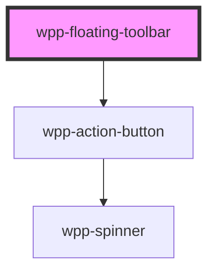

# wpp-floating-toolbar


<!-- Auto Generated Below -->


## Usage

### Angular

```ts
@Component({
  ...
})
export class FloatingToolbarExample {
  actionButtonsConfig: ActionButtonData[] = [
    {
      icon: 'add',
      onClick: () => console.log('Add button clicked')
    }, {
      icon: 'edit',
    },
  ]
```

```html
<wpp-floating-toolbar [actionButtonsConfig]="actionButtonsConfig" />
```


### React

```tsx
import { ActionButtonData } from '@wppopen/components-library';
import { WppFloatingToolbar } from '@wppopen/components-library-react';

export const FloatingToolbarExample = () => {
  const actionButtonsConfig: ActionButtonData[] = [{
    icon: 'add', onClick: () => console.log('Add button clicked')
  }, {
    icon: 'edit',
  },]

  return (
    <>
      <WppFloatingToolbar actionButtonsConfig={actionButtonsConfig} />
    </>
  )
}
```


### Vue

```vue
<script setup lang="ts">
  import { ActionButtonData } from "@wppopen/components-library";
  import {
    WppFloatingToolbar
  } from "@wppopen/components-library-vue";

  const actionButtonsConfig: ActionButtonData[] = [
    {
      icon: 'add',
      onClick: () => console.log('Add button clicked')
    }, {
      icon: 'edit',
    },
  ]
</script>

<template>
  <WppFloatingToolbar :actionButtonsConfig="actionButtonsConfig" />
</template>
```


## Properties

| Property              | Attribute     | Description                                                                   | Type                         | Default        |
| --------------------- | ------------- | ----------------------------------------------------------------------------- | ---------------------------- | -------------- |
| `actionButtonsConfig` | --            | Defines the action buttons configuration. Must contain between 2 and 7 items. | `ActionButtonData[]`         | `undefined`    |
| `ariaProps`           | --            | Contains the floating toolbar `aria-` props.                                  | `AriaProps`                  | `{}`           |
| `orientation`         | `orientation` | Defines the orientation of the floating toolbar.                              | `"horizontal" \| "vertical"` | `'horizontal'` |


## Shadow Parts

| Part     | Description |
| -------- | ----------- |
| `"icon"` |             |


## Dependencies

### Depends on

- [wpp-action-button](../wpp-action-button)

### Graph


----------------------------------------------

*Built with [StencilJS](https://stenciljs.com/)*
