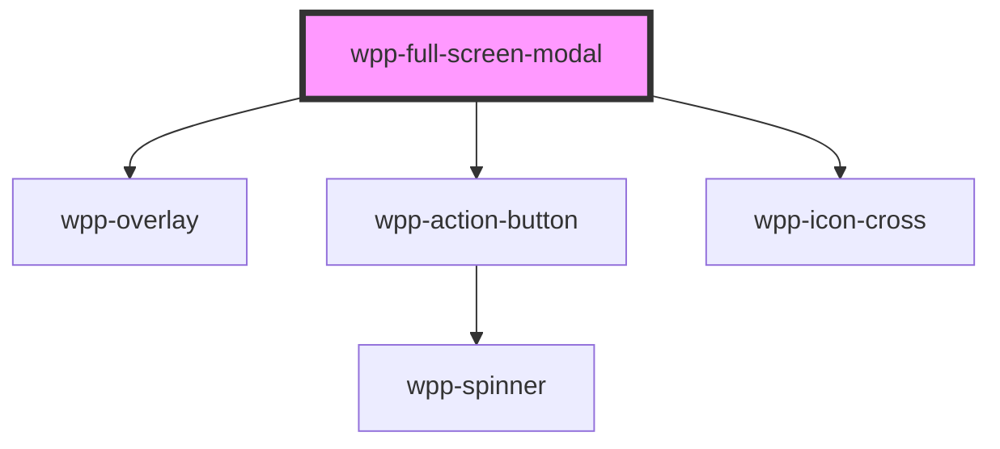

# wpp-full-screen-modal


<!-- Auto Generated Below -->


## Usage

### Angular

```ts
@Component({
  ...
})
export class FullScreenModalExample {
  public isOpen: boolean = false;

  public open(): void {
    this.isOpen = true;
  }

  public close(): void {
    this.isOpen = false;
  }
}
```

```html
<wpp-button (click)="open()">Open</wpp-button>

<wpp-full-screen-modal [open]="isOpen" (wppFullScreenModalClose)="close()">
  <div slot="header">Lorem Ipsum</div>

  <div slot="body">
    <p>
      Lorem ipsum dolor sit amet, consectetur adipiscing elit, sed do eiusmod tempor incididunt ut labore et dolore
      magna aliqua. Ut enim ad minim veniam, quis nostrud exercitation ullamco laboris nisi ut aliquip ex ea commodo
      consequat. Duis aute irure dolor in reprehenderit in voluptate velit esse cillum dolore eu fugiat nulla pariatur.
      Excepteur sint occaecat cupidatat non proident, sunt in culpa qui officia deserunt mollit anim id est laborum.
    </p>
  </div>

  <div slot="actions">
    <wpp-button variant="secondary" (click)="close()">Close</wpp-button>
  </div>
</wpp-full-screen-modal>
```


### React

```tsx
import { WppFullScreenModal, WppButton } from '@platform-ui-kit/components-library-react'

export const FullScreenModalExample = () => {
  const [isFullScreenModalOpen, setFullScreenModalOpen] = useState(false)

  const handleOpenModal = () => setFullScreenModalOpen(true)
  const handleCloseModal = () => setFullScreenModalOpen(false)

  return (
    <>
      <WppButton onClick={handleOpenModal}>Open Modal</WppButton>

      <WppFullScreenModal open={isFullScreenModalOpen} onWppFullScreenModalClose={handleCloseModal}>
        <div slot="header">Title</div>
        <p slot="body">Body of the modal</p>
        <div slot="actions">
          <WppButton variant="primary" size="s" onClick={handleCloseModal}>
            Close
          </WppButton>
        </div>
      </WppFullScreenModal>
    </>
  )
}
```


### Vue

```vue
<script setup lang="ts">
import { ref } from 'vue'
import { WppButton, WppFullScreenModal } from '@platform-ui-kit/components-library-vue'

const isFullScreenModalOpen = ref(false)

const handleOpenFullScreenModal = () => (isFullScreenModalOpen.value = true)
const handleCloseFullScreenModal = () => (isFullScreenModalOpen.value = false)
</script>

<template>
  <div>
    <WppButton @click="handleOpenFullScreenModal">Open Modal</WppButton>
    <WppFullScreenModal :open="isFullScreenModalOpen" @WppFullScreenModalClose="handleCloseFullScreenModal">
      <div slot="header">Title</div>
      <p slot="body">Body of the modal</p>
      <div slot="actions">
        <WppButton variant="primary" size="s" @click="handleCloseFullScreenModal">Close</WppButton>
      </div>
    </WppFullScreenModal>
  </div>
</template>
```


## Properties

| Property                 | Attribute                  | Description                                                       | Type                                     | Default         |
| ------------------------ | -------------------------- | ----------------------------------------------------------------- | ---------------------------------------- | --------------- |
| `disableOutsideClick`    | `disable-outside-click`    | If the modal can be closed by clicking outside of it.             | `boolean`                                | `false`         |
| `formConfig`             | --                         | If you pass this prop wrapper of dialog will be rendered as form. | `FullScreenModalFormConfig \| undefined` | `undefined`     |
| `open`                   | `open`                     | Indicates is the modal open.                                      | `boolean`                                | `false`         |
| `withTransparentOverlay` | `with-transparent-overlay` | Makes overlay transparent                                         | `boolean`                                | `undefined`     |
| `zIndex`                 | `z-index`                  | Defines the z-index of the WppFullScreenModal.                    | `number`                                 | `Z_INDEX.MODAL` |


## Events

| Event                             | Description                                                                                                                                                                                                         | Type                                       |
| --------------------------------- | ------------------------------------------------------------------------------------------------------------------------------------------------------------------------------------------------------------------- | ------------------------------------------ |
| `wppFullScreenModalClose`         | Handles the modal closing actions.                                                                                                                                                                                  | `CustomEvent<FullScreenModalCloseDetails>` |
| `wppFullScreenModalCloseComplete` | Event emitted when the close animation ends.                                                                                                                                                                        | `CustomEvent<FullScreenModalCloseDetails>` |
| `wppFullScreenModalCloseStart`    | Event emitted when the close animation starts.                                                                                                                                                                      | `CustomEvent<FullScreenModalCloseDetails>` |
| `wppFullScreenModalOpen`          | <span style="color:red">**[DEPRECATED]**</span> - this prop will be deleted in version 3.0.0 . Use `wppFullScreenModalOpenStart`/`wppFullScreenModalOpenComplete` instead<br/><br/>Handles the modal click actions. | `CustomEvent<void>`                        |
| `wppFullScreenModalOpenComplete`  | Event emitted when the open animation ends.                                                                                                                                                                         | `CustomEvent<void>`                        |
| `wppFullScreenModalOpenStart`     | Event emitted when the open animation starts.                                                                                                                                                                       | `CustomEvent<void>`                        |


## Methods

### `closeFullScreenModal() => Promise<void>`

Method for closing the full screen modal.

#### Returns

Type: `Promise<void>`


### `openFullScreenModal() => Promise<void>`

Method for opening the full screen modal.

#### Returns

Type: `Promise<void>`


## Slots

| Slot        | Description                                                                                                                                                         |
| ----------- | ------------------------------------------------------------------------------------------------------------------------------------------------------------------- |
| `"actions"` | Content that is displayed within the `.full-screen-modal` element. To add actions, pass `slot="actions"` – can contain any action buttons.                          |
| `"body"`    | Content that is displayed within the `.full-screen-modal` element. To add body content, pass `slot="body"` – can contain any text that describes the modal actions. |
| `"header"`  | Content that is displayed within the `.full-screen-modal` element. To add header content, pass `slot="header"` – can contain the modal title.                       |


## Shadow Parts

| Part        | Description               |
| ----------- | ------------------------- |
| `"actions"` | actions slot element      |
| `"body"`    | Main slot content wrapper |
| `"content"` | modal content element     |
| `"header"`  | header slot element       |
| `"overlay"` | overlay element           |
| `"wrapper"` | component wrapper element |


## CSS Custom Properties

| Name                                       | Description |
| ------------------------------------------ | ----------- |
| `--wpp-full-screen-modal-actions-paddings` |             |
| `--wpp-full-screen-modal-bg-color`         |             |
| `--wpp-full-screen-modal-body-paddings`    |             |
| `--wpp-full-screen-modal-box-shadow`       |             |
| `--wpp-full-screen-modal-header-padding`   |             |
| `--wpp-full-screen-modal-height`           |             |
| `--wpp-full-screen-modal-overlay-bg-color` |             |
| `--wpp-full-screen-modal-width`            |             |


## Dependencies

### Depends on

- [wpp-overlay](../wpp-overlay)
- [wpp-action-button](../wpp-action-button)
- [wpp-icon-cross](../wpp-icon/components/add-and-remove/wpp-icon-cross)

### Graph


----------------------------------------------

*Built with [StencilJS](https://stenciljs.com/)*
