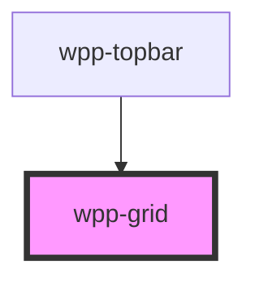

# wpp-grid

<!-- Auto Generated Below -->


## Usage

### Angular

```html
<wpp-grid container>
  <wpp-grid item all="8">Column 1</wpp-grid>
  <wpp-grid item all="8">Column 2</wpp-grid>
  <wpp-grid item all="8">Column 3</wpp-grid>
</wpp-grid>

<wpp-grid container direction="column">
  <wpp-grid item all="24">Row 1</wpp-grid>
  <wpp-grid item all="24">Row 2</wpp-grid>
  <wpp-grid item all="24">Row 3</wpp-grid>
</wpp-grid>

<wpp-grid container>
  <wpp-grid item all="4">Column 1</wpp-grid>
  <wpp-grid item all="6">Column 2</wpp-grid>
  <wpp-grid item all="14">Column 3</wpp-grid>
</wpp-grid>

<wpp-grid container>
  <wpp-grid item xxs="24" xs="24" sm="12" md="12" lg="12" xlg="12">Column 1</wpp-grid>
  <wpp-grid item xxs="24" xs="24" sm="12" md="8" lg="6" xlg="6">Column 2</wpp-grid>
  <wpp-grid item xxs="24" xs="24" sm="24" md="4" lg="6" xlg="6">Column 3</wpp-grid>
</wpp-grid>

<wpp-grid container spacing="1">
  <wpp-grid item all="8">Column 1</wpp-grid>
  <wpp-grid item all="8">Column 2</wpp-grid>
  <wpp-grid item all="8">Column 3</wpp-grid>
  <wpp-grid item all="8">Column 4</wpp-grid>
  <wpp-grid item all="8">Column 5</wpp-grid>
  <wpp-grid item all="8">Column 6</wpp-grid>
  <wpp-grid item all="8">Column 7</wpp-grid>
  <wpp-grid item all="8">Column 8</wpp-grid>
  <wpp-grid item all="8">Column 9</wpp-grid>
</wpp-grid>

<wpp-grid container justifyContent="center">
  <wpp-grid item all="4">Column 1</wpp-grid>
  <wpp-grid item all="4">Column 2</wpp-grid>
  <wpp-grid item all="4">Column 3</wpp-grid>
</wpp-grid>

<wpp-grid container direction="column" alignItems="center">
  <wpp-grid item>Row 1</wpp-grid>
  <wpp-grid item>Row 2</wpp-grid>
  <wpp-grid item>Row 3</wpp-grid>
</wpp-grid>
```


### React

```tsx
import { WppGrid } from '@platform-ui-kit/components-library-react'
​
export const GridExample = () => (
   <WppGrid container rowSpacing={4}>
      <WppGrid item all={16}>
        <WppGrid container makeFullWidth>
          <WppGrid item all={8}>
            <div>
              <h3>Scale</h3>
              <p>50,000</p>
              <h3 >Products on the platform</h3>
            </div>
          </WppGrid>
        </WppGrid>
      </WppGrid>
​
        <WppGrid item all={8}>
          <h3>Resources</h3>
          <p>Product summary</p>
        </WppGrid>
​
        <WppGrid item all={14}>
          <div>
            <h3>Benefits</h3>
            <p>Manage interactive experiences with ease: combining human experience and technology effectively can help consumers learn and engage with content in new ways. However, these unique experiences can be hard to monitor, expensive to update, and difficult to track. By centralising experience management, Interactive Experience Management can make the process </p>
          </div>
        </WppGrid>
    </WppGrid>
)
```


### Vue

```vue

<script setup lang="ts">
import { WppGrid } from '@platform-ui-kit/components-library-vue';
</script>

<template>
  <WppGrid container rowSpacing="4">
    <WppGrid item all="16">
      <WppGrid container makeFullWidth>
        <WppGrid item all="8">
          <div>
            <h3>Scale</h3>
            <p>50,000</p>
            <h3 >Products on the platform</h3>
          </div>
        </WppGrid>
      </WppGrid>
    </WppGrid>
    <WppGrid item all="8">
      <h3>Resources</h3>
      <p>Product summary</p>
    </WppGrid>
    <WppGrid item all="14">
      <div>
        <h3>Benefits</h3>
        <p>Manage interactive experiences with ease: combining human experience and technology effectively can help consumers learn and engage with content in new ways. However, these unique experiences can be hard to monitor, expensive to update, and difficult to track. By centralising experience management, Interactive Experience Management can make the process </p>
      </div>
    </WppGrid>
  </WppGrid>
</template>


```


## Properties

| Property         | Attribute         | Description                                                                                                                                                                                                                 | Type                                                                                                                                                                      | Default        |
| ---------------- | ----------------- | --------------------------------------------------------------------------------------------------------------------------------------------------------------------------------------------------------------------------- | ------------------------------------------------------------------------------------------------------------------------------------------------------------------------- | -------------- |
| `alignItems`     | `align-items`     | Defines the grid `alignItems`, works the same as `alignItems` in flexbox.                                                                                                                                                   | `"baseline" \| "center" \| "flex-end" \| "flex-start" \| "normal"`                                                                                                        | `'normal'`     |
| `all`            | `all`             | Defines the grid item width for all screen sizes. Takes in a number between **1** and **24**, where **24** is **100%** of the item width. If no value is specified, the grid items take all the available screen width.     | `true \| 0 \| 2 \| 1 \| 3 \| 4 \| 5 \| 6 \| 8 \| 7 \| 9 \| 10 \| 11 \| 12 \| 16 \| "auto" \| 15 \| 13 \| 14 \| 17 \| 18 \| 19 \| 20 \| 21 \| 22 \| 23 \| 24 \| undefined` | `undefined`    |
| `columnSpacing`  | `column-spacing`  | Defines the vertical gap between grid columns. Use only if you have more than one column.                                                                                                                                   | `0 \| 2 \| 1 \| 3 \| 4 \| 5 \| 6 \| 8 \| 7 \| 9 \| 10 \| 11 \| 12 \| 16 \| 15 \| 13 \| 14 \| 17 \| 18 \| 19 \| 20 \| 21 \| 22 \| 23 \| 24 \| undefined`                   | `undefined`    |
| `container`      | `container`       | If the component is a grid container.                                                                                                                                                                                       | `boolean`                                                                                                                                                                 | `false`        |
| `direction`      | `direction`       | Defines the grid direction, works the same as flexbox direction.                                                                                                                                                            | `"column" \| "column-reverse" \| "row" \| "row-reverse"`                                                                                                                  | `'row'`        |
| `fluid`          | `fluid`           | If the container's fluid makes it fill all parent width and height                                                                                                                                                          | `boolean`                                                                                                                                                                 | `false`        |
| `fullHeight`     | `full-height`     | If the container's height is at **100%** and the grid content grows to fill the parent block height.                                                                                                                        | `boolean`                                                                                                                                                                 | `false`        |
| `fullWidth`      | `full-width`      | If the container has full width and no margins.                                                                                                                                                                             | `boolean`                                                                                                                                                                 | `false`        |
| `item`           | `item`            | If the component is a grid item. Must be used inside a grid container.                                                                                                                                                      | `boolean`                                                                                                                                                                 | `false`        |
| `justifyContent` | `justify-content` | Defines the grid `justifyContent` value, works the same as `justifyContent` in flexbox.                                                                                                                                     | `"center" \| "flex-end" \| "flex-start" \| "space-around" \| "space-between"`                                                                                             | `'flex-start'` |
| `lg`             | `lg`              | Defines the grid item width for screen size - 1440px. Takes in a number between **1** and **24**, where **24** is **100%** of the item width. If no value is specified, the grid items take all the available screen width. | `true \| 0 \| 2 \| 1 \| 3 \| 4 \| 5 \| 6 \| 8 \| 7 \| 9 \| 10 \| 11 \| 12 \| 16 \| "auto" \| 15 \| 13 \| 14 \| 17 \| 18 \| 19 \| 20 \| 21 \| 22 \| 23 \| 24 \| undefined` | `undefined`    |
| `md`             | `md`              | Defines the grid item width for screen size - 1366px. Takes in a number between **1** and **24**, where **24** is **100%** of the item width. If no value is specified, the grid items take all the available screen width. | `true \| 0 \| 2 \| 1 \| 3 \| 4 \| 5 \| 6 \| 8 \| 7 \| 9 \| 10 \| 11 \| 12 \| 16 \| "auto" \| 15 \| 13 \| 14 \| 17 \| 18 \| 19 \| 20 \| 21 \| 22 \| 23 \| 24 \| undefined` | `undefined`    |
| `rowSpacing`     | `row-spacing`     | Defines the horizontal gap between grid rows. Use only if you have more than one row.                                                                                                                                       | `0 \| 2 \| 1 \| 3 \| 4 \| 5 \| 6 \| 8 \| 7 \| 9 \| 10 \| 11 \| 12 \| 16 \| 15 \| 13 \| 14 \| 17 \| 18 \| 19 \| 20 \| 21 \| 22 \| 23 \| 24 \| undefined`                   | `undefined`    |
| `sm`             | `sm`              | Defines the grid item width for screen size - 1280px. Takes in a number between **1** and **24**, where **24** is **100%** of the item width. If no value is specified, the grid items take all the available screen width. | `true \| 0 \| 2 \| 1 \| 3 \| 4 \| 5 \| 6 \| 8 \| 7 \| 9 \| 10 \| 11 \| 12 \| 16 \| "auto" \| 15 \| 13 \| 14 \| 17 \| 18 \| 19 \| 20 \| 21 \| 22 \| 23 \| 24 \| undefined` | `undefined`    |
| `xl`             | `xl`              | Defines the grid item width for screen size - 1920px. Takes in a number between **1** and **24**, where **24** is **100%** of the item width. If no value is specified, the grid items take all the available screen width. | `true \| 0 \| 2 \| 1 \| 3 \| 4 \| 5 \| 6 \| 8 \| 7 \| 9 \| 10 \| 11 \| 12 \| 16 \| "auto" \| 15 \| 13 \| 14 \| 17 \| 18 \| 19 \| 20 \| 21 \| 22 \| 23 \| 24 \| undefined` | `undefined`    |
| `xxl`            | `xxl`             | Defines the grid item width for screen size - 2220px. Takes in a number between **1** and **24**, where **24** is **100%** of the item width. If no value is specified, the grid items take all the available screen width. | `true \| 0 \| 2 \| 1 \| 3 \| 4 \| 5 \| 6 \| 8 \| 7 \| 9 \| 10 \| 11 \| 12 \| 16 \| "auto" \| 15 \| 13 \| 14 \| 17 \| 18 \| 19 \| 20 \| 21 \| 22 \| 23 \| 24 \| undefined` | `undefined`    |


## Shadow Parts

| Part      | Description          |
| --------- | -------------------- |
| `"inner"` | Content slot element |


## CSS Custom Properties

| Name                        | Description |
| --------------------------- | ----------- |
| `--wpp-grid-column-spacing` |             |
| `--wpp-grid-max-spacing`    |             |
| `--wpp-grid-max-width`      |             |
| `--wpp-grid-min-spacing`    |             |
| `--wpp-grid-row-spacing`    |             |
| `--wpp-grid-total-columns`  |             |
| `--wpp-grid-width`          |             |


## Dependencies

### Used by

 - [wpp-topbar](../wpp-topbar)

### Graph


----------------------------------------------

*Built with [StencilJS](https://stenciljs.com/)*
