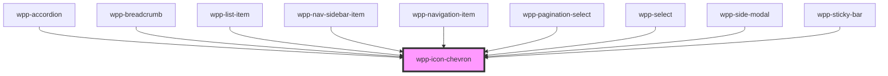

# wpp-icon-chevron

<!-- Auto Generated Below -->

## Properties

| Property    | Attribute   | Description                                                                                                               | Type                                           | Default                   |
| ----------- | ----------- | ------------------------------------------------------------------------------------------------------------------------- | ---------------------------------------------- | ------------------------- |
| `color`     | `color`     | Defines the icon color.                                                                                                   | `string`                                       | `'var(--wpp-icon-color)'` |
| `direction` | `direction` | Defines the icon direction.                                                                                               | `"down" \| "left" \| "right" \| "top" \| "up"` | `'right'`                 |
| `height`    | `height`    | Defines the icon height and changes its default size. If you use `height` only, the icon width will not be affected.      | `number \| undefined`                          | `undefined`               |
| `size`      | `size`      | Defines the icon size, where `s` is **16px** and `m` is **20px**.                                                         | `"m" \| "s"`                                   | `'m'`                     |
| `width`     | `width`     | Defines the icon width and changes its default size. If you use `width` only, the icon width and height will be the same. | `number \| undefined`                          | `undefined`               |

## Dependencies

### Used by

 - [wpp-accordion](../../../../../wpp-accordion)
 - [wpp-breadcrumb](../../../../../wpp-breadcrumb)
 - [wpp-list-item](../../../../../wpp-list-item)
 - [wpp-nav-sidebar-item](../../../../../wpp-nav-sidebar/components/wpp-nav-sidebar-item)
 - [wpp-navigation-item](../../../../../wpp-topbar/components/wpp-navigation-item)
 - [wpp-pagination-select](../../../../../wpp-pagination/components/wpp-pagination-select)
 - [wpp-select](../../../../../wpp-select)
 - [wpp-side-modal](../../../../../wpp-side-modal)
 - [wpp-sticky-bar](../../../../../wpp-sticky-bar)

### Graph

----------------------------------------------

*Built with [StencilJS](https://stenciljs.com/)*
