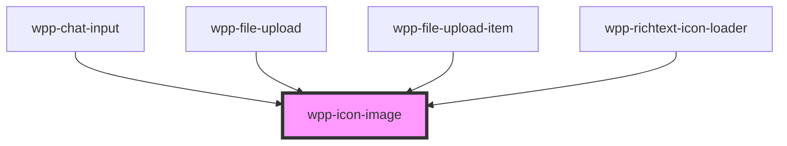

# wpp-icon-image

<!-- Auto Generated Below -->

## Properties

| Property | Attribute | Description                                                                                                               | Type                  | Default                   |
| -------- | --------- | ------------------------------------------------------------------------------------------------------------------------- | --------------------- | ------------------------- |
| `color`  | `color`   | Defines the icon color.                                                                                                   | `string`              | `'var(--wpp-icon-color)'` |
| `height` | `height`  | Defines the icon height and changes its default size. If you use `height` only, the icon width will not be affected.      | `number \| undefined` | `undefined`               |
| `size`   | `size`    | Defines the icon size, where `s` is **16px** and `m` is **20px**.                                                         | `"m" \| "s"`          | `'m'`                     |
| `width`  | `width`   | Defines the icon width and changes its default size. If you use `width` only, the icon width and height will be the same. | `number \| undefined` | `undefined`               |

## Dependencies

### Used by

 - [wpp-chat-input](../../../../../wpp-chat/components/wpp-chat-input)
 - [wpp-file-upload](../../../../../wpp-file-upload)
 - [wpp-file-upload-item](../../../../../wpp-file-upload/components)
 - [wpp-richtext-icon-loader](../../../../../wpp-richtext)

### Graph

----------------------------------------------

*Built with [StencilJS](https://stenciljs.com/)*
