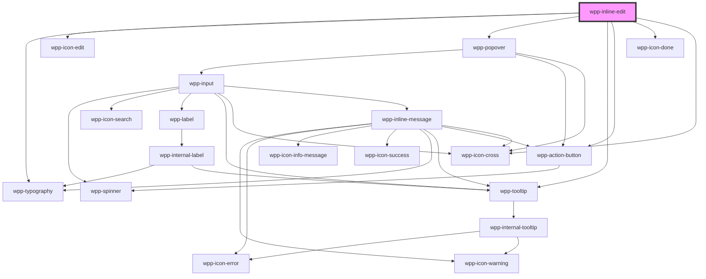

# wpp-inline-edit

InlineEdit component supports wpp-input and wpp-textarea-input only.

<!-- Auto Generated Below -->


## Usage

### Angular

### inline-edit-example.page.html

```angular2html
<div class="wrapper">
  <div>
    <h3>Inline Edit Input</h3>
    <wpp-inline-edit
      [value]="inputValue"
      [mode]="inputMode"
      [inputWidth]="'300px'"
      (wppModeChange)="handleInputModeChange($event)"
      (wppConfirm)="handleConfirm($event)"
    >
      <wpp-input
        size="s"
        slot="form-element"
         name="InlineEdit with Input Example"
        [value]="inputValue"
        (wppChange)="handleInputValueChange($event)"
      ></wpp-input>
    </wpp-inline-edit>
  </div>

  <div>
    <h3>Inline Edit Textarea</h3>
    <wpp-inline-edit
      [value]="textareaText"
      [mode]="textareaMode"
      [inputWidth]="'300px'"
      (wppModeChange)="handleTextareaModeChange($event)"
      (wppConfirm)="handleConfirm($event)"
    >
      <wpp-textarea-input
        size="s"
        slot="form-element"
        name="InlineEdit with Textarea Example"
        [value]="textareaText"
        (wppChange)="handleTextareaValueChange($event)"
      ></wpp-textarea-input>
    </wpp-inline-edit>
  </div>
</div>

```

### inline-edit-example.page.ts

```typescript
const simulateServerRequest = (value: string): Promise<void> => {
  return new Promise((resolve, reject) => {
    setTimeout(() => {
      if (value.length < 5) {
        reject(new Error(`The value needs to be at least 5 characters long! Current length: ${value.length}`))
      } else {
        resolve()
      }
    }, 1000)
  })
}

@Component({
  selector: 'app-inline-edit-example',
  templateUrl: './inline-edit-example.page.html',
  styleUrls: ['./inline-edit-example.page.scss'],
  changeDetection: ChangeDetectionStrategy.OnPush,
})
export class InlineEditExamplePage {
  public inputValue = 'input value'
  public inputMode = 'read'
  public textareaValue = 'textarea value'
  public textareaMode = 'read'
  public textareaInlineEditConfig = { placement: 'bottom-start' }

  public handleInputModeChange(event: Event) {
    const e = event as CustomEvent<InlineEditChangeModeEventDetail>

    this.inputMode = e.detail.mode
  }

  public handleInputValueChange(event: Event) {
    this.inputValue = ((event as CustomEvent<InputChangeEventDetail>).target as HTMLWppInputElement).value
  }

  public handleTextareaModeChange(event: Event) {
    const e = event as CustomEvent<InlineEditChangeModeEventDetail>

    this.textareaMode = e.detail.mode
  }

  public handleTextareaValueChange(event: Event) {
    this.textareaValue = ((event as CustomEvent<InputChangeEventDetail>).target as HTMLWppInputElement).value
  }

  public handleConfirm = (event: Event) => {
    const { value, waitUntil } = (event as CustomEvent).detail

    waitUntil(simulateServerRequest(value))
  }
}
```


### React

```tsx
import React, { useState } from 'react'

import { WppInlineEdit, WppInput, WppTextareaInput } from '@wppopen/components-library-react'
import { InputChangeEventDetail, InlineEditChangeModeEventDetail } from '@wppopen/components-library'
import {
  InlineEditConfirmDetail,
  WppInlineEditCustomEvent,
  WppInputCustomEvent,
} from '@wppopen/components-library/dist/types/components'

const simulateServerRequest = (value: string): Promise<void> => {
  return new Promise((resolve, reject) => {
    setTimeout(() => {
      if (value.length < 5) {
        reject(new Error(`The value needs to be at least 5 characters long! Current length: ${value.length}`))
      } else {
        resolve()
      }
    }, 1000)
  })
}

export const InlineEditVCPage = () => {
  const [inputMode, setInputMode] = useState('read')
  const [textareaMode, setTextareaMode] = useState('read')
  const [inputText, setInputText] = useState('input value')
  const [textareaText, setTextareaText] = useState('textarea value')

  const handleConfirm = (event: WppInlineEditCustomEvent<InlineEditConfirmDetail>) => {
    const { value, waitUntil } = event.detail

    waitUntil(simulateServerRequest(value))
  }

  return (
    <>
      <div>
        <h3>Inline Edit Input</h3>
        <WppInlineEdit
          className={styles.withErrorItem}
          value={inputText}
          mode={inputMode}
          inputWidth="300px"
          onWppModeChange={(event: WppInlineEditCustomEvent<InlineEditChangeModeEventDetail>) => {
            setInputMode(event.detail.mode)
          }}
          onWppConfirm={handleConfirm}
        >
          <WppInput
            size="s"
            slot="form-element"
            name="Input Example"
            value={inputText}
            onWppChange={(e: WppInputCustomEvent<InputChangeEventDetail>) => {
              setInputText(e.detail.value!)
            }}
          />
        </WppInlineEdit>
      </div>

      <div className={styles.block}>
        <h3>Inline Edit Textarea</h3>
        <WppInlineEdit
          value={textareaText}
          mode={textareaMode}
          inputWidth="300px"
          onWppModeChange={(event: WppInlineEditCustomEvent<InlineEditChangeModeEventDetail>) => {
            setTextareaMode(event.detail.mode)
          }}
          onWppConfirm={handleConfirm}
        >
          <WppTextareaInput
            size="s"
            slot="form-element"
            name="Textarea Example"
            value={textareaText}
            onWppChange={(e: CustomEvent) => {
              setTextareaText(e.detail.value!)
            }}
          />
        </WppInlineEdit>
      </div>
    </>
  )
}
```


### Vue

```vue
<script setup lang="ts">
import { WppInlineEdit, WppInput, WppTextareaInput } from '@wppopen/components-library-vue'
import { ref } from 'vue'

const inputMode = ref('read')
const textareaMode = ref('read')
const inputText = ref('input text')
const textareaText = ref('textarea text')
const textareaInlineEditConfig = {
  placement: 'bottom-start',
}

const handleInputModeChange = (event: CustomEvent) => {
  inputMode.value = event.detail.mode
  if (event.detail.mode === 'read') {
    event.detail.closePopover()
  }
}

const handleTextareaModeChange = (event: CustomEvent) => {
  textareaMode.value = event.detail.mode
  if (event.detail.mode === 'read') {
    event.detail.closePopover()
  }
}

const handleInputValueChange = (event: CustomEvent) => {
  inputText.value = event.detail.value
}

const handleTextareaValueChange = (event: CustomEvent) => {
  textareaText.value = event.detail.value
}

const simulateServerRequest = (value: string): Promise<void> => {
  return new Promise((resolve, reject) => {
    setTimeout(() => {
      if (value.length < 5) {
        reject(new Error(`The value needs to be at least 5 characters long! Current length: ${value.length}`))
      } else {
        resolve()
      }
    }, 1000)
  })
}

const handleConfirm = (event: CustomEvent) => {
  const { value, waitUntil } = event.detail

  waitUntil(simulateServerRequest(value))
}
</script>

<template>
  <div class="container">
    <div class="block">
      <h3>Inline Edit Input</h3>
      <WppInlineEdit
        :value="inputText"
        :mode="inputMode"
        :inputWidth="'300px'"
        @wppModeChange="handleInputModeChange"
        @wppConfirm="handleConfirm"
      >
        <WppInput size="s" slot="form-element" name="test" :value="inputText" @wppChange="handleInputValueChange" />
      </WppInlineEdit>
    </div>

    <div class="block">
      <h3>Inline Edit Textarea</h3>
      <WppInlineEdit
        :value="textareaText"
        :mode="textareaMode"
        :inputWidth="'300px'"
        :dropdownConfig="textareaInlineEditConfig"
        @wppModeChange="handleTextareaModeChange"
        @wppConfirm="handleConfirm"
      >
        <WppTextareaInput
          slot="form-element"
          size="s"
          :rows="3"
          :value="textareaText"
          @wppChange="handleTextareaValueChange"
        />
      </WppInlineEdit>
    </div>
  </div>
</template>

<style>
.container {
  display: flex;
}
.block {
  width: 400px;
  margin-right: 30px;
}
</style>
```


## Properties

| Property         | Attribute     | Description                                                                                                                                                                                                    | Type                                             | Default         |
| ---------------- | ------------- | -------------------------------------------------------------------------------------------------------------------------------------------------------------------------------------------------------------- | ------------------------------------------------ | --------------- |
| `dropdownConfig` | --            | Defines the dropdown configuration. Under the hood dropdown using tippy.js, all information about this library and available props you can see via this link `https://atomiks.github.io/tippyjs/v6/all-props/` | `DropdownConfig`                                 | `{}`            |
| `inputWidth`     | `input-width` | Defines the width of the input field when in active state. Accepts any valid CSS width expression (e.g., "300px", "100%", "calc(100% - 68px)").                                                                | `string \| undefined`                            | `'auto'`        |
| `locales`        | --            | Indicates locales for the inline-edit component                                                                                                                                                                | `{ defaultErrorMessage?: string \| undefined; }` | `{}`            |
| `mode`           | `mode`        | Defines the inline edit mode.                                                                                                                                                                                  | `"edit" \| "read"`                               | `'read'`        |
| `placeholder`    | `placeholder` | Defines the placeholder for the input field. It is displayed when the input field is empty. The placeholder is visible only in view mode. In edit mode, the input provided by the user will be displayed.      | `string \| undefined`                            | `'placeholder'` |
| `value`          | `value`       | Defines the value of the editing field.                                                                                                                                                                        | `string`                                         | `undefined`     |


## Events

| Event           | Description                                | Type                                                                                                                   |
| --------------- | ------------------------------------------ | ---------------------------------------------------------------------------------------------------------------------- |
| `wppConfirm`    | Emitted when user clicks "Confirm" button. | `CustomEvent<{ value: string; waitUntil: (p: Promise<unknown>) => void; }>`                                            |
| `wppModeChange` | Emitted when the inline edit mode changes  | `CustomEvent<{ mode: InlineEditMode; closePopover: () => void; reason?: InlineEditClosePopoverReason \| undefined; }>` |


## Methods

### `closePopover() => Promise<void>`

Method for closing inline-edit

#### Returns

Type: `Promise<void>`


### `setFocus() => Promise<void>`

Method that sets focus on the native input.

#### Returns

Type: `Promise<void>`


## Shadow Parts

| Part                       | Description |
| -------------------------- | ----------- |
| `"buttons"`                |             |
| `"content"`                |             |
| `"content-bg"`             |             |
| `"inline-edit-typography"` |             |
| `"wrapper"`                |             |


## Dependencies

### Depends on

- [wpp-typography](../wpp-typography)
- [wpp-icon-edit](../wpp-icon/components/actions/content actions/wpp-icon-edit)
- [wpp-popover](../wpp-popover)
- [wpp-tooltip](../wpp-tooltip)
- [wpp-action-button](../wpp-action-button)
- [wpp-icon-done](../wpp-icon/components/status/status/wpp-icon-done)
- [wpp-icon-cross](../wpp-icon/components/add-and-remove/wpp-icon-cross)

### Graph


----------------------------------------------

*Built with [StencilJS](https://stenciljs.com/)*
