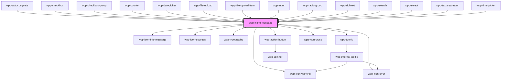

# wpp-inline-message


<!-- Auto Generated Below -->


## Usage

### Angular

```html
<wpp-inline-message
  size="s"
  [message]="message"
  [type]="messageType"
  [showTooltipFrom]="showTooltipFrom"
></wpp-inline-message>

<wpp-inline-message class="item" size="m" message="Warning message" type="warning"></wpp-inline-message>

<wpp-inline-message
  class="item"
  size="l"
  action-btn-text="Action"
  title-text="Title"
  message="Success Message"
  type="success"
  (wppClickCloseBtn)="handleClickCloseBtn()"
  (wppClickActionBtn)="handleClickActionBtn()"
></wpp-inline-message>
```


### React

```tsx
import { WppInlineMessage } from '@wppopen/components-library-react'

export const InlineMessageExample = () => (
  <>
    <WppInlineMessage size="s" message="Warning message" type="warning" showTooltipFrom={10} />
    <WppInlineMessage size="m" message="Warning message" type="warning" />
    <WppInlineMessage
      size="l"
      actionBtnText="Action"
      hideCloseBtn={false}
      titleText="Title"
      message="Success message"
      type="success"
      onWppClickCloseBtn={() => {
        console.log('Clicked Close')
      }}
      onWppClickActionBtn={() => {
        console.log('Clicked Action Btn')
      }}
    />
  </>
)
```


### Vue

```vue
<script setup lang="ts">
import { WppInlineMessage } from '@wppopen/components-library-vue'
</script>

<template>
  <WppInlineMessage size="s" message="Warning message" type="warning" showTooltipFrom="10" />
  <WppInlineMessage size="m" message="Warning message" type="warning" />
  <WppInlineMessage
    class="item"
    size="l"
    actionBtnText="Action"
    titleText="Title"
    message="Success Message"
    type="success"
    @wppClickCloseBtn="handleCloseBtn"
    @wppClickActionBtn="handleActionBtn"
  />
</template>
```


## Properties

| Property          | Attribute           | Description                                                                                                                                                                                                                       | Type                                                 | Default     |
| ----------------- | ------------------- | --------------------------------------------------------------------------------------------------------------------------------------------------------------------------------------------------------------------------------- | ---------------------------------------------------- | ----------- |
| `actionBtnText`   | `action-btn-text`   | Defines the text of the action button. This prop is available only for inline-messages with size="l".                                                                                                                             | `string`                                             | `''`        |
| `hideCloseBtn`    | `hide-close-btn`    | If `true`, the close button on the right of the container for the inline-message with size='l' will not be displayed.                                                                                                             | `boolean`                                            | `false`     |
| `locales`         | --                  | Defines the component locale types.                                                                                                                                                                                               | `{ close?: string \| undefined; }`                   | `{}`        |
| `message`         | `message`           | Defines the inline message.                                                                                                                                                                                                       | `string`                                             | `''`        |
| `showTooltipFrom` | `show-tooltip-from` | Controls message truncation behavior. When set to a number, limits visible characters to that value. When set to 'auto' (default), truncates based on input width. In both cases, full message appears in tooltip when truncated. | `"auto" \| number`                                   | `'auto'`    |
| `size`            | `size`              | Defines the inline message size.                                                                                                                                                                                                  | `"l" \| "m" \| "s"`                                  | `'s'`       |
| `titleText`       | `title-text`        | Defines the title of the component. This prop is available only for inline-messages with size="l".                                                                                                                                | `string`                                             | `''`        |
| `tooltipConfig`   | --                  | Defines the dropdown configuration. Under the hood dropdown using tippy.js, all information about this library and available props you can see via this link `https://atomiks.github.io/tippyjs/v6/all-props/`                    | `DropdownConfig`                                     | `{}`        |
| `type`            | `type`              | Defines the inline message style based on the available types.                                                                                                                                                                    | `"error" \| "information" \| "success" \| "warning"` | `undefined` |


## Events

| Event               | Description                                                                                                  | Type                |
| ------------------- | ------------------------------------------------------------------------------------------------------------ | ------------------- |
| `wppClickActionBtn` | Emitted when the action button is clicked. This event is emitted only for the inline-messages with size="l". | `CustomEvent<void>` |
| `wppClickCloseBtn`  | Emitted when the close button is clicked. This event is emitted only for the inline-messages with size="l".  | `CustomEvent<void>` |


## Shadow Parts

| Part              | Description                          |
| ----------------- | ------------------------------------ |
| `"action-btn"`    |                                      |
| `"container"`     |                                      |
| `"message"`       | message element                      |
| `"message-block"` | Wrapper around the icon and message. |
| `"message-icon"`  | message icon element                 |
| `"title"`         |                                      |
| `"tooltip"`       | tooltip wrapper content              |
| `"wrapper"`       | component wrapper element            |


## CSS Custom Properties

| Name                                                | Description |
| --------------------------------------------------- | ----------- |
| `--wpp-inline-message-border-radius`                |             |
| `--wpp-inline-message-empty-type-text-color`        |             |
| `--wpp-inline-message-error-background-color`       |             |
| `--wpp-inline-message-error-text-color`             |             |
| `--wpp-inline-message-information-background-color` |             |
| `--wpp-inline-message-information-text-color`       |             |
| `--wpp-inline-message-l-icon-margin`                |             |
| `--wpp-inline-message-l-padding`                    |             |
| `--wpp-inline-message-line-height`                  |             |
| `--wpp-inline-message-m-icon-margin`                |             |
| `--wpp-inline-message-m-padding`                    |             |
| `--wpp-inline-message-success-background-color`     |             |
| `--wpp-inline-message-success-text-color`           |             |
| `--wpp-inline-message-text-color`                   |             |
| `--wpp-inline-message-warning-background-color`     |             |
| `--wpp-inline-message-warning-text-color`           |             |
| `--wpp-inline-message-width-l`                      |             |


## Dependencies

### Used by

 - [wpp-autocomplete](../wpp-autocomplete)
 - [wpp-checkbox](../wpp-checkbox)
 - [wpp-checkbox-group](../wpp-checkbox-group)
 - [wpp-counter](../wpp-counter)
 - [wpp-datepicker](../wpp-datepicker)
 - [wpp-file-upload](../wpp-file-upload)
 - [wpp-file-upload-item](../wpp-file-upload/components)
 - [wpp-input](../wpp-input)
 - [wpp-radio-group](../wpp-radio-group)
 - [wpp-richtext](../wpp-richtext)
 - [wpp-search](../wpp-search)
 - [wpp-select](../wpp-select)
 - [wpp-textarea-input](../wpp-textarea-input)
 - [wpp-time-picker](../wpp-time-picker)

### Depends on

- [wpp-icon-warning](../wpp-icon/components/status/status/wpp-icon-warning)
- [wpp-icon-error](../wpp-icon/components/status/status/wpp-icon-error)
- [wpp-icon-info-message](../wpp-icon/components/status/status/wpp-icon-info-message)
- [wpp-icon-success](../wpp-icon/components/status/status/wpp-icon-success)
- [wpp-typography](../wpp-typography)
- [wpp-tooltip](../wpp-tooltip)
- [wpp-action-button](../wpp-action-button)
- [wpp-icon-cross](../wpp-icon/components/add-and-remove/wpp-icon-cross)

### Graph


----------------------------------------------

*Built with [StencilJS](https://stenciljs.com/)*
