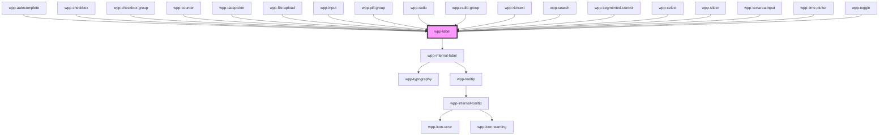

# wpp-label

The label binds its text to another element. Usage of this component you can see below in the section `Dependencies -> Used by`

<!-- Auto Generated Below -->


## Usage

### Angular

```html
<wpp-label [config]='labelConfig' htmlFor='name'></wpp-label>
<wpp-label [config]='labelConfig' htmlFor='name' typography="s-body"></wpp-label>

<wpp-label
  [config]='labelConfig'
  htmlFor='name'
  typography="s-body"
  [optional]='optional'
  [disabled]='disabled'
></wpp-label>
```


### React

```tsx
import { WppLabel } from '@wppopen/components-library-react'

export const LabelExample = () => (
    <>
      <WppLabel config={{ text: 'Label' }} htmlFor="name" />
      <WppLabel config={{ text: 'Label' }} htmlFor="name" typography="s-body" />

      <WppLabel
        config={{ text: 'Label' }}
        htmlFor="name"
        typography="s-body"
        optional={isOptional}
        disabled={isDisabled}
      />
    </>
  )
```


### Vue

```vue

<script setup lang="ts">
import { WppLabel } from '@wppopen/components-library-vue'
</script>

<template>
  <WppLabel :config="{ text: 'Label' }" htmlFor="name" />
  <WppLabel :config="{ text: 'Label' }" htmlFor="name" typography="s-body" />

  <WppLabel
    :config="{ text: 'Label' }"
    htmlFor="name"
    typography="s-body"
    :optional="isOptional"
    :disabled="isDisabled"
  />
</template>


```


## Properties

| Property        | Attribute     | Description                                                                                                                                                                                                    | Type                       | Default                                           |
| --------------- | ------------- | -------------------------------------------------------------------------------------------------------------------------------------------------------------------------------------------------------------- | -------------------------- | ------------------------------------------------- |
| `config`        | --            | Indicates label config                                                                                                                                                                                         | `LabelConfig \| undefined` | `undefined`                                       |
| `description`   | `description` | Indicates description in tooltip when hover on icon                                                                                                                                                            | `string \| undefined`      | `undefined`                                       |
| `disabled`      | `disabled`    | If the component is disabled.                                                                                                                                                                                  | `boolean`                  | `false`                                           |
| `htmlFor`       | `html-for`    | Defines which form element the label is bound to.                                                                                                                                                              | `string \| undefined`      | `undefined`                                       |
| `labelId`       | `label-id`    | Optional unique identifier for the label element. Useful for associating the label with form controls or for accessibility purposes.                                                                           | `string \| undefined`      | `undefined`                                       |
| `optional`      | `optional`    | If **(Optional)** is displayed after the label.                                                                                                                                                                | `boolean`                  | `false`                                           |
| `tooltipConfig` | --            | Defines the dropdown configuration. Under the hood dropdown using tippy.js, all information about this library and available props you can see via this link `https://atomiks.github.io/tippyjs/v6/all-props/` | `DropdownConfig`           | `{     popperOptions: { strategy: 'fixed' },   }` |
| `typography`    | `typography`  | Defines the label typography style.                                                                                                                                                                            | `"s-body" \| "s-strong"`   | `'s-strong'`                                      |


## Shadow Parts

| Part             | Description                           |
| ---------------- | ------------------------------------- |
| `"content"`      | content wrapper element               |
| `"icon"`         | Icon element                          |
| `"info-wrapper"` | wrapper around text and optional text |
| `"optional"`     | optional text                         |
| `"text"`         | label text                            |
| `"wrapper"`      | component wrapper element             |


## Dependencies

### Used by

 - [wpp-autocomplete](../wpp-autocomplete)
 - [wpp-checkbox](../wpp-checkbox)
 - [wpp-checkbox-group](../wpp-checkbox-group)
 - [wpp-counter](../wpp-counter)
 - [wpp-datepicker](../wpp-datepicker)
 - [wpp-file-upload](../wpp-file-upload)
 - [wpp-input](../wpp-input)
 - [wpp-pill-group](../wpp-pill-group)
 - [wpp-radio](../wpp-radio)
 - [wpp-radio-group](../wpp-radio-group)
 - [wpp-richtext](../wpp-richtext)
 - [wpp-search](../wpp-search)
 - [wpp-segmented-control](../wpp-segmented-control)
 - [wpp-select](../wpp-select)
 - [wpp-slider](../wpp-slider)
 - [wpp-textarea-input](../wpp-textarea-input)
 - [wpp-time-picker](../wpp-time-picker)
 - [wpp-toggle](../wpp-toggle)

### Depends on

- [wpp-internal-label](./components/wpp-internal-label)

### Graph


----------------------------------------------

*Built with [StencilJS](https://stenciljs.com/)*
