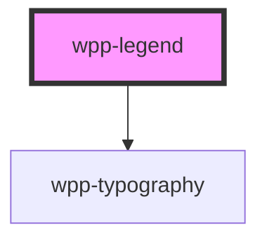

# wpp-legend

<!-- Auto Generated Below -->

## Properties

| Property   | Attribute  | Description | Type                                  | Default                                    |
| ---------- | ---------- | ----------- | ------------------------------------- | ------------------------------------------ |
| `color`    | `color`    |             | ``var(--wpp-${string})` \| undefined` | `'var(--wpp-dataviz-color-cat-neutral-1)'` |
| `disabled` | `disabled` |             | `boolean`                             | `false`                                    |
| `label`    | `label`    |             | `string \| undefined`                 | `undefined`                                |

## Dependencies

### Depends on

- [wpp-typography](../wpp-typography)

### Graph

----------------------------------------------

*Built with [StencilJS](https://stenciljs.com/)*
