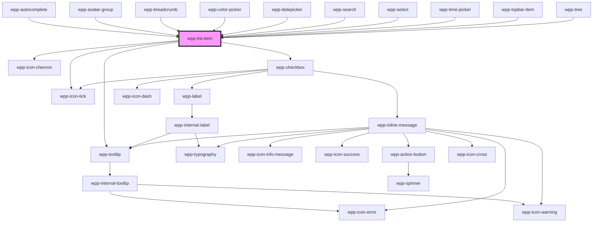

# wpp-list-item


<!-- Auto Generated Below -->


## Usage

### Angular

#### list-item-example.page.html
```html
<div class="container">
  <div class="items">
    <wpp-typography type='xl-heading'>Single-line</wpp-typography>

    <div class="variants">
      <wpp-list-item class="item">
        <wpp-avatar
          size="s"
          src="https://cdna.artstation.com/p/assets/images/images/004/966/196/large/hossein-diba-1.jpg?1487536028"
          slot="left"
        ></wpp-avatar>
        <span slot="subtitle">Subtitle</span>
        <span slot="label">Lorem ipsum dolor sit amet,</span>
        <wpp-tag slot="right" label="Positive" variant="positive"></wpp-tag>
      </wpp-list-item>

      <wpp-list-item class="item" checked>
        <wpp-avatar
          size="s"
          src="https://cdna.artstation.com/p/assets/images/images/004/966/196/large/hossein-diba-1.jpg?1487536028"
          slot="left"
        ></wpp-avatar>
        <span slot="label">Lorem ipsum dolor sit amet,</span>
        <wpp-tag slot="right" label="Positive" variant="positive"></wpp-tag>
      </wpp-list-item>

      <wpp-list-item class="item" disabled>
        <wpp-avatar
          size="s"
          src="https://cdna.artstation.com/p/assets/images/images/004/966/196/large/hossein-diba-1.jpg?1487536028"
          slot="left"
        ></wpp-avatar>
        <span slot="label">Lorem ipsum dolor sit amet,</span>
        <wpp-tag slot="right" label="Positive" variant="positive"></wpp-tag>
      </wpp-list-item>
    </div>
  </div>

  <div class="items">
    <wpp-typography type='xl-heading'>Two-line</wpp-typography>

    <div class="variants">
      <wpp-list-item class="item" multiple>
        <span slot="label">Text</span>
        <span slot="caption">Caption</span>
      </wpp-list-item>

      <wpp-list-item class="item" multiple checked>
        <span slot="label">Text</span>
        <span slot="caption">Caption</span>
      </wpp-list-item>
    </div>

    <div class="variants">
      <wpp-list-item class="item">
        <span slot="subtitle">Subtitle</span>
        <span slot="label">Text</span>
        <span slot="caption">Caption</span>
        <wpp-avatar
          size="s"
          src="https://cdna.artstation.com/p/assets/images/images/004/966/196/large/hossein-diba-1.jpg?1487536028"
          slot="left"
        ></wpp-avatar>
        <wpp-icon-mail slot="right"></wpp-icon-mail>
      </wpp-list-item>

      <wpp-list-item class="item" checked>
        <span slot="label">Text</span>
        <span slot="caption">Caption</span>
        <wpp-avatar
          size="s"
          src="https://cdna.artstation.com/p/assets/images/images/004/966/196/large/hossein-diba-1.jpg?1487536028"
          slot="left"
        ></wpp-avatar>
        <wpp-icon-mail slot="right"></wpp-icon-mail>
      </wpp-list-item>

      <wpp-list-item class="item" disabled>
        <span slot="label">Text</span>
        <span slot="caption">Caption</span>
        <wpp-avatar
          size="s"
          src="https://cdna.artstation.com/p/assets/images/images/004/966/196/large/hossein-diba-1.jpg?1487536028"
          slot="left"
        ></wpp-avatar>
        <wpp-icon-mail slot="right"></wpp-icon-mail>
      </wpp-list-item>
    </div>

    <wpp-list-item selectable class="item">
      <span slot="label">Selectable Item</span>
      <span slot="caption">Caption</span>
      <wpp-icon-more slot="right"></wpp-icon-more>
    </wpp-list-item>

    <wpp-list-item class="item" selectable multiple>
      <span slot="label">Menu context example</span>
      <span slot="caption">Context check</span>
      <wpp-menu-context slot="right">
        <wpp-action-button slot="trigger-element" variant="secondary">
          <wpp-icon-more slot="icon-start"></wpp-icon-more>
        </wpp-action-button>
        <div>
          <wpp-list-item>
            <p slot="label">Item 1</p>
          </wpp-list-item>
          <wpp-list-item>
            <p slot="label">Item 2</p>
          </wpp-list-item>
        </div>
      </wpp-menu-context>
    </wpp-list-item>
  </div>

  <div class="items" style="width: 100%">
    <h3>With custom typography</h3>
    <div class="variants" style="flex-direction: column">
      <wpp-list-item [labelTypography]="labelTypography" [captionTypography]="captionTypography">
        <span slot="caption">Big Heading</span>
        <span slot="label">Big Heading</span>
      </wpp-list-item>
    </div>
  </div>
</div>
```

#### list-item-example.page.ts
```tsx
import { Component } from '@angular/core';

@Component({…})

export class ListItemExample {
  public checked: boolean = true
  public multiple: boolean = true

  public handleListItemChange(event: CustomEvent): void {
    console.log('event :>> ', event.detail)
  }

  public labelTypography = {
    type: 'l-body',
    color: 'var(--wpp-grey-color-1000)',
  }

  public captionTypography = {
    type: 'm-body',
    color: 'var(--wpp-grey-color-500)',
  }
}
```


### React

```tsx
import React from 'react'
import {
  WppActionButton,
  WppAvatar,
  WppIconChevron,
  WppIconMail,
  WppListItem,
} from '@platform-ui-kit/components-library-react'
import { ListItemChangeEventDetail } from '@platform-ui-kit/components-library'

export const ListItemsExample = () => {
  const handleListItemClick = (event: CustomEvent<ListItemChangeEventDetail>) => {
    console.log('event.detail => ', event.detail.checked)
  }

  return (
    <>
      <WppListItem>
        <p slot="label">Text</p>
        <WppActionButton variant="secondary" slot="right">
          <WppIconAddCircle slot="icon-start" />
        </WppActionButton>
      </WppListItem>

      <WppListItem selectable onWppChangeListItem={handleListItemClick}>
        <span slot="subtitle">Subtitle</span>
        <span slot="label">Text</span>
        <span slot="caption">Caption</span>
        <WppIconChevron slot="right" />
      </WppListItem>

      <WppListItem checked>
        <span slot="subtitle">Subtitle</span>
        <span slot="label">Text</span>
        <span slot="caption">Caption</span>
        <WppActionButton variant="secondary" slot="right">
          <WppIconMail slot="icon-start" />
        </WppActionButton>
        <WppAvatar
          size="s"
          src="https://cdna.artstation.com/p/assets/images/images/004/966/196/large/hossein-diba-1.jpg?1487536028"
          slot="left"
        />
      </WppListItem>

      <WppListItem
        labelTypography={{
          type: 'l-body',
          color: 'var(--wpp-grey-color-1000)',
        }}
        captionTypography={{
          type: 'm-body',
        }}
      >
        <span slot="label">Big Heading</span>
        <span slot="caption">Caption</span>
      </WppListItem>
    </>
  )
}
```


### Vue

```vue

<script setup lang="ts">
import {
  WppActionButton,
  WppAvatar,
  WppIconChevron,
  WppIconMail,
  WppListItem,
} from '@platform-ui-kit/components-library-vue'

const handleListItemClick = (ev: CustomEvent) => console.log("change item: ", ev.detail);
</script>

<template>
  <WppListItem>
    <p slot="label">Text</p>
    <WppActionButton variant="secondary" slot="right">
      <WppIconPlus slot="icon-start" />
    </WppActionButton>
  </WppListItem>

  <WppListItem selectable @wppChangeListItem="handleListItemClick">
    <span slot="subtitle">Subtitle</span>
    <span slot="label">Text</span>
    <span slot="caption">Caption</span>
    <WppIconChevron slot="right" />
  </WppListItem>

  <WppListItem checked>
    <span slot="subtitle">Subtitle</span>
    <span slot="label">Text</span>
    <span slot="caption">Caption</span>
    <WppActionButton variant="secondary" slot="right">
      <WppIconMail slot="icon-start" />
    </WppActionButton>
    <WppAvatar
      size="s"
      src="https://cdna.artstation.com/p/assets/images/images/004/966/196/large/hossein-diba-1.jpg?1487536028"
      slot="left"
    />
  </WppListItem>

  <WppListItem
    :labelTypography="{
      type: 'l-body',
      color: 'var(--wpp-grey-color-1000)'
    }"
    :captionTypography="{
      type: 'm-body',
    }"
  >
    <span slot="label">Big Heading</span>
    <span slot="caption">Caption</span>
  </WppListItem>
</template>

```


## Properties

| Property             | Attribute         | Description                                                                                           | Type                                                                                                                                           | Default     |
| -------------------- | ----------------- | ----------------------------------------------------------------------------------------------------- | ---------------------------------------------------------------------------------------------------------------------------------------------- | ----------- |
| `active`             | `active`          | If the component is active.                                                                           | `boolean`                                                                                                                                      | `false`     |
| `captionTypography`  | --                | Custom Typography for caption text                                                                    | `undefined \| { color?: ThemeColorValue \| undefined; type?: TypographyType \| undefined; }`                                                   | `undefined` |
| `checkboxName`       | `checkbox-name`   | Value for a name attribute on checkbox input Used in WppSelect component                              | `string \| undefined`                                                                                                                          | `undefined` |
| `checked`            | `checked`         | If `true`, the component is checked.                                                                  | `boolean`                                                                                                                                      | `false`     |
| `containerState`     | `container-state` | Show if the item list container is visible.                                                           | `"hidden" \| "shown" \| "tooltipTrigger" \| undefined`                                                                                         | `undefined` |
| `disabled`           | `disabled`        | If `true`, the component is disabled                                                                  | `boolean`                                                                                                                                      | `false`     |
| `highlight`          | `highlight`       | If `true`, it will be used to highlight matching parts of the label or caption text in the component. | `string`                                                                                                                                       | `''`        |
| `isExtended`         | `is-extended`     | If the component is extended.                                                                         | `boolean`                                                                                                                                      | `false`     |
| `label`              | `label`           | Indicates the label of list item                                                                      | `string \| undefined`                                                                                                                          | `''`        |
| `labelTooltipConfig` | --                | Configuration of tooltip's dropdown.                                                                  | `DropdownConfig`                                                                                                                               | `{}`        |
| `labelTypography`    | --                | Custom Typography for label text                                                                      | `undefined \| { color?: ThemeColorValue \| undefined; type?: TypographyType \| undefined; }`                                                   | `undefined` |
| `linkConfig`         | --                | If you pass a href here menu-item will be rendered as a tag. This config allow you to customize link  | `{ href?: string \| undefined; rel?: string \| undefined; target?: string \| undefined; onClick?: ((e: PointerEvent) => void) \| undefined; }` | `{}`        |
| `multiple`           | `multiple`        | If `true`, the component is multiple.                                                                 | `boolean`                                                                                                                                      | `false`     |
| `nonInteractive`     | `non-interactive` | If 'false', the component will have hover/active style states                                         | `boolean`                                                                                                                                      | `false`     |
| `selectable`         | `selectable`      | If `true`, the component is selectable.                                                               | `boolean`                                                                                                                                      | `false`     |
| `tooltipConfig`      | --                | Tooltip config for the slots.                                                                         | `TooltipConfig`                                                                                                                                | `{}`        |
| `value`              | `value`           | Indicates the value of list item                                                                      | `number \| string \| undefined \| { [x: string]: any; }`                                                                                       | `undefined` |


## Events

| Event               | Description                            | Type                                     |
| ------------------- | -------------------------------------- | ---------------------------------------- |
| `wppChangeListItem` | Emitted when the list item was clicked | `CustomEvent<ListItemChangeEventDetail>` |


## Methods

### `setFocus() => Promise<void>`

Sets focus on the list-item element.

#### Returns

Type: `Promise<void>`


## Slots

| Slot         | Description                                                                                                          |
| ------------ | -------------------------------------------------------------------------------------------------------------------- |
| `"caption"`  | Caption text                                                                                                         |
| `"label"`    | Main text                                                                                                            |
| `"left"`     | May contain an icon or avatar that will be placed before the label, e.g. a plus icon, avatar                         |
| `"right"`    | May contain an icon, text or tag, action button that will be placed after the label, e.g. a plus icon, action button |
| `"subtitle"` | Subtitle text                                                                                                        |


## Shadow Parts

| Part              | Description                                        |
| ----------------- | -------------------------------------------------- |
| `"body-wrapper"`  | Wrapper that contains label and caption            |
| `"checkbox"`      | checkbox element                                   |
| `"highlight"`     |                                                    |
| `"icon-active"`   |                                                    |
| `"icon-extended"` |                                                    |
| `"info-wrapper"`  | Wrapper that contains left-icon, label and caption |
| `"item"`          | Wrapper that contains label, icon, caption         |
| `"ul-wrapper"`    |                                                    |


## CSS Custom Properties

| Name                                               | Description |
| -------------------------------------------------- | ----------- |
| `--wpp-list-item-bg-color`                         |             |
| `--wpp-list-item-bg-color-active`                  |             |
| `--wpp-list-item-bg-color-hover`                   |             |
| `--wpp-list-item-bg-color-selected`                |             |
| `--wpp-list-item-border-radius`                    |             |
| `--wpp-list-item-caption-text-color`               |             |
| `--wpp-list-item-height`                           |             |
| `--wpp-list-item-icon-color-active`                |             |
| `--wpp-list-item-icon-color-hover`                 |             |
| `--wpp-list-item-icons-color-disabled`             |             |
| `--wpp-list-item-label-text-color-selected`        |             |
| `--wpp-list-item-label-text-color-selected-active` |             |
| `--wpp-list-item-label-text-color-selected-hover`  |             |
| `--wpp-list-item-left-icon-color`                  |             |
| `--wpp-list-item-left-icon-color-active`           |             |
| `--wpp-list-item-left-icon-color-hover`            |             |
| `--wpp-list-item-left-icon-color-selected`         |             |
| `--wpp-list-item-left-wrapper-margin-right`        |             |
| `--wpp-list-item-padding`                          |             |
| `--wpp-list-item-right-icon-color-selected`        |             |
| `--wpp-list-item-right-text-color`                 |             |
| `--wpp-list-item-right-text-color-disabled`        |             |
| `--wpp-list-item-right-wrapper-margin-right`       |             |
| `--wpp-list-item-text-color-disabled`              |             |
| `--wpp-list-item-width`                            |             |
| `--wpp-list-item-with-caption-height`              |             |
| `--wpp-list-item-with-right-icon-padding`          |             |


## Dependencies

### Used by

 - [wpp-autocomplete](../wpp-autocomplete)
 - [wpp-avatar-group](../wpp-avatar-group)
 - [wpp-breadcrumb](../wpp-breadcrumb)
 - [wpp-color-picker](../wpp-color-picker)
 - [wpp-datepicker](../wpp-datepicker)
 - [wpp-search](../wpp-search)
 - [wpp-select](../wpp-select)
 - [wpp-time-picker](../wpp-time-picker)
 - [wpp-topbar-item](../wpp-topbar/components/wpp-topbar-item)
 - [wpp-tree](../wpp-tree)

### Depends on

- [wpp-icon-chevron](../wpp-icon/components/arrows/arrows/wpp-icon-chevron)
- [wpp-icon-tick](../wpp-icon/components/system/controls/wpp-icon-tick)
- [wpp-checkbox](../wpp-checkbox)
- [wpp-tooltip](../wpp-tooltip)

### Graph


----------------------------------------------

*Built with [StencilJS](https://stenciljs.com/)*
