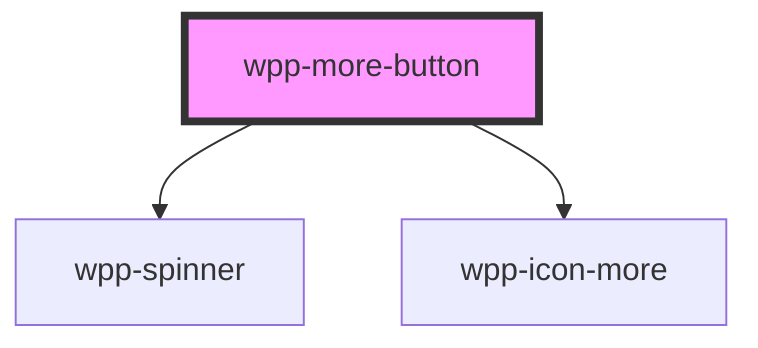

# wpp-more-button


<!-- Auto Generated Below -->


## Usage

### Angular

```ts
import { Component } from '@angular/core'

@Component({
  ...,
})
export class WppMoreButtons {
  public ariaProps = { label: 'More items menu' }

  public handleClick = () => {
    console.log('Clicked')
  }
}
```

```html
<div class="moreBtnSection">
  <wpp-more-button
    (click)="handleClick()"
    ariaProps="ariaProps"
    data-testid="default-more-btn-m"
    class="moreBtnItem"
  ></wpp-more-button>
  <wpp-more-button
    (click)="handleClick()"
    ariaProps="ariaProps"
    data-testid="default-more-btn-s"
    class="moreBtnItem"
    size="s"
  ></wpp-more-button>
</div>
```

```scss
.moreBtnSection {
  margin-bottom: 20px;

  .moreBtnItem {
    margin-right: 100px;

    &:last-child {
      margin-right: 0;
    }
  }
}
```


### React

```tsx
import { WppMoreButton } from '@wppopen/components-library-react'

export const WppMoreButtons = () => {
  const handleClick = () => {
    console.log('Clicked')
  }

  return (
    <div className={styles.moreBtnSection}>
      <WppMoreButton
        onClick={handleClick}
        ariaProps={{ label: 'More items menu' }}
        data-testid="default-more-btn-m"
        className={styles.moreBtnItem}
      ></WppMoreButton>
      <WppMoreButton
        onClick={handleClick}
        ariaProps={{ label: 'More items menu' }}
        data-testid="default-more-btn-s"
        className={styles.moreBtnItem}
        size="s"
      ></WppMoreButton>
    </div>
  )
}
```

```scss
.moreBtnSection {
  margin-bottom: 20px;

  .moreBtnItem {
    margin-right: 100px;

    &:last-child {
      margin-right: 0;
    }
  }
}
```


### Vue

```vue
<script setup lang="ts">
import { WppMoreButton } from '@wppopen/components-library-vue'
</script>

<template>
  <div class="moreBtnSection">
    <WppMoreButton
      @wppClick="() => console.log('Clicked')"
      :ariaProps="{ label: 'More items menu' }"
      data-testid="default-more-btn-m"
      class="moreBtnItem"
    ></WppMoreButton>
    <WppMoreButton
      @wppClick="() => console.log('Clicked')"
      :ariaProps="{ label: 'More items menu' }"
      data-testid="default-more-btn-s"
      class="moreBtnItem"
      size="s"
    ></WppMoreButton>
  </div>
</template>

<style scoped>
.subtitle {
  display: block;
  margin: 10px 0;
}

.moreBtnSection {
  margin-bottom: 20px;
}

.moreBtnItem {
  margin-right: 100px;
}

.moreBtnItem:last-child {
  margin-right: 0;
}
</style>
```


## Properties

| Property    | Attribute  | Description                                                                | Type                  | Default     |
| ----------- | ---------- | -------------------------------------------------------------------------- | --------------------- | ----------- |
| `ariaProps` | --         | Contains the button `aria-` props.                                         | `AriaProps`           | `{}`        |
| `disabled`  | `disabled` | If the button is disabled.                                                 | `boolean`             | `false`     |
| `loading`   | `loading`  | If the component is in loading state.                                      | `boolean`             | `false`     |
| `name`      | `name`     | Defines the button name.                                                   | `string \| undefined` | `undefined` |
| `size`      | `size`     | Indicates the size of the button. Different sizes have different paddings. | `"m" \| "s"`          | `'m'`       |


## Methods

### `setFocus() => Promise<void>`

Method that sets focus on the native button.

#### Returns

Type: `Promise<void>`


## Dependencies

### Depends on

- [wpp-spinner](../wpp-spinner)
- [wpp-icon-more](../wpp-icon/components/system/menu/wpp-icon-more)

### Graph


----------------------------------------------

*Built with [StencilJS](https://stenciljs.com/)*
