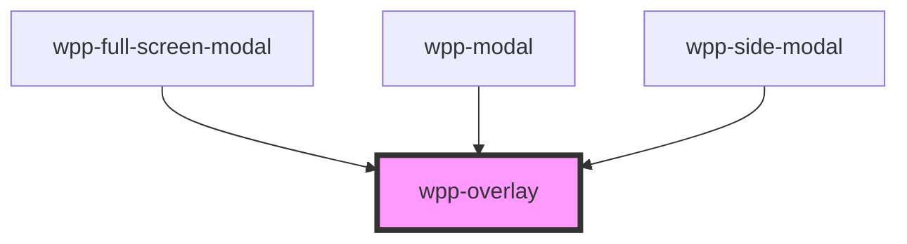

# wpp-overlay


<!-- Auto Generated Below -->


## Usage

### Angular

```ts
import { Component } from '@angular/core'

@Component({
  selector: 'overlay-example',
  templateUrl: './overlay-example.page.html',
  styleUrls: ['./overlay-example.page.scss'],
})
export class OverlayExamplePage {
  isVisible = true

  handleOverlayChange() {
    console.log('Overlay Clicked:')
  }

  toggleOverlay(): void {
    this.isVisible = !this.isVisible
  }
}
```

```html
<div class="container" data-testid="overlay-container">
  <wpp-typography class="title" type="2xl-heading"> Overlay component </wpp-typography>

  <div class="scenarios">
    <wpp-typography class="scenario-title" type="xl-heading">
      Scenario: render overlay in the body of a page.
    </wpp-typography>

    <div class="section">
      <div class="header">
        <wpp-typography class="text" type="s-body">Header</wpp-typography>
      </div>
      <div class="body">
        <wpp-typography class="text" type="s-body">Body</wpp-typography>
        <wpp-overlay [isVisible]="isVisible" (overlayClose)="handleOverlayChange()"></wpp-overlay>
      </div>
    </div>
  </div>

  <wpp-button class="button" variant="primary" (click)="toggleOverlay()"> Toggle overlay </wpp-button>
</div>
```

```scss
.container {
  padding: 20px 50px;

  .text {
    margin: 10px 0;
    display: block;
  }

  .scenarios {
    .scenarioTitle {
      margin-bottom: 20px;
    }

    .section {
      width: 100%;
      height: 500px;
      display: flex;
      align-items: center;
      justify-content: center;
      flex-direction: column;
      margin-bottom: 20px;
      border: 1px solid var(--wpp-grey-color-300);
      border-radius: var(--wpp-border-radius-m);
      background-color: var(--wpp-grey-color-100);

      .header {
        height: 50px;
        border-bottom: 1px solid var(--wpp-grey-color-300);
        width: 100%;
        padding-left: 20px;
        box-sizing: border-box;
      }

      .body {
        height: 100%;
        width: 100%;
        position: relative;
        padding: 20px;
        box-sizing: border-box;
      }
    }
  }
}
```


### React

```tsx
import React, { useState } from 'react'
import { WppOverlay, WppTypography, WppButton } from '@platform-ui-kit/components-library-react'
import styles from './Overlay.module.scss'

const OverlayExample = () => {
  const [isVisible, setIsVisible] = useState<boolean>(true)

  const handleOverlayClick = () => {
    console.log('Overlay Clicked:')
  }

  return (
    <div className={styles.container}>
      <div className={styles.scenarios}>
        <WppTypography className={styles.scenarioTitle} type="xl-heading">
          Scenario: render overlay in the body of a page.
        </WppTypography>

        <div className={styles.section}>
          <div className={styles.header}>
            <WppTypography className={styles.text} type="s-body">
              Header
            </WppTypography>
          </div>
          <div className={styles.body}>
            <WppTypography className={styles.text} type="s-body">
              Body
            </WppTypography>
            <WppOverlay isVisible={isVisible} onWppClick={handleOverlayClick} />
          </div>
        </div>
      </div>

      <WppButton
        className={styles.button}
        variant="primary"
        onClick={() => {
          setIsVisible(!isVisible)
        }}
      >
        Toggle overlay
      </WppButton>
    </div>
  )
}
```

```scss
.container {
  padding: 20px 50px;

  .text {
    margin: 10px 0;
    display: block;
  }

  .scenarios {
    .scenarioTitle {
      margin-bottom: 20px;
    }

    .section {
      width: 100%;
      height: 500px;
      display: flex;
      align-items: center;
      justify-content: center;
      flex-direction: column;
      margin-bottom: 20px;
      border: 1px solid var(--wpp-grey-color-300);
      border-radius: var(--wpp-border-radius-m);
      background-color: var(--wpp-grey-color-100);

      .header {
        height: 50px;
        border-bottom: 1px solid var(--wpp-grey-color-300);
        width: 100%;
        padding-left: 20px;
        box-sizing: border-box;
      }

      .body {
        height: 100%;
        width: 100%;
        position: relative;
        padding: 20px;
        box-sizing: border-box;
      }
    }
  }
}
```


### Vue

<script setup>
import { ref } from 'vue'
import { WppOverlay, WppTypography, WppButton } from '@platform-ui-kit/components-library-vue'

const isVisible = ref(true)

function handleOverlayChange() {
  console.log('Overlay Clicked:')
}

function toggleOverlay() {
  isVisible.value = !isVisible.value
}
</script>

<template>
  <div class="container" data-testid="overlay-container">
    <WppTypography class="title" type="2xl-heading"> Overlay component </WppTypography>

    <div class="scenarios">
      <WppTypography class="scenarioTitle" type="xl-heading">
        Scenario: render overlay in the body of a page.
      </WppTypography>

      <div class="section">
        <div class="header">
          <WppTypography class="text" type="s-body"> Header </WppTypography>
        </div>
        <div class="body">
          <WppTypography class="text" type="s-body"> Body </WppTypography>
          <WppOverlay :isVisible="isVisible" @wppClick="handleOverlayChange" />
        </div>
      </div>
    </div>

    <WppButton class="button" variant="primary" @click="toggleOverlay"> Toggle overlay </WppButton>

  </div>
</template>

<style scoped>
.container {
  padding: 20px 50px;
}

.text {
  margin: 10px 0;
  display: block;
}

.scenarioTitle {
  margin-bottom: 20px;
}

.section {
  width: 100%;
  height: 500px;
  display: flex;
  align-items: center;
  justify-content: center;
  flex-direction: column;
  margin-bottom: 20px;
  border: 1px solid var(--wpp-grey-color-300);
  border-radius: var(--wpp-border-radius-m);
  background-color: var(--wpp-grey-color-100);
}

.header {
  height: 50px;
  border-bottom: 1px solid var(--wpp-grey-color-300);
  width: 100%;
  padding-left: 20px;
  box-sizing: border-box;
}

.body {
  height: 100%;
  width: 100%;
  position: relative;
  padding: 20px;
  box-sizing: border-box;
}
</style>


## Properties

| Property    | Attribute    | Description                             | Type      | Default           |
| ----------- | ------------ | --------------------------------------- | --------- | ----------------- |
| `isVisible` | `is-visible` | Controls the visibility of the overlay. | `boolean` | `false`           |
| `zIndex`    | `z-index`    | Defines the z-index of the WppOverlay.  | `number`  | `Z_INDEX.OVERLAY` |


## Events

| Event      | Description                          | Type                |
| ---------- | ------------------------------------ | ------------------- |
| `wppClick` | Emitted when the overlay is clicked. | `CustomEvent<void>` |


## Dependencies

### Used by

 - [wpp-full-screen-modal](../wpp-full-screen-modal)
 - [wpp-modal](../wpp-modal)
 - [wpp-side-modal](../wpp-side-modal)

### Graph


----------------------------------------------

*Built with [StencilJS](https://stenciljs.com/)*
