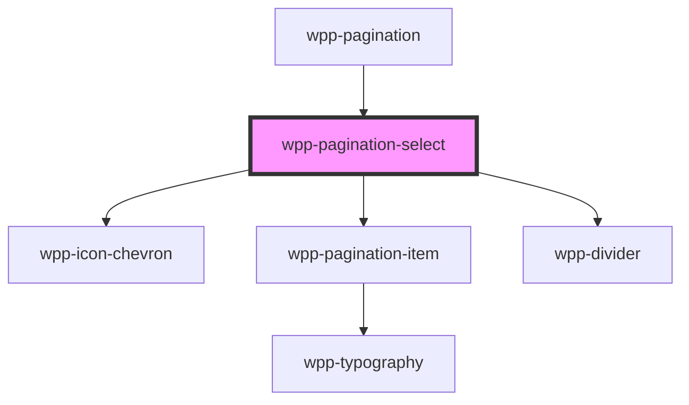

# wpp-pagination-select

The pagination-select component enables the user to select a specific page from a range of pages.

<!-- Auto Generated Below -->


## Usage

### Angular

```html
<wpp-pagination-select
  [count]='count'
  [activePageNumber]='activePageNumber'
  [pageSelectThreshold]='pageSelectThreshold'
></wpp-pagination-select>
```


### React

```tsx
import { WppPaginationSelect } from '@wppopen/components-library-react'
import { PageChangeEventDetail } from '@wppopen/components-library'

export const PaginationSelectExample = () => {
  const handleChange = (event: CustomEvent<PageChangeEventDetail>) => {
    console.log('value :>> ', event.detail.page);
  }

  return (
    <WppPaginationSelect
      count={10}
      activePageNumber={6}
      pageSelectThreshold={5}
      onWppChange={handleChange}
    />
  )
}
```


## Properties

| Property              | Attribute               | Description                                                                                                                                                           | Type     | Default     |
| --------------------- | ----------------------- | --------------------------------------------------------------------------------------------------------------------------------------------------------------------- | -------- | ----------- |
| `activePageNumber`    | `active-page-number`    | Defines the active page number.                                                                                                                                       | `number` | `1`         |
| `count` _(required)_  | `count`                 | Defines the total number of items.                                                                                                                                    | `number` | `undefined` |
| `pageSelectThreshold` | `page-select-threshold` | Defines a threshold for pages to display. When the number of pages to display exceeds this value, the component displays a numeric selector instead of the page list. | `number` | `8`         |


## Events

| Event       | Description                | Type                                           |
| ----------- | -------------------------- | ---------------------------------------------- |
| `wppChange` | Emitted active page number | `CustomEvent<PaginationPageChangeEventDetail>` |


## Shadow Parts

| Part             | Description                  |
| ---------------- | ---------------------------- |
| `"divider"`      | divider element              |
| `"icon-left"`    | icon left element            |
| `"icon-right"`   | icon right element           |
| `"input"`        | Pagination input element     |
| `"page-item"`    | page item element            |
| `"page-numeric"` | page numeric wrapper element |
| `"page-select"`  | page select wrapper element  |
| `"total"`        | total text element           |


## CSS Custom Properties

| Name                                               | Description |
| -------------------------------------------------- | ----------- |
| `--wpp-pagination-icons-color`                     |             |
| `--wpp-pagination-icons-color-active`              |             |
| `--wpp-pagination-icons-color-disabled`            |             |
| `--wpp-pagination-icons-color-hover`               |             |
| `--wpp-pagination-icons-first-border-color-focus`  |             |
| `--wpp-pagination-icons-second-border-color-focus` |             |
| `--wpp-pagination-input-border-color`              |             |
| `--wpp-pagination-input-border-color-active`       |             |
| `--wpp-pagination-input-border-color-hover`        |             |
| `--wpp-pagination-input-border-style`              |             |
| `--wpp-pagination-input-border-width`              |             |
| `--wpp-pagination-input-first-border-color-focus`  |             |
| `--wpp-pagination-input-second-border-color-focus` |             |
| `--wpp-pagination-total-count-color`               |             |


## Dependencies

### Used by

 - [wpp-pagination](../..)

### Depends on

- [wpp-icon-chevron](../../../wpp-icon/components/arrows/arrows/wpp-icon-chevron)
- [wpp-pagination-item](../wpp-pagination-item)
- [wpp-divider](../../../wpp-divider)

### Graph


----------------------------------------------

*Built with [StencilJS](https://stenciljs.com/)*
