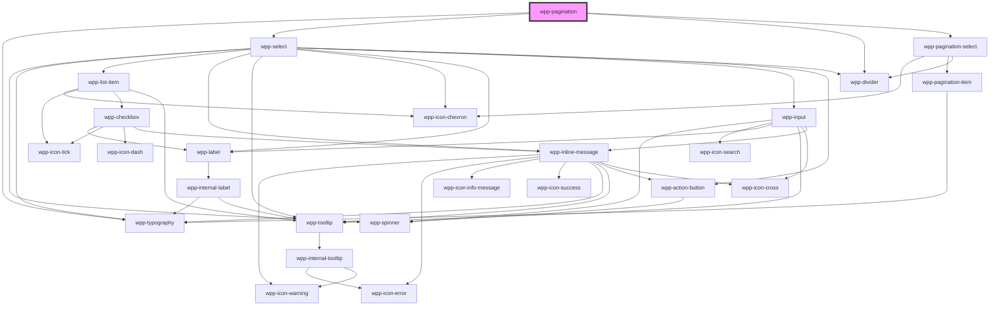

# wpp-pagination

Create a component that allows dividing large amounts of content into smaller chunks across multiple pages and selecting the number of items displayed on each page.

<!-- Auto Generated Below -->


## Usage

### Angular

```html
<wpp-pagination
  [count]='count'
  [itemsPerPage]='itemsPerPage'
  [selectedItemPerPage]='selectedItemPerPage'
  [pageSelectThreshold]='pageSelectThreshold'
  [activePageNumber]='activePageNumber'
></wpp-pagination>
```


### React

```tsx
import { useState } from 'react'
import {
  WppTable,
  WppTableCell,
  WppTableHeadCell,
  WppTableRow,
  WppAvatar,
  WppPagination,
} from '@wppopen/components-library-react'
import { PaginationChangeEventDetail } from '@wppopen/components-library'

import { dataList } from './consts'

import './Table.css'

export const PaginationExample = () => {
  const itemsPerPage = [3, 5, 10]

  const [page, setPage] = useState(1)
  const [perPage, setPerPage] = useState(itemsPerPage[0])

  const handlePaginationChange = (event: CustomEvent<PaginationChangeEventDetail>) => {
    setPage(event.detail.page)
    setPerPage(event.detail.itemsPerPage)
  }

  const dataToDisplay = [...dataList.slice((page - 1) * perPage, page * perPage)]

  return (
    <div className="table-page">
      <WppTable>
        <WppTableRow slot="table-head">
          <WppTableHeadCell>
            <p className="text">ID</p>
          </WppTableHeadCell>
          <WppTableHeadCell>
            <p className="text">First Name</p>
          </WppTableHeadCell>
          <WppTableHeadCell>
            <p className="text">Height</p>
          </WppTableHeadCell>
        </WppTableRow>
        {dataToDisplay.map(user => (
          <WppTableRow slot="table-body">
            <WppTableCell>
              <p className="text">{user.id}</p>
            </WppTableCell>
            <WppTableCell>
              <WppAvatar name={user.firstName} className="avatar" />
              <p className="text">{user.firstName}</p>
            </WppTableCell>
            <WppTableCell>
              <p className="text">{user.height}</p>
            </WppTableCell>
          </WppTableRow>
        ))}
      </WppTable>
      <WppPagination
        count={dataList.length}
        itemsPerPage={itemsPerPage}
        onWppChange={handlePaginationChange}
      />
    </div>
  )
}
```


### Vue

```vue

<script setup lang="ts">
import { ref } from "vue"

import {
  WppTable,
  WppTableCell,
  WppTableHeadCell,
  WppTableRow,
  WppAvatar,
  WppPagination,
} from '@wppopen/components-library-vue'

import { dataList } from './consts'

const itemsPerPage = [3, 5, 10]

const page = ref(1)
const perPage = ref(itemsPerPage[0])

const handlePaginationChange = (event: CustomEvent) => {
  page.value = event.detail.page
  perPage.value = event.detail.itemsPerPage
}

const dataToDisplay = [...dataList.slice((page - 1) * perPage, page * perPage)]
</script>

<template>
  <div class="table-page">
    <WppTable>
      <WppTableRow slot="table-head">
        <WppTableHeadCell>
          <p class="text">ID</p>
        </WppTableHeadCell>
        <WppTableHeadCell>
          <p class="text">First Name</p>
        </WppTableHeadCell>
        <WppTableHeadCell>
          <p class="text">Height</p>
        </WppTableHeadCell>
      </WppTableRow>
      <WppTableRow v-if="user in dataToDisplay" slot="table-body">
        <WppTableCell>
          <p class="text">{{ user.id }}</p>
        </WppTableCell>
        <WppTableCell>
          <WppAvatar :name="user.firstName" class="avatar" />
          <p class="text">{{ user.firstName }}</p>
        </WppTableCell>
        <WppTableCell>
          <p class="text">{{ user.height }}</p>
        </WppTableCell>
      </WppTableRow>
    </WppTable>
    <WppPagination
      :count="dataList.length"
      :itemsPerPage="itemsPerPage"
      @wppChange="handlePaginationChange"
    />
  </div>
</template>


```


## Properties

| Property              | Attribute                | Description                                                                                                                                                                                 | Type                                                                                             | Default           |
| --------------------- | ------------------------ | ------------------------------------------------------------------------------------------------------------------------------------------------------------------------------------------- | ------------------------------------------------------------------------------------------------ | ----------------- |
| `activePageNumber`    | `active-page-number`     | Defines the active page number.                                                                                                                                                             | `number`                                                                                         | `1`               |
| `count` _(required)_  | `count`                  | Defines the total number of items.                                                                                                                                                          | `number`                                                                                         | `undefined`       |
| `dropdownConfig`      | --                       | Dropdown config, under the hood dropdown using tippy.js, all information about this library and available props you can see via this link `https://atomiks.github.io/tippyjs/v6/all-props/` | `DropdownConfig`                                                                                 | `{}`              |
| `itemsPerPage`        | --                       | Defines the menu items.                                                                                                                                                                     | `number[]`                                                                                       | `[5, 10, 20, 50]` |
| `locales`             | --                       | Indicates locales for pagination component                                                                                                                                                  | `{ itemsPerPage?: string \| undefined; of?: string \| undefined; items?: string \| undefined; }` | `{}`              |
| `pageSelectThreshold` | `page-select-threshold`  | Defines a threshold for pages to display. When the number of pages to display exceeds this value, the component displays a numeric selector instead of the page list.                       | `number`                                                                                         | `8`               |
| `selectedItemPerPage` | `selected-item-per-page` | Defines a menu item that serves as the initial value.                                                                                                                                       | `number \| undefined`                                                                            | `undefined`       |


## Events

| Event       | Description                                                    | Type                                       |
| ----------- | -------------------------------------------------------------- | ------------------------------------------ |
| `wppChange` | Emitted when selected page or number of items per page changes | `CustomEvent<PaginationChangeEventDetail>` |


## Shadow Parts

| Part                | Description                   |
| ------------------- | ----------------------------- |
| `"body"`            | Main content wrapper          |
| `"divider"`         | divider element               |
| `"page-select"`     | page select element           |
| `"per-page-item"`   | per-page item element         |
| `"per-page-label"`  | per-page label text element   |
| `"pre-page-select"` | per-page select element       |
| `"range"`           | pagination range text element |


## CSS Custom Properties

| Name                                  | Description |
| ------------------------------------- | ----------- |
| `--wpp-pagination-options-list-width` |             |
| `--wpp-pagination-text-color`         |             |


## Dependencies

### Depends on

- [wpp-typography](../wpp-typography)
- [wpp-select](../wpp-select)
- [wpp-divider](../wpp-divider)
- [wpp-pagination-select](./components/wpp-pagination-select)

### Graph


----------------------------------------------

*Built with [StencilJS](https://stenciljs.com/)*
