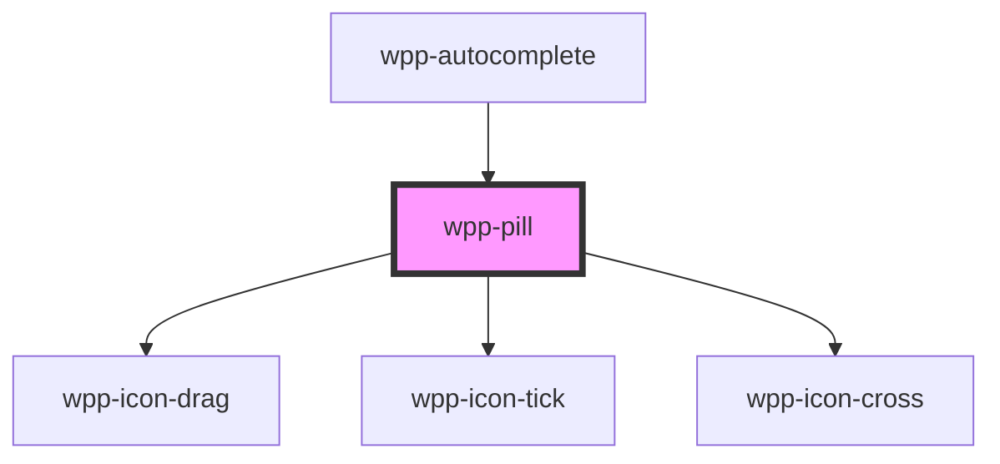

# wpp-pill

Create a label that helps to qualify information. Must be used in `wpp-pill-group` only.

<!-- Auto Generated Below -->


## Usage

### Angular

```html
<wpp-pill>Text</wpp-pill>

<wpp-pill
  type='single'
  label='Text'
  name='chip'
  size='m'
></wpp-pill>

<wpp-pill
  type='multiple'
  label='Text'
  name='chip1'
  [disabled]='disabled'
  [checked]='checked'
></wpp-pill>
```


### React

```tsx
import { WppPill } from '@wppopen/components-library-react'

export const Example = () => (
  <>
    <WppPill>Text</WppPill>

    <WppPill
      type='single'
      label="Text"
      name="chip"
      size="m"
    />

    <WppPill
      type='multiple'
      label="Text"
      name="chip1"
      disabled={isDisabled}
      checked={isChecked}
    ></WppPill>
  </>
)
```


## Properties

| Property    | Attribute    | Description                                                                                                         | Type                                                 | Default     |
| ----------- | ------------ | ------------------------------------------------------------------------------------------------------------------- | ---------------------------------------------------- | ----------- |
| `ariaProps` | --           | Contains the pill `aria-` props.                                                                                    | `AriaProps`                                          | `{}`        |
| `checked`   | `checked`    | If the pill is selected.                                                                                            | `boolean`                                            | `false`     |
| `disabled`  | `disabled`   | If the pill is disabled.                                                                                            | `boolean`                                            | `false`     |
| `label`     | `label`      | Defines the pill label.                                                                                             | `string \| undefined`                                | `undefined` |
| `maxLength` | `max-length` | Defines the maximum label length (in characters) of a single item. Zero or fewer means there is no limit            | `number \| undefined`                                | `undefined` |
| `name`      | `name`       | Defines the pill name.                                                                                              | `string \| undefined`                                | `undefined` |
| `removable` | `removable`  | If `true`, the pill has close icon button Note: This is applicable only for `type="display"` or `type="draggable"`. | `boolean`                                            | `false`     |
| `size`      | `size`       | Defines the pill size.                                                                                              | `"m"`                                                | `'m'`       |
| `type`      | `type`       | Defines the pill type.                                                                                              | `"display" \| "draggable" \| "multiple" \| "single"` | `undefined` |
| `value`     | `value`      | Defines the pill value.                                                                                             | `number \| string`                                   | `undefined` |


## Events

| Event          | Description                              | Type                                 |
| -------------- | ---------------------------------------- | ------------------------------------ |
| `wppBlur`      | Emitted when the pill loses focus.       | `CustomEvent<FocusEvent>`            |
| `wppClick`     | Emitted when the selected state changes. | `CustomEvent<PillChangeEventDetail>` |
| `wppClose`     | Emitted when the close icon clicked      | `CustomEvent<MouseEvent>`            |
| `wppDragPress` | Emitted when the drag icon pressed       | `CustomEvent<MouseEvent>`            |
| `wppFocus`     | Emitted when the pill is in focus.       | `CustomEvent<FocusEvent>`            |


## Slots

| Slot           | Description                                                                                                 |
| -------------- | ----------------------------------------------------------------------------------------------------------- |
|                | Contains the content displayed in the pill. The default slot, without the name attribute.                   |
| `"icon-start"` | May contain an icon or components that will be placed before the main content, e.g. a plus icon, wpp-avatar |


## Shadow Parts

| Part             | Description                  |
| ---------------- | ---------------------------- |
| `"active-icon"`  | active icon element          |
| `"drag-icon"`    | drag icon element            |
| `"drag-wrapper"` | drag wrapper element         |
| `"inner"`        | Content slot element         |
| `"input"`        | Input element                |
| `"label"`        | label text element           |
| `"pill-wrapper"` | Wrapper for the pill content |
| `"remove-icon"`  | remove icon element          |


## CSS Custom Properties

| Name                                             | Description |
| ------------------------------------------------ | ----------- |
| `--wpp-checked-pill-multiple-padding-icon-m`     |             |
| `--wpp-checked-pill-multiple-padding-m`          |             |
| `--wpp-pill-active-icon-color`                   |             |
| `--wpp-pill-active-icon-margin`                  |             |
| `--wpp-pill-bg-color`                            |             |
| `--wpp-pill-bg-color-active`                     |             |
| `--wpp-pill-bg-color-hover`                      |             |
| `--wpp-pill-border-color`                        |             |
| `--wpp-pill-border-color-active`                 |             |
| `--wpp-pill-border-color-disabled`               |             |
| `--wpp-pill-border-color-hover`                  |             |
| `--wpp-pill-border-radius`                       |             |
| `--wpp-pill-border-style`                        |             |
| `--wpp-pill-border-width`                        |             |
| `--wpp-pill-checked-bg-color`                    |             |
| `--wpp-pill-checked-bg-color-hover`              |             |
| `--wpp-pill-checked-font-weight`                 |             |
| `--wpp-pill-checked-multiple-border-color`       |             |
| `--wpp-pill-checked-multiple-border-color-hover` |             |
| `--wpp-pill-checked-multiple-padding-icon-m`     |             |
| `--wpp-pill-checked-multiple-padding-m`          |             |
| `--wpp-pill-checked-single-border-color`         |             |
| `--wpp-pill-checked-start-icon-color`            |             |
| `--wpp-pill-checked-text-color`                  |             |
| `--wpp-pill-cross-icon-color-active`             |             |
| `--wpp-pill-cross-icon-color-disabled`           |             |
| `--wpp-pill-cross-icon-color-hover`              |             |
| `--wpp-pill-display-padding-icon-m`              |             |
| `--wpp-pill-display-padding-m`                   |             |
| `--wpp-pill-drag-icon-color-active`              |             |
| `--wpp-pill-drag-icon-color-disabled`            |             |
| `--wpp-pill-drag-icon-color-hover`               |             |
| `--wpp-pill-draggable-active-box-shadow-color`   |             |
| `--wpp-pill-draggable-margin-icon-text-m`        |             |
| `--wpp-pill-draggable-padding-m`                 |             |
| `--wpp-pill-first-border-color-focus`            |             |
| `--wpp-pill-height`                              |             |
| `--wpp-pill-icon-color-disabled`                 |             |
| `--wpp-pill-margin-icon--close`                  |             |
| `--wpp-pill-margin-icon-text-m`                  |             |
| `--wpp-pill-multiple-padding-icon-m`             |             |
| `--wpp-pill-multiple-padding-m`                  |             |
| `--wpp-pill-padding-icon-m`                      |             |
| `--wpp-pill-padding-m`                           |             |
| `--wpp-pill-second-border-color-focus`           |             |
| `--wpp-pill-start-icon-color-active`             |             |
| `--wpp-pill-start-icon-color-hover`              |             |
| `--wpp-pill-text-color`                          |             |
| `--wpp-pill-text-color-disabled`                 |             |


## Dependencies

### Used by

 - [wpp-autocomplete](../../../wpp-autocomplete)

### Depends on

- [wpp-icon-drag](../../../wpp-icon/components/actions/content actions/wpp-icon-drag)
- [wpp-icon-tick](../../../wpp-icon/components/system/controls/wpp-icon-tick)
- [wpp-icon-cross](../../../wpp-icon/components/add-and-remove/wpp-icon-cross)

### Graph


----------------------------------------------

*Built with [StencilJS](https://stenciljs.com/)*
