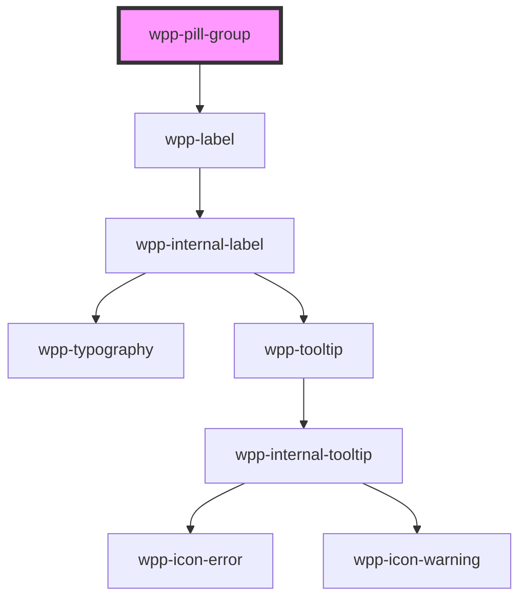

# wpp-pill-group

Create a group of labels that help to qualify information.

<!-- Auto Generated Below -->


## Usage

### Angular

```ts
@Component({
  ...
})
export class PillGroupExample {
  public multipleValue: PillValue[] = ['item-a', 'item-b']
  public singleValue: PillValue = 'item-c'

  public handlePillGroupChange(event: Event): void {
    console.log('event.detail => ', (event as CustomEvent<PillGroupChangeEvent>).detail.value)
  }

  public handlePillClose = () => {
    console.log('onWppClose')
  }

  public handlePillDragPress = (event: CustomEvent<MouseEvent>) => {
    console.log('event.detail =>', event.detail)
  }
}
```

```html
<wpp-pill-group type="multiple" [value]="multipleValue" (wppChange)="handlePillGroupChange($event)">
  <wpp-pill label="Item A" value="item-a"></wpp-pill>
  <wpp-pill label="Item B" value="item-b"></wpp-pill>
  <wpp-pill label="Item C" value="item-c"></wpp-pill>
</wpp-pill-group>

<wpp-pill-group type="single" [value]="singleValue" (wppChange)="handlePillGroupChange($event)">
  <wpp-pill label="Item A" value="item-a"></wpp-pill>
  <wpp-pill label="Item B" value="item-b"></wpp-pill>
  <wpp-pill label="Item C" value="item-c"></wpp-pill>
</wpp-pill-group>

<wpp-pill-group type="display" [value]="singleValue" (wppChange)="handlePillGroupChange($event)">
  <wpp-pill label="Item A" value="item-a" removable="true" (onWppClose)="handlePillClose"></wpp-pill>
  <wpp-pill label="Item B" value="item-b" removable="false"></wpp-pill>
</wpp-pill-group>

<wpp-pill-group type="draggable" [value]="singleValue" (wppChange)="handlePillGroupChange($event)">
  <wpp-pill label="Item A" value="item-a" removable="true" (onWppClose)="handlePillClose"></wpp-pill>
  <wpp-pill label="Item B" value="item-b" removable="true" (onWppDragPress)="handlePillDragPress"></wpp-pill>
</wpp-pill-group>
```


### React

```tsx
import React from 'react'
import { WppPill, WppPillGroup } from '@wppopen/components-library-react'
import { PillGroupChangeEvent } from '@wppopen/components-library'

export const PillGroupExample = () => {
  const handlePillGroupChange = (event: CustomEvent<PillGroupChangeEvent>) => {
    console.log('event.detail =>', event.detail)
  }

  const handlePillClose = () => {
    console.log('onWppClose')
  }

  const handlePillDragPress = (event: CustomEvent<MouseEvent>) => {
    console.log('event.detail =>', event.detail)
  }

  return (
    <>
      <WppPillGroup type="multiple" value={['item-a', 'item-c']} onWppChange={handlePillGroupChange}>
        <WppPill label="Item A" value="item-a" />
        <WppPill label="Item B" value="item-b" />
        <WppPill label="Item C" value="item-c" />
      </WppPillGroup>

      <WppPillGroup type="single" value="item-a" onWppChange={handlePillGroupChange}>
        <WppPill label="Item A" value="item-a" />
        <WppPill label="Item B" value="item-b" />
        <WppPill label="Item C" value="item-c" />
      </WppPillGroup>

      <WppPillGroup type="display" value="item-a" onWppChange={handlePillGroupChange}>
        <WppPill label="Item A" value="item-a" removable={true} onWppClose={handlePillClose} />
        <WppPill label="Item C" value="item-c" removable={false} />
      </WppPillGroup>

      <WppPillGroup type="draggable" value="item-a" onWppChange={handlePillGroupChange}>
        <WppPill label="Item A" value="item-a" removable={true} onWppClose={handlePillClose} />
        <WppPill label="Item B" value="item-b" removable={true} onWppDragPress={handlePillDragPress} />
      </WppPillGroup>
    </>
  )
}

```


### Vue

```vue
<script setup lang="ts">
import { ref } from "vue";

import {
  WppPillGroup,
  WppPill,
  WppAvatar,
  WppIconFavorites,
} from "@wppopen/components-library-vue";

const pillValue = ref<string>("item-a");

const handleSinglePillGroupChange = (event: CustomEvent) => {
  console.log("event.detail =>", event.detail.value);
  pillValue.value = event.detail.value;
};
</script>

<template>
  <WppPillGroup
    :labelConfig="{
      icon: 'wpp-icon-info',
      text: 'Multi Group',
      description: 'Description',
      locales: {
        optional: 'Optional',
      },
    }"
    :value="pillValue"
    @wppChange="handleSinglePillGroupChange"
  >
    <WppPill label="Item A" value="item-a" />
    <WppPill label="Item B" value="item-b" />
    <WppPill label="Item C" value="item-c" />
  </WppPillGroup>
</template>
```


## Properties

| Property             | Attribute  | Description                                                                                                                                                                                                    | Type                                                 | Default                                           |
| -------------------- | ---------- | -------------------------------------------------------------------------------------------------------------------------------------------------------------------------------------------------------------- | ---------------------------------------------------- | ------------------------------------------------- |
| `labelConfig`        | --         | Indicates label config                                                                                                                                                                                         | `LabelConfig \| undefined`                           | `undefined`                                       |
| `labelTooltipConfig` | --         | Defines the dropdown configuration. Under the hood dropdown using tippy.js, all information about this library and available props you can see via this link `https://atomiks.github.io/tippyjs/v6/all-props/` | `DropdownConfig`                                     | `{     popperOptions: { strategy: 'fixed' },   }` |
| `name`               | `name`     | Defines the pill group name.                                                                                                                                                                                   | `string`                                             | `undefined`                                       |
| `required`           | `required` | If the pill group is required.                                                                                                                                                                                 | `boolean`                                            | `false`                                           |
| `size`               | `size`     | Defines the pill group size.                                                                                                                                                                                   | `"m"`                                                | `'m'`                                             |
| `type`               | `type`     | Indicates the type of the pill                                                                                                                                                                                 | `"display" \| "draggable" \| "multiple" \| "single"` | `undefined`                                       |
| `value`              | `value`    | Defines the pill group value.                                                                                                                                                                                  | `PillValue[] \| number \| string \| undefined`       | `undefined`                                       |


## Events

| Event       | Description                                | Type                                                                                        |
| ----------- | ------------------------------------------ | ------------------------------------------------------------------------------------------- |
| `wppBlur`   | Emitted when the pill group loses focus    | `CustomEvent<FocusEvent>`                                                                   |
| `wppChange` | Emitted when the pill group value changes. | `CustomEvent<BaseFormControlEventDetail<PillGroupValue> & { name?: string \| undefined; }>` |
| `wppFocus`  | Emitted when the pill group receives focus | `CustomEvent<FocusEvent>`                                                                   |


## Slots

| Slot | Description                                                                                                                                             |
| ---- | ------------------------------------------------------------------------------------------------------------------------------------------------------- |
|      | Can contain only the `wpp-pill` components that are displayed in `pill-group`. It can be only <wpp-pill>. The default slot, without the name attribute. |


## Shadow Parts

| Part        | Description             |
| ----------- | ----------------------- |
| `"content"` | content wrapper element |
| `"inner"`   | Content slot element    |
| `"label"`   | Label text element      |


## CSS Custom Properties

| Name                            | Description |
| ------------------------------- | ----------- |
| `--wpp-pill-group-item-margin`  |             |
| `--wpp-pill-group-label-margin` |             |


## Dependencies

### Depends on

- [wpp-label](../wpp-label)

### Graph


----------------------------------------------

*Built with [StencilJS](https://stenciljs.com/)*
