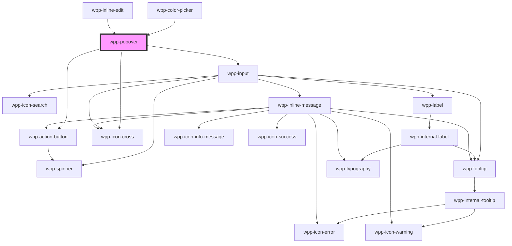

# wpp-popover


<!-- Auto Generated Below -->


## Usage

### Angular

```html
<wpp-popover>
  <wpp-button variant="secondary" slot="trigger-element">Trigger button to open Popover</wpp-button>
  <div>
    <div>
      <wpp-typography type="m-strong">Title</wpp-typography>
    </div>
    <wpp-divider></wpp-divider>
    <div>
      <wpp-typography>
        Lorem Ipsum is simply dummy text of the printing and typesetting industry. Lorem Ipsum has been the industry's
        standard dummy text ever since the 1500s, when an unknown printer took a galley of type and
      </wpp-typography>
    </div>
    <wpp-divider></wpp-divider>
    <div>
      <wpp-action-button variant="secondary">Button</wpp-action-button>
      <wpp-action-button>Button</wpp-action-button>
    </div>
  </div>
</wpp-popover>
```


### React

```tsx
import React, { useRef } from 'react'

import {
  WppPopover,
  WppTypography,
  WppButton,
  WppActionButton,
  WppIconCross,
  WppDivider,
} from '@wppopen/components-library-react'

export const PopoversVCPage = () => {
  const defaultPopoverRef = useRef<HTMLWppPopoverElement>(null)

  const handleCloseButtonClick = () => {
    defaultPopoverRef?.current?.closePopover()
  }

  const handleSubmitButtonClick = () => {
    alert('Some message')
  }

  return (
    <WppPopoverclosable
      config={{ appendTo: () => document.querySelector('#root')! }} // This config is required for React to work with different handlers like 'onClick'
      ref={defaultPopoverRef}
    >
      <WppButton variant="secondary" slot="trigger-element">
        Trigger button to open Popover
      </WppButton>
      <div>
        <div>
          <WppTypography type="m-strong">Title</WppTypography>
        </div>
        <WppDivider />
        <div>
          <WppTypography>
            Lorem Ipsum is simply dummy text of the printing and typesetting industry. Lorem Ipsum has been the
            industry's standard dummy text ever since the 1500s, when an unknown printer took a galley of type and
          </WppTypography>
        </div>
        <WppDivider />
        <div>
          <WppActionButton variant="secondary" className={styles.secondaryButton} onClick={handleCloseButtonClick}>
            Close
          </WppActionButton>
          <WppActionButton onClick={handleSubmitButtonClick}>Submit</WppActionButton>
        </div>
      </div>
    </WppPopover>
  )
}
```


### Vue

```vue
<script setup lang="ts">
import {
  WppPopover,
  WppTypography,
  WppButton,
  WppActionButton,
  WppIconCross,
  WppDivider,
} from '@wppopen/components-library-vue'
</script>

<template>
  <WppPopover closable>
    <WppButton variant="secondary" slot="trigger-element"> Trigger button to open Popover </WppButton>
    <div>
      <div>
        <WppTypography type="m-strong">Title</WppTypography>
      </div>
      <WppDivider></WppDivider>
      <div>
        <WppTypography>
          Lorem Ipsum is simply dummy text of the printing and typesetting industry. Lorem Ipsum has been the industry's
          standard dummy text ever since the 1500s, when an unknown printer took a galley of type and
        </WppTypography>
      </div>
      <WppDivider></WppDivider>
      <div>
        <WppActionButton variant="secondary">Button</WppActionButton>
        <WppActionButton>Button</WppActionButton>
      </div>
    </div>
  </WppPopover>
</template>
```


## Properties

| Property                    | Attribute           | Description                                                                                                                                                                                                                                                                      | Type                        | Default                     |
| --------------------------- | ------------------- | -------------------------------------------------------------------------------------------------------------------------------------------------------------------------------------------------------------------------------------------------------------------------------- | --------------------------- | --------------------------- |
| `ariaProps`                 | --                  | Contains the button `aria-` props.                                                                                                                                                                                                                                               | `AriaProps`                 | `{     role: 'dialog',   }` |
| `closable`                  | `closable`          | If the popover has cross button on the right-top side.                                                                                                                                                                                                                           | `boolean`                   | `false`                     |
| `config`                    | --                  | Defines the dropdown configuration. Under the hood dropdown using tippy.js, all information about this library and available props you can see via this link `https://atomiks.github.io/tippyjs/v6/all-props/`                                                                   | `DropdownConfig`            | `{}`                        |
| `dropdownWidth`             | `dropdown-width`    | Defines the dropdown's width. The maximum width of the dropdown is 350px.                                                                                                                                                                                                        | `string`                    | `'auto'`                    |
| `externalClass`             | `external-class`    | Add an external class to the popover. This class will be applied to the list wrapper that placed in tippy box that appended to the body. To add some properties to this class you have to add this class to global styles, for example .wpp-popover.external-class-name {  ... } | `string`                    | `''`                        |
| `locales`                   | --                  | Defines the component locale types.                                                                                                                                                                                                                                              | `PopoverLocalesInteface`    | `DEFAULT_POPOVER_LOCALES`   |
| `persistantSearch`          | `persistant-search` | By default, the search value in the input is cleared once the dropdown is closed. Set to `true` if you need the search value to not be cleared after closing the dropdown. This property should be used together with `this.withSearch` property.                                | `boolean`                   | `false`                     |
| `searchName`                | `search-name`       | The name for the input component inside the popover's dropdown. This property should be used together with `this.withSearch` property.                                                                                                                                           | `string`                    | `''`                        |
| `searchValue`               | `search-value`      | Value of the search inside the popover's dropdown. This property should be used together with `this.withSearch` property.                                                                                                                                                        | `string`                    | `''`                        |
| `shouldCloseOnOutsideClick` | --                  | Helper that defines If the popover can be closed by clicking outside of it.                                                                                                                                                                                                      | `(event: Event) => boolean` | `() => true`                |
| `withSearch`                | `with-search`       | If the popover has search inside of the dropdown.                                                                                                                                                                                                                                | `boolean`                   | `false`                     |


## Events

| Event             | Description                                                             | Type                                         |
| ----------------- | ----------------------------------------------------------------------- | -------------------------------------------- |
| `wppSearchChange` | Emitted when the value of the search input inside the dropdown changes. | `CustomEvent<PopoverInputChangeEventDetail>` |


## Methods

### `closePopover() => Promise<void>`

Method for closing the popover programatically

#### Returns

Type: `Promise<void>`


### `openPopover() => Promise<void>`

Method for opening the popover programatically

#### Returns

Type: `Promise<void>`


## Slots

| Slot                | Description                                                                    |
| ------------------- | ------------------------------------------------------------------------------ |
|                     | Can contain the popover content. The default slot, without the name attribute. |
| `"trigger-element"` | Can contain the popover anchor element.                                        |


## Shadow Parts

| Part                | Description             |
| ------------------- | ----------------------- |
| `"anchor"`          | Popover anchor wrapper  |
| `"content"`         | Popover content wrapper |
| `"trigger-element"` |                         |


## Dependencies

### Used by

 - [wpp-color-picker](../wpp-color-picker)
 - [wpp-inline-edit](../wpp-inline-edit)

### Depends on

- [wpp-input](../wpp-input)
- [wpp-action-button](../wpp-action-button)
- [wpp-icon-cross](../wpp-icon/components/add-and-remove/wpp-icon-cross)

### Graph


----------------------------------------------

*Built with [StencilJS](https://stenciljs.com/)*
