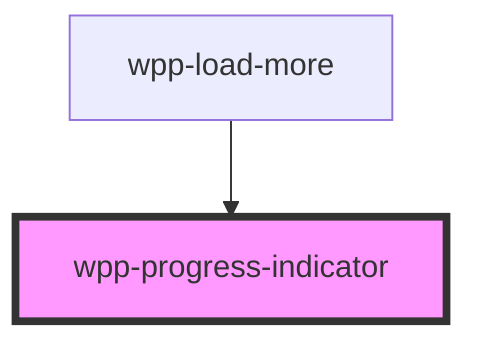

# wpp-progress-indicator


<!-- Auto Generated Below -->


## Usage

### Angular

```html

<!-- Without value: shows indeterminate -->
<wpp-progress-indicator variant="circle"></wpp-progress-indicator>

<!-- value=0 but forceIntermediateEmptyState=true: shows 0% empty state -->
<wpp-progress-indicator
  variant="circle"
  [value]="0"
  [forceIntermediateEmptyState]="true"
  is-show-percentage
  label="0%"
></wpp-progress-indicator>

<!-- With value>0: shows defined progress -->
<wpp-progress-indicator variant="circle" [value]="50"></wpp-progress-indicator>

```


### React

```tsx
import { WppProgressIndicator } from '@wppopen/components-library-react'

export const ProgressIndicatorExample = () => (
  <>
    {/* Without value: shows indeterminate */}
    <WppProgressIndicator variant="circle" />

    {/* value=0 but forceIntermediateEmptyState=true: shows 0% empty state */}
    <WppProgressIndicator
      variant="circle"
      value={0}
      forceIntermediateEmptyState
      isShowPercentage
      label="0%"
    />

    {/* With value>0: shows defined progress */}
    <WppProgressIndicator variant="circle" value={50} />
  </>
)
```


### Vue

```vue

<script setup lang="ts">
import { WppProgressIndicator } from '@wppopen/components-library-vue'
</script>

<template>
  <!-- Without value: shows indeterminate -->
  <WppProgressIndicator variant="circle" />

  <!-- value=0 but forceIntermediateEmptyState=true: shows 0% empty state -->
  <WppProgressIndicator
    variant="circle"
    value="0"
    :forceIntermediateEmptyState="true"
    isShowPercentage
    label="0%"
  />

  <!-- With value>0: shows defined progress -->
  <WppProgressIndicator variant="circle" value="50" />
</template>


```


## Properties

| Property                      | Attribute                        | Description                                                                                                                                                      | Type                   | Default     |
| ----------------------------- | -------------------------------- | ---------------------------------------------------------------------------------------------------------------------------------------------------------------- | ---------------------- | ----------- |
| `ariaProps`                   | --                               | Contains the `aria-` props of the progess-indicator component.                                                                                                   | `AriaProps`            | `{}`        |
| `forceIntermediateEmptyState` | `force-intermediate-empty-state` | If set to `true` and `value` is `0`, the component will show a 0% empty state instead of the indeterminate loading animation.                                    | `boolean \| undefined` | `false`     |
| `isShowPercentage`            | `is-show-percentage`             | If the loading percentage is displayed.                                                                                                                          | `boolean`              | `false`     |
| `label`                       | `label`                          | <span style="color:red">**[DEPRECATED]**</span> This property will be removed in version 5.0.0.<br/><br/>Defines the loading label.                              | `string \| undefined`  | `undefined` |
| `value`                       | `value`                          | Defines the loading progress. If `undefined`, the loading progress is infinite.                                                                                  | `number \| undefined`  | `undefined` |
| `variant`                     | `variant`                        | Defines the progress indicator type.                                                                                                                             | `"bar" \| "circle"`    | `'bar'`     |
| `width`                       | `width`                          | Defines the progress indicator width in pixels. If left `undefined`, the linear indicators are **100%** in width, and circle indicators are **80px** by default. | `number \| undefined`  | `undefined` |


## Shadow Parts

| Part       | Description             |
| ---------- | ----------------------- |
| `"body"`   | Main content wrapper    |
| `"circle"` | progress circle element |
| `"label"`  | Label text element      |
| `"line"`   | progress line element   |


## CSS Custom Properties

| Name                                   | Description |
| -------------------------------------- | ----------- |
| `--wpp-progress-bar-color`             |             |
| `--wpp-progress-bar-height`            |             |
| `--wpp-progress-bar-text-margin`       |             |
| `--wpp-progress-bar-text-size`         |             |
| `--wpp-progress-bar-text-weight`       |             |
| `--wpp-progress-circle-infinity-width` |             |
| `--wpp-progress-circle-stroke-color`   |             |
| `--wpp-progress-circle-stroke-width`   |             |
| `--wpp-progress-linear-bg-color`       |             |
| `--wpp-progress-linear-text-color`     |             |
| `--wpp-progress-text-color`            |             |
| `--wpp-progress-text-margin`           |             |
| `--wpp-progress-wrapper-bg-color`      |             |


## Dependencies

### Used by

 - [wpp-load-more](../wpp-load-more)

### Graph


----------------------------------------------

*Built with [StencilJS](https://stenciljs.com/)*
