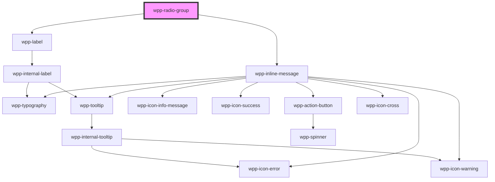

# wpp-radio-group


<!-- Auto Generated Below -->


## Usage

### Angular

```html
<div>
  <wpp-typography type="xl-heading">With truncation on warning message</wpp-typography>
  <wpp-radio-group
    class="radioGroup"
    [value]="radioGroupValue"
    [labelConfig]="labelConfigGroup"
    message="Warning message"
    [messageType]="messageTypeWarning"
    [maxMessageLength]="maxMessageLength"
    (wppChange)="handleChange($event)"
  >
    <wpp-radio required value="option-1" [labelConfig]="getLabelConfig('Option-1')"></wpp-radio>
    <wpp-radio required value="option-2" [labelConfig]="getLabelConfig('Option-2')"></wpp-radio>
    <wpp-radio required value="option-3" [labelConfig]="getLabelConfig('Option-3')"></wpp-radio>
    <wpp-radio required value="option-4" [labelConfig]="getLabelConfig('Option-4')"></wpp-radio>
    <wpp-radio required value="option-5" [labelConfig]="getLabelConfig('Option-5')"></wpp-radio>
  </wpp-radio-group>

  <h4>Programmatically set value of radio group:</h4>
  <div class="buttons">
    <wpp-button size="s" variant="secondary" (click)="setValue('option-1')"> Set option-1 </wpp-button>
    <wpp-button size="s" variant="secondary" (click)="setValue('option-2')"> Set option-2 </wpp-button>
    <wpp-button size="s" variant="secondary" (click)="setValue('option-3')"> Set option-3 </wpp-button>
    <wpp-button size="s" variant="secondary" (click)="setValue('')"> Reset </wpp-button>
  </div>
</div>
```

**component.ts**

```tsx
@Component({…})

export class RadioGroupExample {
  public messageTypeWarning = 'warning'
  public maxMessageLength = 10

  public radioGroupValue = 'option-1'
  public labelConfigGroup = { text: 'Radio Group', description: 'Radio Group description', icon: 'wpp-icon-info' }

  public getLabelConfig = (text: string) => ({
    text,
  })

  public setValue = (value: string) => {
    this.radioGroupValue = value
  }

  public handleChange = (e: Event) => {
    this.radioGroupValue = String((e as CustomEvent).detail.value)
  }
}
```


### React

```tsx
import { WppRadioGroup, WppRadio, WppTypography, WppButton } from '@platform-ui-kit/components-library-react'
import { WppRadioGroupCustomEvent } from '@platform-ui-kit/components-library/dist/types/components'
import { RadioGroupChangeEvent } from '@platform-ui-kit/components-library'

export const RadioGroupExample = () => {
  const [value, setValue] = useState('email')

  return (
    <div>
      <WppTypography type={'xl-heading'}>With truncation on warning message</WppTypography>
      <WppRadioGroup
        className={styles.radioGroup}
        value={value}
        message={'Warning message'}
        messageType={'warning'}
        maxMessageLength={10}
        labelConfig={{ text: 'Radio Group', description: 'Radio Group description', icon: 'wpp-icon-info' }}
        onWppChange={(e: WppRadioGroupCustomEvent<RadioGroupChangeEvent>) =>
          setValue(e.detail.value as RadioGroupValue)
        }
      >
        <WppRadio required value="option-1" labelConfig={{ text: 'Option-1' }} />
        <WppRadio required value="option-2" labelConfig={{ text: 'Option-2' }} />
        <WppRadio required value="option-3" labelConfig={{ text: 'Option-3' }} />
        <WppRadio required value="option-4" labelConfig={{ text: 'Option-4' }} />
        <WppRadio required value="option-5" labelConfig={{ text: 'Option-5' }} />
      </WppRadioGroup>

      <h4>Programmatically set value of radio group:</h4>
      <div>
        <WppButton size="s" variant="secondary" onClick={() => setValue('option-1')}>
          Set option-1
        </WppButton>
        <WppButton size="s" variant="secondary" onClick={() => setValue('option-2')}>
          Set option-2
        </WppButton>
        <WppButton size="s" variant="secondary" onClick={() => setValue('option-3')}>
          Set option-3
        </WppButton>
        <WppButton size="s" variant="secondary" onClick={() => setValue('')}>
          Reset
        </WppButton>
      </div>
    </div>
  )
}
```


### Vue

```vue
<script setup lang="ts">
import type { RadioGroupChangeEvent, RadioGroupValue } from '@platform-ui-kit/components-library'
import { WppButton, WppRadio, WppRadioGroup, WppTypography } from '@platform-ui-kit/components-library-vue'
import type { WppRadioGroupCustomEvent } from '@platform-ui-kit/components-library/dist/types/components'
import { ref } from 'vue'

const radioGroupValue = ref<RadioGroupValue>('option-1')

const setValue = (value: RadioGroupValue) => {
  radioGroupValue.value = value
}
</script>

<template>
  <div>
    <WppTypography type="xl-heading">With truncation on warning message</WppTypography>
    <WppRadioGroup
      class="radioGroup"
      :value="radioGroupValue"
      :labelConfig="{ text: 'Radio Group', description: 'Radio Group description', icon: 'wpp-icon-info' }"
      message="Warning message"
      messageType="warning"
      :maxMessageLength="10"
      @wppChange="(e: WppRadioGroupCustomEvent<RadioGroupChangeEvent>) => setValue(e.detail.value || '')"
    >
      <WppRadio required value="option-1" :labelConfig="{ text: 'Option-1' }" />
      <WppRadio required value="option-2" :labelConfig="{ text: 'Option-2' }" />
      <WppRadio required value="option-3" :labelConfig="{ text: 'Option-3' }" />
      <WppRadio required value="option-4" :labelConfig="{ text: 'Option-4' }" />
      <WppRadio required value="option-5" :labelConfig="{ text: 'Option-5' }" />
    </WppRadioGroup>

    <div class="buttons">
      <WppButton size="s" variant="secondary" @click="setValue('option-1')"> Set option-1 </WppButton>
      <WppButton size="s" variant="secondary" @click="setValue('option-2')"> Set option-2 </WppButton>
      <WppButton size="s" variant="secondary" @click="setValue('option-3')"> Set option-3 </WppButton>
      <WppButton size="s" variant="secondary" @click="setValue('')"> Reset </WppButton>
    </div>
  </div>
</template>

<style></style>
```


## Properties

| Property             | Attribute            | Description                                                                                                                                                                                         | Type                                | Default                                                                |
| -------------------- | -------------------- | --------------------------------------------------------------------------------------------------------------------------------------------------------------------------------------------------- | ----------------------------------- | ---------------------------------------------------------------------- |
| `ariaProps`          | --                   | Contains the checkbox group `aria-` props.                                                                                                                                                          | `AriaProps`                         | `{     labelledby: 'label-id',     describedby: 'description-id',   }` |
| `direction`          | `direction`          | Defines the direction in which the checkbox items are displayed. By default, the items are displayed vertically (in a column).                                                                      | `"column" \| "row"`                 | `'column'`                                                             |
| `labelConfig`        | --                   | Indicates the label configuration for the radio group.                                                                                                                                              | `LabelConfig \| undefined`          | `undefined`                                                            |
| `labelTooltipConfig` | --                   | Tooltip config for label, under the hood tooltip using tippy.js, all information about this library and available props you can see via this link `https://atomiks.github.io/tippyjs/v6/all-props/` | `DropdownConfig`                    | `{     popperOptions: { strategy: 'fixed' },   }`                      |
| `maxMessageLength`   | `max-message-length` | Defines the message's maximum length. If the length of the message is greater than the value of this property, the message will be truncated and a tooltip will display the whole text upon hover.  | `number \| undefined`               | `undefined`                                                            |
| `message`            | `message`            | Defines the message that is going to be displayed below the radio group. This property should be used in case there is an error / warning that needs to be displayed on the component.              | `string \| undefined`               | `undefined`                                                            |
| `messageType`        | `message-type`       | Defines the message's type and can take one of the following values: "error" / "warning". The icon displayed for the message will change based on this property.                                    | `"error" \| "warning" \| undefined` | `undefined`                                                            |
| `required`           | `required`           | If `true`, the group is required                                                                                                                                                                    | `boolean`                           | `false`                                                                |
| `value`              | `value`              | Defines the radio group value.                                                                                                                                                                      | `number \| string`                  | `undefined`                                                            |


## Events

| Event       | Description                                 | Type                                                       |
| ----------- | ------------------------------------------- | ---------------------------------------------------------- |
| `wppBlur`   | Emitted when the group loses focus          | `CustomEvent<FocusEvent>`                                  |
| `wppChange` | Emitted when the radio group value changes. | `CustomEvent<BaseFormControlEventDetail<RadioGroupValue>>` |
| `wppFocus`  | Emitted when the group receives focus       | `CustomEvent<FocusEvent>`                                  |


## Slots

| Slot | Description                                                                                                                                                                                                    |
| ---- | -------------------------------------------------------------------------------------------------------------------------------------------------------------------------------------------------------------- |
|      | Can contain only the `wpp-radio` components that are displayed in `radio-group`. The default slot, without the name attribute. A maximum of 5 radio elements are allowed in this component and a minimum of 2. |


## Shadow Parts

| Part      | Description          |
| --------- | -------------------- |
| `"inner"` | Content slot element |


## Dependencies

### Depends on

- [wpp-label](../wpp-label)
- [wpp-inline-message](../wpp-inline-message)

### Graph


----------------------------------------------

*Built with [StencilJS](https://stenciljs.com/)*
