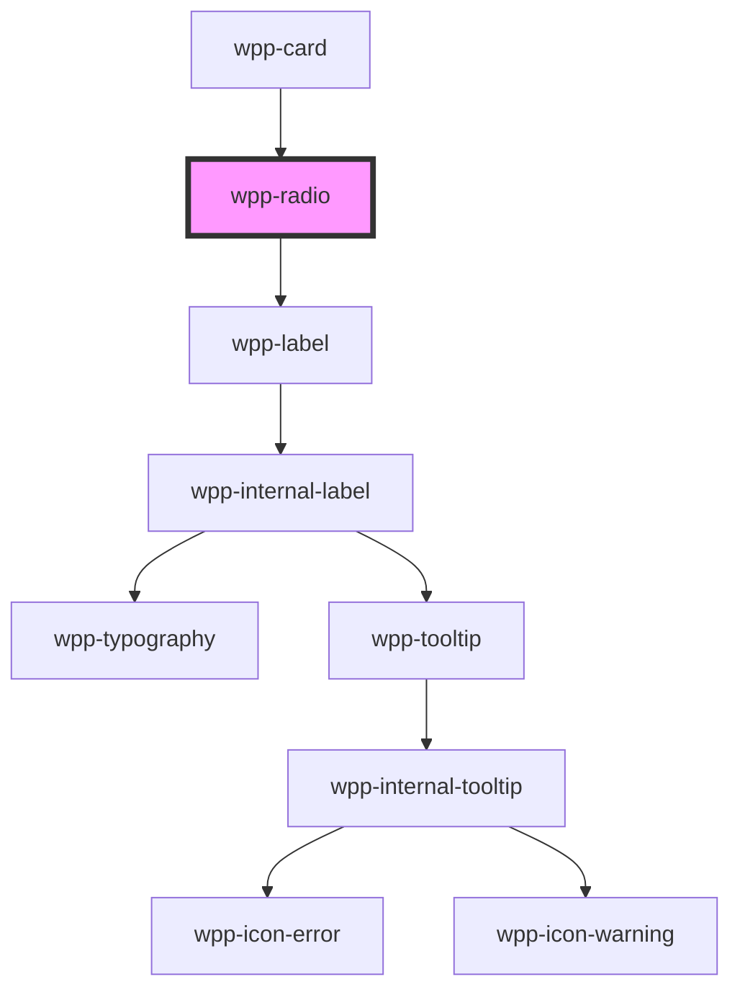

# wpp-radio

Radio button must be used only in wpp-radio-group.


<!-- Auto Generated Below -->


## Usage

### Angular

```html
<wpp-radio
  [disabled]='disabled'
  value="value"
  [checked]='checked'
  [labelConfig]='labelConfig'
  name='options'
  (wppChange)="handleChange($event)"
/>

<wpp-radio [labelConfig]='labelConfig' [(ngModel)]='checked'></wpp-radio>

<form [formGroup]="form" (ngSubmit)="submit()">
  <wpp-radio formControlName="options" [labelConfig]='labelConfig' name='options'></wpp-radio>
</form>
```


### React

```tsx
import { WppRadio } from '@wppopen/components-library-react'

export const RadioExample = () => (
  <>
    <WppRadio
      disabled={isDisabled}
      value={radioButtonValue}
      labelConfig={{ text: 'Option' }}
      checked={isChecked}
      onWppChange={({ detail: { checked } }) => setChecked(checked)}
    />

    <form onSubmit={handleSubmit}>
      <WppRadio
        checked={isChecked}
        labelConfig={{ text: 'Option' }}
        name="options"
        onWppChange={({ detail: { checked } }) => setChecked(checked)}
      />
    </form>
  </>
)
```


### Vue

```vue
<script setup lang="ts">
import { WppRadio } from "@wppopen/components-library-vue";
</script>

<template>
  <WppRadio
    name="wpp-radio-2"
    class="item"
    :labelConfig="{
      icon: 'wpp-icon-info',
      text: 'Option 2',
      description: 'Description',
      locales: {
        optional: 'Optional',
      },
    }"
    required
  />
</template>
```


## Properties

| Property             | Attribute    | Description                                                                                                                                                                                                    | Type                       | Default                                           |
| -------------------- | ------------ | -------------------------------------------------------------------------------------------------------------------------------------------------------------------------------------------------------------- | -------------------------- | ------------------------------------------------- |
| `ariaProps`          | --           | Contains the radio `aria-` props.                                                                                                                                                                              | `AriaProps`                | `{}`                                              |
| `autoFocus`          | `auto-focus` | If `true`, the radio should be focused on page load                                                                                                                                                            | `boolean`                  | `false`                                           |
| `checked`            | `checked`    | If the radio is selected.                                                                                                                                                                                      | `boolean`                  | `false`                                           |
| `disabled`           | `disabled`   | If the radio is disabled.                                                                                                                                                                                      | `boolean`                  | `false`                                           |
| `labelConfig`        | --           | Indicates label config                                                                                                                                                                                         | `LabelConfig \| undefined` | `undefined`                                       |
| `labelTooltipConfig` | --           | Defines the dropdown configuration. Under the hood dropdown using tippy.js, all information about this library and available props you can see via this link `https://atomiks.github.io/tippyjs/v6/all-props/` | `DropdownConfig`           | `{     popperOptions: { strategy: 'fixed' },   }` |
| `name`               | `name`       | Defines the radio name.                                                                                                                                                                                        | `string \| undefined`      | `undefined`                                       |
| `required`           | `required`   | If the radio is required.                                                                                                                                                                                      | `boolean`                  | `false`                                           |
| `size`               | `size`       | Defines the radio size.                                                                                                                                                                                        | `"m" \| "s"`               | `'m'`                                             |
| `value`              | `value`      | Defines the radio value.                                                                                                                                                                                       | `number \| string`         | `undefined`                                       |


## Events

| Event       | Description                              | Type                                                                                       |
| ----------- | ---------------------------------------- | ------------------------------------------------------------------------------------------ |
| `wppBlur`   | Emitted when the radio loses focus.      | `CustomEvent<FocusEvent>`                                                                  |
| `wppChange` | Emitted when the selected state changes. | `CustomEvent<BooleanFormControlEventDetail<RadioValue> & { name?: string \| undefined; }>` |
| `wppFocus`  | Emitted when the radio is in focus.      | `CustomEvent<FocusEvent>`                                                                  |


## Methods

### `setFocus() => Promise<void>`

Method that sets focus on the native input.

#### Returns

Type: `Promise<void>`


## Shadow Parts

| Part       | Description          |
| ---------- | -------------------- |
| `"circle"` | radio circle element |
| `"input"`  | input element        |
| `"label"`  | Label text element   |


## CSS Custom Properties

| Name                                            | Description |
| ----------------------------------------------- | ----------- |
| `--wpp-radio-bg-color`                          |             |
| `--wpp-radio-bg-color-active`                   |             |
| `--wpp-radio-bg-color-checked`                  |             |
| `--wpp-radio-bg-color-checked-disabled`         |             |
| `--wpp-radio-bg-color-disabled`                 |             |
| `--wpp-radio-bg-color-hover`                    |             |
| `--wpp-radio-border-color`                      |             |
| `--wpp-radio-border-color-active`               |             |
| `--wpp-radio-border-color-checked`              |             |
| `--wpp-radio-border-color-checked-disabled`     |             |
| `--wpp-radio-border-color-disabled`             |             |
| `--wpp-radio-border-color-hover`                |             |
| `--wpp-radio-border-style`                      |             |
| `--wpp-radio-border-width`                      |             |
| `--wpp-radio-first-border-color-focus`          |             |
| `--wpp-radio-inside-circle-bg-color`            |             |
| `--wpp-radio-inside-circle-size`                |             |
| `--wpp-radio-label-margin`                      |             |
| `--wpp-radio-label-text-color-checked-disabled` |             |
| `--wpp-radio-label-text-color-disabled`         |             |
| `--wpp-radio-second-border-color-focus`         |             |
| `--wpp-radio-size`                              |             |


## Dependencies

### Used by

 - [wpp-card](../wpp-card-group/components/wpp-card)

### Depends on

- [wpp-label](../wpp-label)

### Graph


----------------------------------------------

*Built with [StencilJS](https://stenciljs.com/)*
