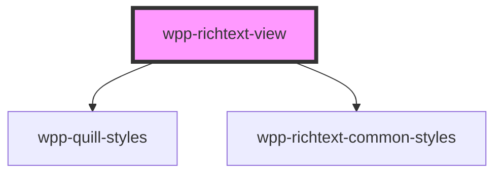

# wpp-richtext-view

<!-- Auto Generated Below -->

## Properties

| Property             | Attribute             | Description                                                                                                                                                                                                                                                                                                      | Type                  | Default        |
| -------------------- | --------------------- | ---------------------------------------------------------------------------------------------------------------------------------------------------------------------------------------------------------------------------------------------------------------------------------------------------------------- | --------------------- | -------------- |
| `debug`              | `debug`               | Debug level: `error`, `warn`, `log`, or `info`. Passing true is equivalent to passing `log`. Passing false disables all messages.                                                                                                                                                                                | `string`              | `'warn'`       |
| `format`             | `format`              | Format of editor value                                                                                                                                                                                                                                                                                           | `string`              | `formats.html` |
| `formats`            | --                    | Whitelist of formats to allow in the editor. See [Formats](https://quilljs.com/docs/formats/) for a complete list.                                                                                                                                                                                               | `string[]`            | `undefined`    |
| `modules`            | `modules`             | Collection of modules to include and respective options. The only configurable modules are the following: imageUpload, videoUpload, attachmentUpload and toolbar.aliases.embed (See "Usage" section of Notes) See [Modules](https://quilljs.com/docs/modules/) for more information about the library's modules. | `string \| undefined` | `undefined`    |
| `name`               | `name`                | Name of the editor instance                                                                                                                                                                                                                                                                                      | `string \| undefined` | `undefined`    |
| `preserveWhitespace` | `preserve-whitespace` | Use `pre` HTML element as a container to preserve white space, or regular `div` element                                                                                                                                                                                                                          | `boolean`             | `false`        |
| `strict`             | `strict`              | Use strict comparison for objects.                                                                                                                                                                                                                                                                               | `boolean`             | `true`         |
| `styles`             | `styles`              | Inline styles for editor, in a JSON format                                                                                                                                                                                                                                                                       | `string \| undefined` | `'{}'`         |
| `value`              | `value`               | Editor value                                                                                                                                                                                                                                                                                                     | `string`              | `undefined`    |

## Dependencies

### Depends on

- [wpp-quill-styles](../wpp-quill-styles)
- [wpp-richtext-common-styles](../wpp-richtext-common-styles)

### Graph

----------------------------------------------

*Built with [StencilJS](https://stenciljs.com/)*
