# wpp-richtext


<!-- Auto Generated Below -->


## Usage

### Angular

**richtext-example.page.html**

```html
<h3>Rich text</h3>
<wpp-richtext
  [value]="value"
  [modules]="modules"
  (wppChange)='handleChange($event)'
  (wppSelectionChange)='handleSelectionChange($event)'
  (wppUploadRequest)='handleUploadRequest($event)'
  required="true"
  [charactersLimit]="500"
  [warningThreshold]="480"
></wpp-richtext>
<h3>Rich text view</h3>
<wpp-richtext-view [value]="value"></wpp-richtext-view>
<h3>Rich text HTML view</h3>
<wpp-richtext-html [value]="value"></wpp-richtext-html>
<hr />

<h2>Markdown Demo</h2>
<p>This demo shows the new Markdown features. Simply copy and paste or type Markdown into the editor. Below is a demo snippet:</p>
<pre style="background-color: #f7f7f7; padding: 1rem;">
{{ markdownValue }}
</pre>

<h3>Markdown Editor</h3>
<wpp-richtext
  [value]="markdownValue"
  [format]="'markdown'"
  [modules]="modules"
  (wppChange)="handleMarkdownChange($event)"
  (wppSelectionChange)="handleSelectionChange($event)"
  (wppUploadRequest)="handleUploadRequest($event)"
  required="true"
  [charactersLimit]="500"
  [warningThreshold]="480"
  auto-focus="true"
></wpp-richtext>

<h3>Output as HTML</h3>
<wpp-richtext-html [value]="htmlOutput"></wpp-richtext-html>
```

**richtext-example.page.ts**

```tsx
import { ChangeDetectionStrategy, Component } from '@angular/core'
import { marked } from 'marked'
import { modulesJSON, markdownDemoText } from './consts'

function upload(file: File): Promise<string> {
  return new Promise(resolve => {
    const delay = Math.floor(Math.random() * 10000)

    setTimeout(() => resolve(URL.createObjectURL(file)), delay)
  })
}

@Component({
  selector: 'richtext-example',
  templateUrl: './richtext-example.page.html',
  changeDetection: ChangeDetectionStrategy.OnPush,
})
export class RichtextExamplePage {
  public value = ''
  public markdownValue = markdownDemoText
  public modules = modulesJSON
  public htmlOutput = marked(this.markdownValue) as string

  public handleChange = (e: Event) => {
    console.log('wppChange', e)
    const event = e as WppRichtextCustomEvent<RichtextChangeEventDetail>

    this.value = event.detail.value
  }

  public handleMarkdownChange = (e: Event) => {
    console.log('wppMarkdownChange', e)
    const event = e as any
    this.markdownValue = event.detail.value
    this.htmlOutput = marked(this.markdownValue) as string
  }

  public handleSelectionChange = (e: Event) => {
    const event = e as WppRichtextCustomEvent<RichtextSelectionChangeEventDetail>

    console.log('wppSelectionChange', { ...event.detail.range }, e)
  }

  public handleUploadRequest = (e: Event) => {
    console.log('wppUploadRequest', e)
    const event = e as WppRichtextCustomEvent<RichtextUploadRequestEventDetail>

    const type = event.detail.type
    const callback = event.detail.callback
    const input = document.createElement('input')

    input.type = 'file'
    input.accept = type === 'attachment' ? '*' : `${type}/*`
    input.multiple = true
    input.onchange = () => {
      const uploadItems = Array.from(input.files!).map(file => ({
        file,
        promise: upload(file),
      }))

      callback(uploadItems)
    }
    input.click()
  }
}
```

```ts
export const modulesJSON = JSON.stringify({
  toolbar: {
    aliases: {
      embed: ['link', 'image', 'video', 'attachment'],
    },
  },
  imageUpload: true,
  videoUpload: true,
  attachmentUpload: true,
})

export const markdownDemoText = `
Welcome to the **Markdown** demo! Type some _Markdown_ here...

# Header 1
## Header 2
###### Header 6

Headers Setext-style:

 Header 2
 --------

Emphasis: **bold** *italic*

Intra-word emphasis: t*es*t becomes t<em>es</em>t.

Use \`inline code\` for snippets.

Create [links](http://example.com).

An [example][id]. Then, anywhere
else in the doc, define the link: [id]: http://example.com/  "Title"

Display an image: 

This is a list:
- Item 1
- Item 2
- Item 3

Ordered, without paragraphs:
1. Foo
2. Bar

This is a code block:
\`\`\`js
function hello() {
  console.log('Hello, world!');
}
\`\`\`

This is a task list:
- [x] Task 1
- [ ] Task 2
- [ ] Task 3

Manual Line Breaks - End a line with two or more spaces:
 Roses are red,
 Violets are blue.
`
```


### React

```tsx
import {
  WppRichtext,
  WppRichtextHtml,
  WppRichtextView,
} from '@platform-ui-kit/components-library-react'
import { useCallback, useState } from 'react'
import {
  RichtextChangeEventDetail,
  RichtextSelectionChangeEventDetail,
  RichtextUploadRequestEventDetail,
  WppRichtextCustomEvent,
} from '@platform-ui-kit/components-library/dist/types/components'
import { marked } from 'marked'

const markdownDemoText = `
Welcome to the **Markdown** demo! Type some _Markdown_ here...

# Header 1
## Header 2
###### Header 6

Headers Setext-style:

 Header 2
 --------

Emphasis: **bold** *italic*

Intra-word emphasis: t*es*t becomes t<em>es</em>t.

Use \`inline code\` for snippets.

Create [links](http://example.com).

An [example][id]. Then, anywhere
else in the doc, define the link: [id]: http://example.com/  "Title"

Display an image: 

This is a list:
- Item 1
- Item 2
- Item 3

Ordered, without paragraphs:
1. Foo
2. Bar

This is a code block:
\`\`\`js
function hello() {
  console.log('Hello, world!');
}
\`\`\`

This is a task list:
- [x] Task 1
- [ ] Task 2
- [ ] Task 3

Manual Line Breaks - End a line with two or more spaces:
 Roses are red,
 Violets are blue.
`

const modules = JSON.stringify({
  toolbar: {
    aliases: {
      // Add image, video and attachments buttons to the embed section of toolbar
      embed: ['link', 'image', 'video', 'attachment'],
    },
  },
  // Enable custom upload handler for image, video and attachment
  imageUpload: true,
  videoUpload: true,
  attachmentUpload: true,
})

function upload(file: File): Promise<string> {
  return new Promise(resolve => {
    const delay = Math.floor(Math.random() * 10000)

    setTimeout(() => resolve(URL.createObjectURL(file)), delay)
  })
}

export const RichTextPage = () => {
  const [value, setValue] = useState('')
  const [markdownValue, setMarkdownValue] = useState(markdownDemoText)

  const handleChange = useCallback((e: WppRichtextCustomEvent<RichtextChangeEventDetail>) => {
    console.log('wppChange', e)
    setValue(e.detail.value)
  }, [])

  const handleMarkdownChange = useCallback((e: WppRichtextCustomEvent<RichtextChangeEventDetail>) => {
    console.log('wppMarkdownChange', e)
    setMarkdownValue(e.detail.value)
  }, [])

  const handleSelectionChange = useCallback((e: WppRichtextCustomEvent<RichtextSelectionChangeEventDetail>) => {
    console.log('wppSelectionChange', { ...e.detail.range }, e)
  }, [])

  // There is also need to enable respective embed button in toolbar (image, video and attachment)
  // and respective upload modules (imageUpload, videoUpload and attachmentUpload)
  const handleUploadRequest = useCallback((e: WppRichtextCustomEvent<RichtextUploadRequestEventDetail>) => {
    console.log('wppUploadRequest', e)

    const type = e.detail.type
    const callback = e.detail.callback
    const input = document.createElement('input')

    input.type = 'file'
    input.accept = type === 'attachment' ? '*' : `${type}/*`
    input.multiple = true
    input.onchange = () => {
      const uploadItems = Array.from(input.files!).map(file => ({
        file,
        promise: upload(file),
      }))

      callback(uploadItems)
    }
    input.click()
  }, [])

  const htmlOutput = marked(markdownValue) as string

  return (
    <>
      <h3>Rich text</h3>
      <WppRichtext
        name="content"
        value="<h1>Hello world!</h1>This is test value"
        modules={modules}
        onWppChange={handleChange}
        onWppSelectionChange={handleSelectionChange}
        onWppUploadRequest={handleUploadRequest}
        required
        charactersLimit={500}
        warningThreshold={480}
      />
      <h3>Rich text view</h3>
      <WppRichtextView value={value} />
      <h3>Rich text HTML view</h3>
      <WppRichtextHtml value={value} />

      <h2>Markdown Demo</h2>
      <p>This demo shows the new Markdown features. Simply copy and paste or type Markdown into the editor. The snippet below is pre-configured:</p>
      <pre style={{ backgroundColor: '#f7f7f7', padding: '1rem' }}>{markdownValue}</pre>

      <h3>Markdown Editor</h3>
      <WppRichtext
        name="markdownContent"
        value={markdownValue}
        format="markdown"
        modules={modules}
        onWppChange={handleMarkdownChange}
        onWppSelectionChange={handleSelectionChange}
        onWppUploadRequest={handleUploadRequest}
        required
        charactersLimit={500}
        warningThreshold={480}
        labelConfig={{ text: 'Markdown Content:' }}
        message="Markdown editor demo"
        placeholder="Type your Markdown here..."
        auto-focus
        style={{ height: '600px' }}
      />

      <h3>Output as HTML</h3>
      <WppRichtextHtml value={htmlOutput} />
    </>
  )
}
```


### Vue

```vue
<script setup lang="ts">
  import {
    WppRichtext,
    WppRichtextView,
    WppRichtextHtml,
  } from '@platform-ui-kit/components-library-vue'
  import { ref } from "vue"
  import { marked } from 'marked'
  import { defaultTextValue, markdownDemoText, modulesJSON } from './consts'

  function upload(file: File): Promise<string> {
    return new Promise(resolve => {
      const delay = Math.floor(Math.random() * 10000)

      setTimeout(() => resolve(URL.createObjectURL(file)), delay)
    })
  }

  const value = ref(defaultTextValue)
  const markdownValue = ref(markdownDemoText)
  const htmlOutput = marked(markdownValue.value) as string

  const setValue = (val: string) => {
    value.value = val
  }

const setMarkdownValue = (val: string) => {
    markdownValue.value = val
  }

  const handleChange = (e: CustomEvent) => {
    console.log('wppChange', e, e.detail)
    setValue(e.detail.value)
  }

  const handleSelectionChange = (e: CustomEvent) => {
    console.log('wppSelectionChange', { ...e.detail.range }, e)
  }

  const handleUploadRequest = (e: CustomEvent) => {
    console.log('wppUploadRequest', e)

    const type = e.detail.type
    const callback = e.detail.callback
    const input = document.createElement('input')

    input.type = 'file'
    input.accept = type === 'attachment' ? '*' : `${type}/*`
    input.multiple = true
    input.onchange = () => {
      const uploadItems = Array.from(input.files!).map(file => ({
        file,
        promise: upload(file),
      }))

      callback(uploadItems)
    }
    input.click()
  }
</script>

<template>
  <div class="richText">
    <h3>Rich text</h3>
    <WppRichtext
      :name="'content'"
      :value="value"
      :modules="modulesJSON"
      @wppChange="handleChange"
      @wppSelectionChange="handleSelectionChange"
      @wppUploadRequest="handleUploadRequest"
      required
      :charactersLimit="500"
      :warningThreshold="480"
    />

    <h3>Rich text view</h3>
    <WppRichtextView :value="value" />

    <h3>Rich text HTML view</h3>
    <WppRichtextHtml :value="value" />

    <hr />

    <h2>Markdown Demo</h2>
    <p>This demo shows the new Markdown features. Simply copy and paste or type Markdown into the editor. The snippet below is pre-configured:</p>
    <pre style="background-color: #f7f7f7; padding: 1rem;">{{ markdownValue }}</pre>

    <h3>Markdown Editor</h3>
    <WppRichtext
      :name="'markdownContent'"
      :value="markdownValue"
      :format="'markdown'"
      :modules="modulesJSON"
      @wppChange="(e) => setMarkdownValue(e.detail.value)"
      @wppSelectionChange="handleSelectionChange"
      @wppUploadRequest="handleUploadRequest"
      required
      :charactersLimit="500"
      :warningThreshold="480"
      :labelConfig="{ text: 'Markdown Content:' }"
      :message="'Markdown editor demo'"
      :placeholder="'Type your Markdown here...'"
      auto-focus
    />

    <h3>Output as HTML</h3>
    <WppRichtextHtml :value="htmlOutput" />
  </div>
</template>

<style></style>

```

```ts
export const defaultTextValue = ''

export const modulesJSON = JSON.stringify({
  toolbar: {
    aliases: {
      embed: ['link', 'image', 'video', 'attachment'],
    },
  },
  imageUpload: true,
  videoUpload: true,
  attachmentUpload: true,
})

export const markdownDemoText = `
Welcome to the **Markdown** demo! Type some _Markdown_ here...

# Header 1
## Header 2
###### Header 6

Headers Setext-style:

 Header 2
 --------

Emphasis: **bold** *italic*

Intra-word emphasis: t*es*t becomes t<em>es</em>t.

Use \`inline code\` for snippets.

Create [links](http://example.com).

An [example][id]. Then, anywhere
else in the doc, define the link: [id]: http://example.com/  "Title"

Display an image: 

This is a list:
- Item 1
- Item 2
- Item 3

Ordered, without paragraphs:
1. Foo
2. Bar

This is a code block:
\`\`\`js
function hello() {
  console.log('Hello, world!');
}
\`\`\`

This is a task list:
- [x] Task 1
- [ ] Task 2
- [ ] Task 3

Manual Line Breaks - End a line with two or more spaces:
 Roses are red,
 Violets are blue.
`
```


## Dependencies

### Used by

 - [wpp-richtext](.)

### Depends on

- [wpp-icon-bold](../wpp-icon/components/tools/text-formatting/wpp-icon-bold)
- [wpp-icon-italic](../wpp-icon/components/tools/text-formatting/wpp-icon-italic)
- [wpp-icon-underline](../wpp-icon/components/tools/text-formatting/wpp-icon-underline)
- [wpp-icon-strike-through](../wpp-icon/components/tools/text-formatting/wpp-icon-strike-through)
- [wpp-icon-blockquote](../wpp-icon/components/tools/text-formatting/wpp-icon-blockquote)
- [wpp-icon-code-view](../wpp-icon/components/tools/text-formatting/wpp-icon-code-view)
- [wpp-icon-h1](../wpp-icon/components/tools/text-formatting/wpp-icon-h1)
- [wpp-icon-h2](../wpp-icon/components/tools/text-formatting/wpp-icon-h2)
- [wpp-icon-ordered-list](../wpp-icon/components/tools/text-formatting/wpp-icon-ordered-list)
- [wpp-icon-unordered-list](../wpp-icon/components/tools/text-formatting/wpp-icon-unordered-list)
- [wpp-icon-text-alignment-left](../wpp-icon/components/tools/align/wpp-icon-text-alignment-left)
- [wpp-icon-text-alignment-center](../wpp-icon/components/tools/align/wpp-icon-text-alignment-center)
- [wpp-icon-text-alignment-right](../wpp-icon/components/tools/align/wpp-icon-text-alignment-right)
- [wpp-icon-text-alignment-justify](../wpp-icon/components/tools/align/wpp-icon-text-alignment-justify)
- [wpp-icon-float-left](../wpp-icon/components/tools/text-formatting/wpp-icon-float-left)
- [wpp-icon-float-center](../wpp-icon/components/tools/text-formatting/wpp-icon-float-center)
- [wpp-icon-float-right](../wpp-icon/components/tools/text-formatting/wpp-icon-float-right)
- [wpp-icon-indent-increase](../wpp-icon/components/tools/text-formatting/wpp-icon-indent-increase)
- [wpp-icon-indent-decrease](../wpp-icon/components/tools/text-formatting/wpp-icon-indent-decrease)
- [wpp-icon-link](../wpp-icon/components/actions/content actions/wpp-icon-link)
- [wpp-icon-undo](../wpp-icon/components/actions/content actions/wpp-icon-undo)
- [wpp-icon-redo](../wpp-icon/components/actions/content actions/wpp-icon-redo)
- [wpp-icon-attach](../wpp-icon/components/actions/content actions/wpp-icon-attach)
- [wpp-icon-image](../wpp-icon/components/media/media/wpp-icon-image)
- [wpp-icon-video-clip](../wpp-icon/components/media/media/wpp-icon-video-clip)
- [wpp-icon-info](../wpp-icon/components/communication/communication/wpp-icon-info)

### Graph

```mermaid
graph TD;
  wpp-richtext-icon-loader --> wpp-icon-bold
  wpp-richtext-icon-loader --> wpp-icon-italic
  wpp-richtext-icon-loader --> wpp-icon-underline
  wpp-richtext-icon-loader --> wpp-icon-strike-through
  wpp-richtext-icon-loader --> wpp-icon-blockquote
  wpp-richtext-icon-loader --> wpp-icon-code-view
  wpp-richtext-icon-loader --> wpp-icon-h1
  wpp-richtext-icon-loader --> wpp-icon-h2
  wpp-richtext-icon-loader --> wpp-icon-ordered-list
  wpp-richtext-icon-loader --> wpp-icon-unordered-list
  wpp-richtext-icon-loader --> wpp-icon-text-alignment-left
  wpp-richtext-icon-loader --> wpp-icon-text-alignment-center
  wpp-richtext-icon-loader --> wpp-icon-text-alignment-right
  wpp-richtext-icon-loader --> wpp-icon-text-alignment-justify
  wpp-richtext-icon-loader --> wpp-icon-float-left
  wpp-richtext-icon-loader --> wpp-icon-float-center
  wpp-richtext-icon-loader --> wpp-icon-float-right
  wpp-richtext-icon-loader --> wpp-icon-indent-increase
  wpp-richtext-icon-loader --> wpp-icon-indent-decrease
  wpp-richtext-icon-loader --> wpp-icon-link
  wpp-richtext-icon-loader --> wpp-icon-undo
  wpp-richtext-icon-loader --> wpp-icon-redo
  wpp-richtext-icon-loader --> wpp-icon-attach
  wpp-richtext-icon-loader --> wpp-icon-image
  wpp-richtext-icon-loader --> wpp-icon-video-clip
  wpp-richtext-icon-loader --> wpp-icon-info
  wpp-richtext --> wpp-richtext-icon-loader
  style wpp-richtext-icon-loader fill:#f9f,stroke:#333,stroke-width:4px
```


----------------------------------------------

*Built with [StencilJS](https://stenciljs.com/)*
