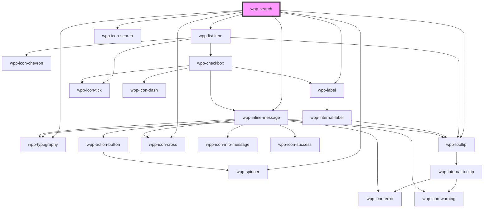

# wpp-search

Create a component that combines the search input, a multiselect dropdown with available options, and chip tags to help users autocomplete the function of an input field.

<!-- Auto Generated Below -->


## Usage

### Angular / vue


### React

```tsx
import React, { useState } from 'react'
import { SearchDefaultOption } from '@wppopen/components-library'
import { WppSearch, WppListItem } from '@wppopen/components-library-react'

export const fruitOptions = [
  {
    id: 1,
    label: 'Mango',
  },
  {
    id: 2,
    label: 'Passion Fruit',
  },
  {
    id: 3,
    label: 'Kiwi',
  },
  {
    id: 4,
    label: 'Dragon Fruit',
  },
  {
    id: 5,
    label: 'Pineapple',
  },
  {
    id: 6,
    label: 'Сarambola',
  },
  {
    id: 7,
    label: 'Grape',
  },
  {
    id: 8,
    label: 'Orange',
  },
  {
    id: 9,
    label: 'Apple',
  },
  {
    id: 10,
    label: 'Grapefruit',
  },
  {
    id: 11,
    label: 'Watermelon',
  },
  {
    id: 12,
    label: 'All the fruits in the world mixed into a SUPER FRUIT MIX! Trimmed to the edge of the universe -_-',
  },
  {
    id: 13,
    label: 'Pear',
  },
  {
    id: 14,
    label: 'Apricot',
  },
  {
    id: 15,
    label: 'Banana',
  },
  {
    id: 16,
    label: 'Melon',
  },
]

export const SearchVCPage = () => {
  const [basicValue, setBasicValue] = useState<SearchDefaultOption[]>([
    {
      id: 5,
      label: 'Pineapple',
    },
  ])

  return (
    <div data-testid="searches">
      <WppSearch
        required
        autoFocus
        labelConfig={{
          text: 'Single Autocomplete with search',
        }}
        highlight={false}
        placeholder="Select fruits"
        value={basicValue}
        onWppChange={(e: CustomEvent) => setBasicValue(e.detail.value as SearchDefaultOption[])}
        simpleSearch
      >
        {fruitOptions.map(option => (
          <WppListItem key={option.id} value={option} label={option.label}>
            <p slot="label">{option.label}</p>
          </WppListItem>
        ))}
      </WppSearch>
    </div>
  )
}
```


## Properties

| Property              | Attribute                | Description                                                                                                                                                                                                    | Type                                                                                                           | Default                                           |
| --------------------- | ------------------------ | -------------------------------------------------------------------------------------------------------------------------------------------------------------------------------------------------------------- | -------------------------------------------------------------------------------------------------------------- | ------------------------------------------------- |
| `autoFocus`           | `auto-focus`             | If `true`, the component should be focused on page load                                                                                                                                                        | `boolean`                                                                                                      | `false`                                           |
| `disabled`            | `disabled`               | If the component is disabled.                                                                                                                                                                                  | `boolean`                                                                                                      | `false`                                           |
| `dropdownConfig`      | --                       | Defines the dropdown configuration. Under the hood dropdown using tippy.js, all information about this library and available props you can see via this link `https://atomiks.github.io/tippyjs/v6/all-props/` | `DropdownConfig`                                                                                               | `{}`                                              |
| `dropdownWidth`       | `dropdown-width`         | Defines the dropdown width.                                                                                                                                                                                    | `string`                                                                                                       | `'auto'`                                          |
| `getOptionId`         | --                       | Helper that gets ID values from the search options.                                                                                                                                                            | `(item: SearchOption) => SearchOptionId`                                                                       | `item => (item as SearchDefaultOption).id`        |
| `getOptionLabel`      | --                       | Helper that gets a label from the search options.                                                                                                                                                              | `(item: SearchOption) => string`                                                                               | `item => (item as SearchDefaultOption).label`     |
| `highlight`           | `highlight`              | If `true`, the search will highlight options                                                                                                                                                                   | `boolean`                                                                                                      | `true`                                            |
| `infinite`            | `infinite`               | If the autocomplete options list has infinite scroll. This overrides the `simpleSearch` prop and considers it as `false`. This prop shouldn't change after the component is rendered.                          | `boolean`                                                                                                      | `false`                                           |
| `infiniteLastPage`    | `infinite-last-page`     | If infinite scroll can request more pages to load.                                                                                                                                                             | `boolean`                                                                                                      | `true`                                            |
| `labelConfig`         | --                       | Indicates label config                                                                                                                                                                                         | `LabelConfig \| undefined`                                                                                     | `undefined`                                       |
| `labelTooltipConfig`  | --                       | Defines the dropdown configuration. Under the hood dropdown using tippy.js, all information about this library and available props you can see via this link `https://atomiks.github.io/tippyjs/v6/all-props/` | `DropdownConfig`                                                                                               | `{     popperOptions: { strategy: 'fixed' },   }` |
| `loadMore`            | --                       | Helper that requests to load more options on infinite scroll. This request is considered done when the returned `Promise` is settled. This prop is required when `infinite` is set to `true`.                  | `(() => Promise<void>) \| undefined`                                                                           | `undefined`                                       |
| `loading`             | `loading`                | If the component is loading.                                                                                                                                                                                   | `boolean`                                                                                                      | `false`                                           |
| `locales`             | --                       | Indicates locales for search component                                                                                                                                                                         | `{ nothingFound?: string \| undefined; loading?: string \| undefined; dropdownHeader?: string \| undefined; }` | `{}`                                              |
| `maxMessageLength`    | `max-message-length`     | Defines the input message maximum length.                                                                                                                                                                      | `number \| undefined`                                                                                          | `undefined`                                       |
| `message`             | `message`                | Defines the input message.                                                                                                                                                                                     | `string \| undefined`                                                                                          | `undefined`                                       |
| `messageType`         | `message-type`           | Defines the input message type.                                                                                                                                                                                | `"error" \| "warning" \| undefined`                                                                            | `undefined`                                       |
| `name`                | `name`                   | Defines the search name.                                                                                                                                                                                       | `string \| undefined`                                                                                          | `undefined`                                       |
| `openDropdownOnClick` | `open-dropdown-on-click` | If `true`, the dropdown will be opened on click                                                                                                                                                                | `boolean`                                                                                                      | `false`                                           |
| `placeholder`         | `placeholder`            | Defines the input placeholder.                                                                                                                                                                                 | `string \| undefined`                                                                                          | `undefined`                                       |
| `required`            | `required`               | If `true`, the input is required                                                                                                                                                                               | `boolean`                                                                                                      | `false`                                           |
| `showOptions`         | `show-options`           | If `true`, search will show the dropdown with options                                                                                                                                                          | `boolean`                                                                                                      | `true`                                            |
| `simpleSearch`        | `simple-search`          | If `true`, search automatically filters options on search instead of relying on updates of the slotted options list. This prop shouldn't change after the component is rendered.                               | `boolean`                                                                                                      | `false`                                           |
| `size`                | `size`                   | Defines the input size.                                                                                                                                                                                        | `"m" \| "s"`                                                                                                   | `'m'`                                             |
| `value`               | --                       | Defines the selected items.                                                                                                                                                                                    | `SearchOption[]`                                                                                               | `[]`                                              |


## Events

| Event                  | Description                            | Type                                                                                                                                                                                                                                                                                     |
| ---------------------- | -------------------------------------- | ---------------------------------------------------------------------------------------------------------------------------------------------------------------------------------------------------------------------------------------------------------------------------------------- |
| `wppBlur`              | Emitted when the search loses focus    | `CustomEvent<void>`                                                                                                                                                                                                                                                                      |
| `wppChange`            | Emitted when the search value changes  | `CustomEvent<SelectOptionChangeEventDetail & { reason: "selectOption"; } & { name?: string \| undefined; } \| { value: SearchOptionList; reason: SearchChangeReason; } & { name?: string \| undefined; } \| { value: null; reason: "removeOption"; } & { name?: string \| undefined; }>` |
| `wppFocus`             | Emitted when the search receives focus | `CustomEvent<FocusEvent>`                                                                                                                                                                                                                                                                |
| `wppSearchValueChange` | Emitted when the search value changes  | `CustomEvent<string>`                                                                                                                                                                                                                                                                    |


## Methods

### `setFocus() => Promise<void>`

Sets focus on native input

#### Returns

Type: `Promise<void>`


## Slots

| Slot | Description                                                                                                                               |
| ---- | ----------------------------------------------------------------------------------------------------------------------------------------- |
|      | Should contain a list of `wpp-list-item` elements that represents the current options list. The default slot, without the name attribute. |


## Shadow Parts

| Part                | Description                |
| ------------------- | -------------------------- |
| `"anchor"`          | Search input tooltip       |
| `"dropdown"`        | Dropdown container         |
| `"dropdown-header"` | Dropdown header            |
| `"input"`           | Autocomplete input element |
| `"options"`         | Options list container     |


## CSS Custom Properties

| Name                                            | Description |
| ----------------------------------------------- | ----------- |
| `--wpp-search-bg-color`                         |             |
| `--wpp-search-bg-color-active`                  |             |
| `--wpp-search-bg-color-disabled`                |             |
| `--wpp-search-bg-color-focused`                 |             |
| `--wpp-search-bg-color-hover`                   |             |
| `--wpp-search-border-color`                     |             |
| `--wpp-search-border-color-active`              |             |
| `--wpp-search-border-color-disabled`            |             |
| `--wpp-search-border-color-focused`             |             |
| `--wpp-search-border-color-hover`               |             |
| `--wpp-search-border-radius`                    |             |
| `--wpp-search-border-style`                     |             |
| `--wpp-search-border-width`                     |             |
| `--wpp-search-box-shadow`                       |             |
| `--wpp-search-create-new-element-color`         |             |
| `--wpp-search-dropdown-bg-color`                |             |
| `--wpp-search-dropdown-border-radius`           |             |
| `--wpp-search-dropdown-checkbox-margin`         |             |
| `--wpp-search-dropdown-max-height`              |             |
| `--wpp-search-first-border-color-focus`         |             |
| `--wpp-search-height-m`                         |             |
| `--wpp-search-height-s`                         |             |
| `--wpp-search-hidden-count-text-color-disabled` |             |
| `--wpp-search-inline-message-margin`            |             |
| `--wpp-search-item-margin-bottom`               |             |
| `--wpp-search-label-margin`                     |             |
| `--wpp-search-limit-lines`                      |             |
| `--wpp-search-line-height`                      |             |
| `--wpp-search-nothing-found-message-color`      |             |
| `--wpp-search-padding-m`                        |             |
| `--wpp-search-padding-s`                        |             |
| `--wpp-search-placeholder-color`                |             |
| `--wpp-search-placeholder-color-disabled`       |             |
| `--wpp-search-search-icon-margin-right`         |             |
| `--wpp-search-second-border-color-focus`        |             |
| `--wpp-search-single-border-color-disabled`     |             |
| `--wpp-search-trigger-actions-right-position`   |             |
| `--wpp-search-trigger-icon-color-active`        |             |
| `--wpp-search-trigger-icon-color-disabled`      |             |
| `--wpp-search-trigger-icon-color-hover`         |             |


## Dependencies

### Depends on

- [wpp-typography](../wpp-typography)
- [wpp-spinner](../wpp-spinner)
- [wpp-list-item](../wpp-list-item)
- [wpp-label](../wpp-label)
- [wpp-icon-search](../wpp-icon/components/actions/content actions/wpp-icon-search)
- [wpp-tooltip](../wpp-tooltip)
- [wpp-icon-cross](../wpp-icon/components/add-and-remove/wpp-icon-cross)
- [wpp-inline-message](../wpp-inline-message)

### Graph


----------------------------------------------

*Built with [StencilJS](https://stenciljs.com/)*
