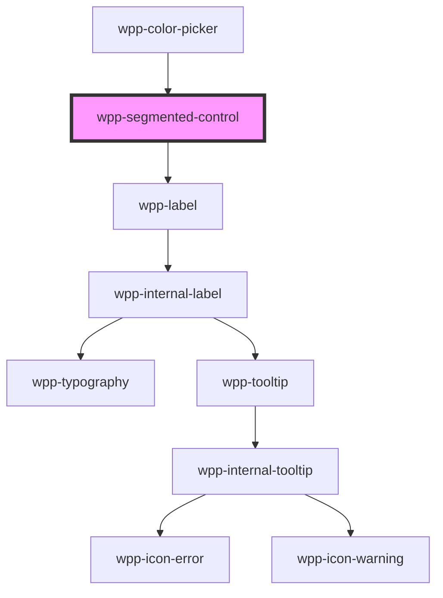

# wpp-segmented-control

The segmented control is a linear set of two or more segments, each of which functions as a mutually exclusive button. Segmented controls can contain text or icons.

<!-- Auto Generated Below -->


## Usage

### Angular

```html
<wpp-segmented-control [value]='activeItem' variant='icon'>
  <wpp-segmented-control-item variant='icon' value='item-1'>
    <wpp-icon-home></wpp-icon-home>
  </wpp-segmented-control-item>
  <wpp-segmented-control-item variant='icon' value='item-2'>
    <wpp-icon-board></wpp-icon-board>
  </wpp-segmented-control-item>
</wpp-segmented-control>

<wpp-segmented-control [value]='activeItem' hugContentOff width='300px' size='s'>
  <wpp-segmented-control-item value='item-1'>Item 1</wpp-segmented-control-item>
  <wpp-segmented-control-item value='item-2'>Item 2</wpp-segmented-control-item>
</wpp-segmented-control>

<wpp-segmented-control [value]='activeItem' formControlName="segment">
  <wpp-segmented-control-item value='item-1'>Item 1</wpp-segmented-control-item>
  <wpp-segmented-control-item value='item-2' [disabled]='disabled'>Item 2</wpp-segmented-control-item>
</wpp-segmented-control>

<wpp-segmented-control [value]='activeItem' [(ngModel)]='segment'>
  <wpp-segmented-control-item value='item-1'>Item 1</wpp-segmented-control-item>
  <wpp-segmented-control-item value='item-2' [counter]='counter'>Item 2</wpp-segmented-control-item>
</wpp-segmented-control>
```


### React

```tsx
import { WppIconHome, WppIconBoard, WppSegmentedControl, WppSegmentedControlItem } from '@wppopen/components-library-react'

export const SegmentedControlExample = () => (
  <>
    <WppSegmentedControl value={value}>
      <WppSegmentedControlItem value="1">Item 1</WppSegmentedControlItem>
      <WppSegmentedControlItem value="2" disabled={isDisabled}>Item 2</WppSegmentedControlItem>
      <WppSegmentedControlItem value="3" counter={counterValue}>Item 3</WppSegmentedControlItem>
      <WppSegmentedControlItem value="4">Item 4</WppSegmentedControlItem>
    </WppSegmentedControl>

    <WppSegmentedControl value={value} size="s" hugContentOff width="200px">
      <WppSegmentedControlItem value="1">Item 1</WppSegmentedControlItem>
      <WppSegmentedControlItem value="2">Long item name #2</WppSegmentedControlItem>
    </WppSegmentedControl>

    <WppSegmentedControl variant='icon' value={value}>
      <WppSegmentedControlItem variant='icon' value="1">
        <WppIconHome />
      </WppSegmentedControlItem>
      <WppSegmentedControlItem variant='icon' value="2">
        <WppIconBoard />
      </WppSegmentedControlItem>
    </WppSegmentedControl>
  </>
)
```


### Vue

```vue
<script setup lang="ts">
import { ref } from "vue";

import {
  WppSegmentedControl,
  WppSegmentedControlItem,
} from "@wppopen/components-library-vue";

const currentItem = ref("1");

const handleSegmentedControlChange = (event: CustomEvent) => {
  currentItem.value = event.detail.value;
};
</script>

<template>
  <WppSegmentedControl
    :value="currentItem"
    @wppChange="handleSegmentedControlChange"
  >
    <WppSegmentedControlItem variant="text" value="a">
      Item 1
    </WppSegmentedControlItem>
    <WppSegmentedControlItem variant="text" value="b">
      Item 2
    </WppSegmentedControlItem>
    <WppSegmentedControlItem variant="text" value="3" disabled>
      Item 3
    </WppSegmentedControlItem>
    <WppSegmentedControlItem variant="text" value="4" counter="3">
      Item 4
    </WppSegmentedControlItem>
    <WppSegmentedControlItem
      variant="text"
      value="5"
      counter="3"
      disabled
    >
      Item 5
    </WppSegmentedControlItem>
  </WppSegmentedControl>
</template>
```


## Properties

| Property             | Attribute         | Description                                                                                                                     | Type                       | Default                                           |
| -------------------- | ----------------- | ------------------------------------------------------------------------------------------------------------------------------- | -------------------------- | ------------------------------------------------- |
| `hugContentOff`      | `hug-content-off` | If the item size is relative to the control bar size.                                                                           | `boolean`                  | `false`                                           |
| `labelConfig`        | --                | Indicates label config                                                                                                          | `LabelConfig \| undefined` | `undefined`                                       |
| `labelTooltipConfig` | --                | Defines the dropdown configuration for the label tooltip.                                                                       | `DropdownConfig`           | `{     popperOptions: { strategy: 'fixed' },   }` |
| `required`           | `required`        | If `true`, the segmented control is required                                                                                    | `boolean`                  | `false`                                           |
| `size`               | `size`            | Defines the segmented control size.                                                                                             | `"m" \| "s"`               | `'m'`                                             |
| `value` _(required)_ | `value`           | Indicates selected value                                                                                                        | `number \| string`         | `undefined`                                       |
| `variant`            | `variant`         | Defines the component style.                                                                                                    | `"icon" \| "text"`         | `'text'`                                          |
| `width`              | `width`           | Defines the control bar width, with the leftover space distributed evenly between the items. Must be in pixels, e.g. **800px**. | `string`                   | `'auto'`                                          |


## Events

| Event       | Description                                                              | Type                                                                                                                  |
| ----------- | ------------------------------------------------------------------------ | --------------------------------------------------------------------------------------------------------------------- |
| `wppBlur`   | Emitted when the segmented control loses focus                           | `CustomEvent<FocusEvent>`                                                                                             |
| `wppChange` | Emitted when the active item has changed, emits value of the active item | `CustomEvent<BaseFormControlEventDetail<SegmentedControlValue> \| { value: SegmentedControlValue; reason: string; }>` |
| `wppFocus`  | Emitted when the segmented control receives focus                        | `CustomEvent<FocusEvent>`                                                                                             |


## Slots

| Slot | Description                                                                                              |
| ---- | -------------------------------------------------------------------------------------------------------- |
|      | Should contain only the `segmented-control-item` elements. The default slot, without the name attribute. |


## Shadow Parts

| Part        | Description               |
| ----------- | ------------------------- |
| `"inner"`   | Content slot element      |
| `"label"`   | Label text element        |
| `"wrapper"` | component wrapper element |


## CSS Custom Properties

| Name                                      | Description |
| ----------------------------------------- | ----------- |
| `--wpp-segmented-control-bg-color`        |             |
| `--wpp-segmented-control-border-radius-m` |             |
| `--wpp-segmented-control-border-radius-s` |             |
| `--wpp-segmented-control-item-margin-m`   |             |
| `--wpp-segmented-control-item-margin-s`   |             |
| `--wpp-segmented-control-padding-m`       |             |
| `--wpp-segmented-control-padding-s`       |             |


## Dependencies

### Used by

 - [wpp-color-picker](../wpp-color-picker)

### Depends on

- [wpp-label](../wpp-label)

### Graph


----------------------------------------------

*Built with [StencilJS](https://stenciljs.com/)*
