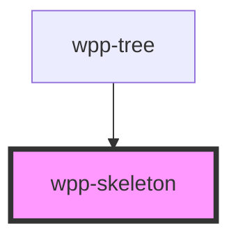

# wpp-skeleton


<!-- Auto Generated Below -->


## Usage

### Angular

```html
<!-- Basic Rectangle Skeleton -->
<wpp-skeleton
  variant="rectangle"
  width="120px"
  height="80px"
></wpp-skeleton>

<!-- Custom Layout: Card Example -->
<div style="width: 260px; padding: 20px;">
  <wpp-skeleton width="60%" height="30px" style="margin-bottom: 16px;"></wpp-skeleton>
  <wpp-skeleton width="90%" height="16px" style="margin-bottom: 8px;"></wpp-skeleton>
  <wpp-skeleton width="80%" height="16px" style="margin-bottom: 24px;"></wpp-skeleton>
  <div style="display: flex; gap: 40px;">
    <wpp-skeleton width="70%" height="8px"></wpp-skeleton>
    <wpp-skeleton width="30%" height="8px"></wpp-skeleton>
  </div>
</div>

<!-- Custom Layout: Table Example -->
<div style="width: 100%;">
  <div style="display: grid; grid-template-columns: repeat(6, 1fr); gap: 16px; margin-bottom: 16px;">
    <wpp-skeleton *ngFor="let header of [].constructor(6)" width="100%" height="20px"></wpp-skeleton>
  </div>
  <div *ngFor="let row of [].constructor(5)" style="display: grid; grid-template-columns: repeat(6, 1fr); gap: 16px; margin-bottom: 16px;">
    <wpp-skeleton *ngFor="let col of [].constructor(6)" width="100%" height="16px"></wpp-skeleton>
  </div>
</div>

<!-- Custom Layout: Mixed Layout -->
<div style="display: flex; gap: 24px; align-items: center; padding: 20px;">
  <wpp-skeleton variant="circle" width="50px" height="50px"></wpp-skeleton>
  <div style="flex: 1;">
    <wpp-skeleton width="80%" height="20px" style="margin-bottom: 8px;"></wpp-skeleton>
    <wpp-skeleton width="60%" height="16px"></wpp-skeleton>
  </div>
</div>
```


### React

```tsx
import { WppSkeleton } from '@wppopen/components-library-react'

export const SkeletonExample = () => (
  <>
    {/* Basic Rectangle Skeleton */}
    <WppSkeleton
      variant="rectangle"
      width="192px"
      height="80px"
    />

    {/* Custom Layout: Card Example */}
    <div style={{ width: '260px', padding: '20px' }}>
      <WppSkeleton width="60%" height="30px" style={{ marginBottom: '16px' }} />
      <WppSkeleton width="90%" height="16px" style={{ marginBottom: '8px' }} />
      <WppSkeleton width="80%" height="16px" style={{ marginBottom: '24px' }} />
      <div style={{ display: 'flex', gap: '40px' }}>
        <WppSkeleton width="70%" height="8px" />
        <WppSkeleton width="30%" height="8px" />
      </div>
    </div>

    {/* Custom Layout: Table Example */}
    <div style={{ width: '100%' }}>
      <div style={{ display: 'grid', gridTemplateColumns: 'repeat(6, 1fr)', gap: '16px', marginBottom: '16px' }}>
        {Array(6).fill(null).map((_, index) => (
          <WppSkeleton key={index} width="100%" height="20px" />
        ))}
      </div>
      {Array(5).fill(null).map((_, rowIndex) => (
        <div
          key={rowIndex}
          style={{ display: 'grid', gridTemplateColumns: 'repeat(6, 1fr)', gap: '16px', marginBottom: '16px' }}
        >
          {Array(6).fill(null).map((_, colIndex) => (
            <WppSkeleton key={`${rowIndex}-${colIndex}`} width="100%" height="16px" />
          ))}
        </div>
      ))}
    </div>

    {/* Custom Layout: Mixed Layout */}
    <div style={{ display: 'flex', gap: '24px', alignItems: 'center', padding: '20px' }}>
      <WppSkeleton variant="circle" width="50px" height="50px" />
      <div style={{ flex: 1 }}>
        <WppSkeleton width="80%" height="20px" style={{ marginBottom: '8px' }} />
        <WppSkeleton width="60%" height="16px" />
      </div>
    </div>
  </>
)
```


### Vue

```vue

<script setup lang="ts">
import { WppSkeleton } from '@wppopen/components-library-vue'
</script>

<template>
  <!-- Basic Rectangle Skeleton -->
  <WppSkeleton
    variant="rectangle"
    width="192px"
    height="80px"
  />

  <!-- Custom Layout: Card Example -->
  <div style="width: 260px; padding: 20px;">
    <WppSkeleton width="60%" height="30px" style="margin-bottom: 16px;" />
    <WppSkeleton width="90%" height="16px" style="margin-bottom: 8px;" />
    <WppSkeleton width="80%" height="16px" style="margin-bottom: 24px;" />
    <div style="display: flex; gap: 40px;">
      <WppSkeleton width="70%" height="8px" />
      <WppSkeleton width="30%" height="8px" />
    </div>
  </div>

  <!-- Custom Layout: Table Example -->
  <div style="width: 100%;">
    <div style="display: grid; grid-template-columns: repeat(6, 1fr); gap: 16px; margin-bottom: 16px;">
      <WppSkeleton v-for="index in 6" :key="`header-${index}`" width="100%" height="20px" />
    </div>
    <div v-for="rowIndex in 5" :key="`row-${rowIndex}`" style="display: grid; grid-template-columns: repeat(6, 1fr); gap: 16px; margin-bottom: 16px;">
      <WppSkeleton v-for="colIndex in 6" :key="`row-${rowIndex}-col-${colIndex}`" width="100%" height="16px" />
    </div>
  </div>

  <!-- Custom Layout: Mixed Layout -->
  <div style="display: flex; gap: 24px; align-items: center; padding: 20px;">
    <WppSkeleton variant="circle" width="50px" height="50px" />
    <div style="flex: 1;">
      <WppSkeleton width="80%" height="20px" style="margin-bottom: 8px;" />
      <WppSkeleton width="60%" height="16px;" />
    </div>
  </div>
</template>

```


## Properties

| Property    | Attribute   | Description                                                                                                                                                                                     | Type                      | Default       |
| ----------- | ----------- | ----------------------------------------------------------------------------------------------------------------------------------------------------------------------------------------------- | ------------------------- | ------------- |
| `animation` | `animation` | <span style="color:red">**[DEPRECATED]**</span> - this prop will be deleted in version 4.0.0. The skeleton component will always have animation.<br/><br/>If `true`, the skeleton has animation | `boolean`                 | `true`        |
| `height`    | `height`    | Height of skeleton, if width is not passed, then it use default value - 80px                                                                                                                    | `number \| string`        | `undefined`   |
| `variant`   | `variant`   | Indicates the skeleton variant                                                                                                                                                                  | `"circle" \| "rectangle"` | `'rectangle'` |
| `width`     | `width`     | Width of skeleton, if width is not passed, then it use default values. For rectangle it's 240px, for circle - 80px                                                                              | `number \| string`        | `undefined`   |


## CSS Custom Properties

| Name                                     | Description |
| ---------------------------------------- | ----------- |
| `--wpp-skeleton-animation-duration`      |             |
| `--wpp-skeleton-bg-color`                |             |
| `--wpp-skeleton-circle-height`           |             |
| `--wpp-skeleton-circle-width`            |             |
| `--wpp-skeleton-rectangle-border-radius` |             |
| `--wpp-skeleton-rectangle-height`        |             |
| `--wpp-skeleton-rectangle-width`         |             |


## Dependencies

### Used by

 - [wpp-tree](../wpp-tree)

### Graph


----------------------------------------------

*Built with [StencilJS](https://stenciljs.com/)*
