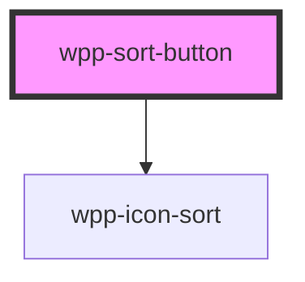

# wpp-sort-button

Create a custom filter button.

<!-- Auto Generated Below -->


## Usage

### Angular

```html
<wpp-sort-button>sort</wpp-sort-button>
<wpp-sort-button
  [disabled]="true"
>Sort</wpp-sort-button>
```


### React

```tsx
import { WppSortButton } from '@wppopen/components-library-react'

export const SortButtonExample = () => (
  <>
    <WppSortButton>Sort</WppSortButton>
    <WppSortButton disabled>Sort</WppSortButton>
  </>
)
```


### Vue

```vue

<script setup lang="ts">
import { WppSortButton } from '@wppopen/components-library-vue'
</script>

<template>
  <WppSortButton>Sort</WppSortButton>
  <WppSortButton disabled>Sort</WppSortButton>
</template>

```


## Properties

| Property    | Attribute    | Description                                    | Type                  | Default     |
| ----------- | ------------ | ---------------------------------------------- | --------------------- | ----------- |
| `ariaProps` | --           | Contains the button `aria-` props.             | `AriaProps`           | `{}`        |
| `autoFocus` | `auto-focus` | If the button should be in focus on page load. | `boolean`             | `false`     |
| `disabled`  | `disabled`   | If the component is disabled.                  | `boolean`             | `false`     |
| `name`      | `name`       | Defines the button name.                       | `string \| undefined` | `undefined` |


## Methods

### `setFocus() => Promise<void>`

Method that sets focus on the native button.

#### Returns

Type: `Promise<void>`


## Slots

| Slot | Description                                                                   |
| ---- | ----------------------------------------------------------------------------- |
|      | Contains the main text content. The default slot, without the name attribute. |


## Shadow Parts

| Part       | Description          |
| ---------- | -------------------- |
| `"button"` | Button element       |
| `"icon"`   | Icon element         |
| `"inner"`  | Content slot element |
| `"text"`   | Main text content    |


## CSS Custom Properties

| Name                                          | Description |
| --------------------------------------------- | ----------- |
| `--wpp-sort-button-bg-color`                  |             |
| `--wpp-sort-button-bg-color-active`           |             |
| `--wpp-sort-button-bg-color-disabled`         |             |
| `--wpp-sort-button-bg-color-hover`            |             |
| `--wpp-sort-button-border-color`              |             |
| `--wpp-sort-button-border-color-active`       |             |
| `--wpp-sort-button-border-color-disabled`     |             |
| `--wpp-sort-button-border-color-hover`        |             |
| `--wpp-sort-button-border-radius`             |             |
| `--wpp-sort-button-border-style`              |             |
| `--wpp-sort-button-border-width`              |             |
| `--wpp-sort-button-first-border-color-focus`  |             |
| `--wpp-sort-button-height`                    |             |
| `--wpp-sort-button-icon-color`                |             |
| `--wpp-sort-button-icon-color-active`         |             |
| `--wpp-sort-button-icon-color-disabled`       |             |
| `--wpp-sort-button-icon-color-hover`          |             |
| `--wpp-sort-button-padding`                   |             |
| `--wpp-sort-button-second-border-color-focus` |             |
| `--wpp-sort-button-text-color`                |             |
| `--wpp-sort-button-text-color-active`         |             |
| `--wpp-sort-button-text-color-disabled`       |             |
| `--wpp-sort-button-text-color-hover`          |             |
| `--wpp-sort-button-text-margin`               |             |


## Dependencies

### Depends on

- [wpp-icon-sort](../wpp-icon/components/arrows/arrows/wpp-icon-sort)

### Graph


----------------------------------------------

*Built with [StencilJS](https://stenciljs.com/)*
