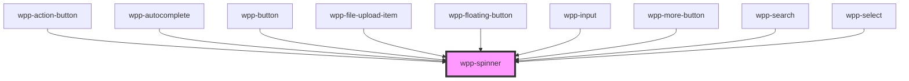

# wpp-spinner

Loading spinners can be used when retrieving data or performing slow computations and help to notify users that loading is underway.

<!-- Auto Generated Below -->


## Usage

### Angular

```html
<wpp-spinner size='m' />
<wpp-spinner color='var(--wpp-primary-color-100)' />
```


### React

```tsx
import { WppButton } from '@platform-ui-kit/components-library-react'

export const SpinnerExample = () => (
  <>
    <WppSpinner size='m' />
    <WppSpinner color='var(--wpp-primary-color-100)' />
  </>
)
```


### Vue

```vue

<script setup lang="ts">
import { WppSpinner } from "@platform-ui-kit/components-library-vue"
</script>

<template>
  <WppSpinner size="m" />
  <WppSpinner color="var(--wpp-primary-color-100)" />
</template>


```


## Properties

| Property    | Attribute | Description                        | Type                     | Default                          |
| ----------- | --------- | ---------------------------------- | ------------------------ | -------------------------------- |
| `ariaProps` | --        | Defines the spinner `aria-` props. | `AriaProps \| undefined` | `undefined`                      |
| `color`     | `color`   | Defines the spinner color.         | `string`                 | `'var(--wpp-primary-color-500)'` |
| `size`      | `size`    | Defines the spinner size.          | `"l" \| "m" \| "s"`      | `'s'`                            |


## CSS Custom Properties

| Name                      | Description |
| ------------------------- | ----------- |
| `--wpp-spinner-padding-l` |             |
| `--wpp-spinner-padding-m` |             |
| `--wpp-spinner-padding-s` |             |


## Dependencies

### Used by

 - [wpp-action-button](../wpp-action-button)
 - [wpp-autocomplete](../wpp-autocomplete)
 - [wpp-button](../wpp-button)
 - [wpp-file-upload-item](../wpp-file-upload/components)
 - [wpp-floating-button](../wpp-floating-button)
 - [wpp-input](../wpp-input)
 - [wpp-more-button](../wpp-more-button)
 - [wpp-search](../wpp-search)
 - [wpp-select](../wpp-select)

### Graph


----------------------------------------------

*Built with [StencilJS](https://stenciljs.com/)*
