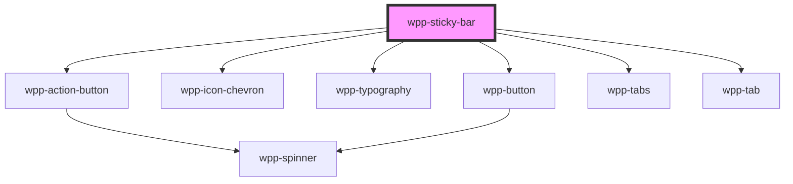

# wpp-sticky-bar


<!-- Auto Generated Below -->


## Usage

### Angular

```ts
import { ChangeDetectionStrategy, Component } from '@angular/core'
import { StickyBarButtonItem, StickyBarTabItem } from '@wppopen/components-library'
import { btns_list_1, tabs_list_1 } from './consts'

@Component({
  selector: 'sticky-bar-example',
  templateUrl: './sticky-bar.page.html',
  styleUrls: ['./sticky-bar.page.scss'],
  changeDetection: ChangeDetectionStrategy.OnPush,
})
export class StickyBarExamplePage {
  public validButtonsList: StickyBarButtonItem[] = btns_list_1 as StickyBarButtonItem[]

  public validTabsList: StickyBarTabItem[] = tabs_list_1

  public handleClickBackIcon = () => {
    console.log('Has Clicked Back Icon')
  }

  public handleClickBtn = (event: Event) => {
    console.log((event as CustomEvent).detail)
  }

  public handleClickTab = (event: Event) => {
    console.log((event as CustomEvent).detail)
  }
}
```

```html
<wpp-sticky-bar
  variant="two-lines-with-tabs"
  [tabs]="validTabsList"
  [buttons]="validButtonsList"
  [barTitle]="'Page Title'"
  (wppClickBackIcon)="handleClickBackIcon()"
  (wppClickBtn)="handleClickBtn($event)"
  (wppClickTab)="handleClickTab($event)"
></wpp-sticky-bar>
<div data-testid="sticky-bar-container" class="container">
  <div class="additionalSpace">
    <wpp-typography type="2xl-heading">Additional space on page</wpp-typography>
  </div>
</div>
```

```scss
.container {
  display: flex;
  flex-direction: column;
  align-items: center;
  box-sizing: border-box;
  width: 100%;
  padding: 50px;
}

.additionalSpace {
  display: flex;
  flex-direction: column;
  align-items: center;
  box-sizing: border-box;
  width: 70%;
  height: 500vh;
  padding: 50px;
  background: rgb(173 216 230);
  border: 4px dashed gray;
  border-radius: 50px;
  opacity: 0.5;
}
```

```ts
export const btns_list_1 = [
  {
    variant: 'primary',
    text: 'Primary',
  },
  {
    variant: 'secondary',
    text: 'Secondary 1',
  },
  {
    variant: 'secondary',
    text: 'Secondary 2',
  },
  {
    variant: 'action-button',
    text: 'Action Btn',
  },
]

export const tabs_list_1 = [
  {
    text: 'Tab 1',
    value: 'tab1',
  },
  {
    text: 'Tab 2',
    value: 'tab2',
  },
  {
    text: 'Tab 3',
    value: 'tab3',
  },
  {
    text: 'Tab 4',
    value: 'tab4',
  },
  {
    text: 'Tab 5',
    value: 'tab5',
  },
]
```


### React

```tsx
import React from 'react'

import styles from './StickyBar.module.scss'
import { WppStickyBar, WppTypography } from '@wppopen/components-library-react'
import { validButtonsList, validTabsList } from './consts'

import {
  StickyBarButtonItem,
  StickyBarTabItem,
} from '@wppopen/components-library/dist/types/components/wpp-sticky-bar/types'
import { WppStickyBarCustomEvent } from '@wppopen/components-library/dist/types/components'

export const StickyBarPage = () => (
  <>
    <WppStickyBar
      onWppClickBackIcon={() => {
        console.log('Has Clicked Back Icon')
      }}
      onWppClickBtn={(event: WppStickyBarCustomEvent<StickyBarButtonItem>) => console.log(event)}
      onWppClickTab={(event: WppStickyBarCustomEvent<StickyBarTabItem>) => console.log(event)}
      variant="two-lines-with-tabs"
      buttons={validButtonsList}
      tabs={validTabsList}
      barTitle={'Page Title'}
    ></WppStickyBar>
    <div className={styles.container}>
      <div className={styles.additionalSpace}>
        <WppTypography type="2xl-heading">Additional space on page</WppTypography>
      </div>
    </div>
  </>
)
```

```scss
.container {
  display: flex;
  flex-direction: column;
  align-items: center;
  box-sizing: border-box;
  width: 100%;
  padding: 50px;
}

.additionalSpace {
  display: flex;
  flex-direction: column;
  align-items: center;
  box-sizing: border-box;
  width: 70%;
  height: 500vh;
  padding: 50px;
  background: rgb(173 216 230);
  border: 4px dashed gray;
  border-radius: 50px;
  opacity: 0.5;
}
```

```ts
import { StickyBarTabItem } from '@wppopen/components-library/dist/types/components/wpp-sticky-bar/types'
import { StickyBarButtonItem } from '@wppopen/components-library/dist/types/components/wpp-sticky-bar/types'

export const validButtonsList: StickyBarButtonItem[] = [
  {
    variant: 'primary',
    text: 'Primary',
  },
  {
    variant: 'secondary',
    text: 'Secondary 1',
  },
  {
    variant: 'secondary',
    text: 'Secondary 2',
  },
  {
    variant: 'action-button',
    text: 'Action Btn',
  },
]

export const validTabsList: StickyBarTabItem[] = [
  {
    text: 'Tab 1',
    value: 'tab1',
  },
  {
    text: 'Tab 2',
    value: 'tab2',
  },
  {
    text: 'Tab 3',
    value: 'tab3',
  },
  {
    text: 'Tab 4',
    value: 'tab4',
  },
  {
    text: 'Tab 5',
    value: 'tab5',
  },
]
```


### Vue

```vue
<script setup lang="ts">
import { WppStickyBar, WppTypography } from '@wppopen/components-library-vue'
import { btns_list_1, tabs_list_1 } from './consts'

const onClickBackIcon = () => {
  console.log('Has Clicked Back Icon')
}

const onClickBtn = (event: CustomEvent) => {
  console.log(event.detail)
}

const onClickTab = (event: CustomEvent) => {
  console.log(event.detail)
}
</script>

<template>
  <WppStickyBar
    variant="two-lines-with-tabs"
    :buttons="btns_list_1"
    :tabs="tabs_list_1"
    barTitle="Page Title"
    @wppClickBackIcon="onClickBackIcon"
    @WppClickBtn="onClickBtn"
    @WppClickTab="onClickTab"
  ></WppStickyBar>
  <div class="container">
    <div class="additionalSpace">
      <WppTypography type="2xl-heading">Additional space on page</WppTypography>
    </div>
  </div>
</template>

<style scoped>
.container {
  display: flex;
  flex-direction: column;
  align-items: center;
  box-sizing: border-box;
  width: 100%;
  padding: 50px;
}

.additionalSpace {
  display: flex;
  flex-direction: column;
  align-items: center;
  box-sizing: border-box;
  width: 70%;
  height: 500vh;
  padding: 50px;
  background: rgb(173 216 230);
  border: 4px dashed gray;
  border-radius: 50px;
  opacity: 0.5;
}
</style>
```


## Properties

| Property         | Attribute          | Description                                                                                                                                                                                                                | Type                                                            | Default                   |
| ---------------- | ------------------ | -------------------------------------------------------------------------------------------------------------------------------------------------------------------------------------------------------------------------- | --------------------------------------------------------------- | ------------------------- |
| `barTitle`       | `bar-title`        | The title on the sticky bar.                                                                                                                                                                                               | `string`                                                        | `undefined`               |
| `buttons`        | --                 | The configuration of the buttons. Based on this array with config items, buttons are placed on the sticky bar. There can be at most 1 primary button, at most 2 secondary buttons and at most 1 action button.             | `StickyBarButtonItem[]`                                         | `[]`                      |
| `offsetFromTop`  | `offset-from-top`  | The offset from the top edge of the screen. In most cases, this shouldn't be used, as the sticky-bar searches for the os-bar and places itself right below it. Use this just when the sticky-bar does not find the os-bar. | `number \| undefined`                                           | `undefined`               |
| `scrollTreshold` | `scroll-treshold`  | The distance in pixels after which the sticky bar will become visible. The default value is 200px.                                                                                                                         | `number`                                                        | `DEFAULT_SCROLL_TRESHOLD` |
| `tabs`           | --                 | The configuration of the tabs. Based on this array with config items, tabs are placed on the sticky bar. This prop can only be used with the "two-lines-with-tabs" variant.                                                | `StickyBarTabItem[]`                                            | `[]`                      |
| `variant`        | `variant`          | The variant of the sticky-bar. The default value is 'one-line'                                                                                                                                                             | `"blank" \| "one-line" \| "two-lines" \| "two-lines-with-tabs"` | `'one-line'`              |
| `withBackButton` | `with-back-button` | If the sticky bar has the back button (on the left of the title). By default, the back button is shown.                                                                                                                    | `boolean`                                                       | `true`                    |
| `zIndex`         | `z-index`          | The zIndex of the sticky bar. The default value is 890 such that it hides below the os-bar.                                                                                                                                | `number`                                                        | `Z_INDEX.STICKY_BAR`      |


## Events

| Event              | Description                                                                                                                                                  | Type                               |
| ------------------ | ------------------------------------------------------------------------------------------------------------------------------------------------------------ | ---------------------------------- |
| `wppClickBackIcon` | Emitted when the back icon is clicked (icon on the left of the title).                                                                                       | `CustomEvent<void>`                |
| `wppClickBtn`      | Emitted when one of the buttons provided in the "buttons" list is clicked. This event contains the details of the StickyBarButtonItem provided to the array. | `CustomEvent<StickyBarButtonItem>` |
| `wppClickTab`      | Emitted when one of the tabs provided in the "tabs" list is clicked. This event contains the details of the tab item clicked.                                | `CustomEvent<StickyBarTabItem>`    |


## Slots

| Slot        | Description                                                                                                                    |
| ----------- | ------------------------------------------------------------------------------------------------------------------------------ |
| `"content"` | Should contain the content for the sticky bar. This slot is available only for the following variants: 'two-lines' and 'blank' |


## Dependencies

### Depends on

- [wpp-action-button](../wpp-action-button)
- [wpp-icon-chevron](../wpp-icon/components/arrows/arrows/wpp-icon-chevron)
- [wpp-typography](../wpp-typography)
- [wpp-button](../wpp-button)
- [wpp-tabs](../wpp-tabs)
- [wpp-tab](../wpp-tabs/components/wpp-tab)

### Graph


----------------------------------------------

*Built with [StencilJS](https://stenciljs.com/)*
