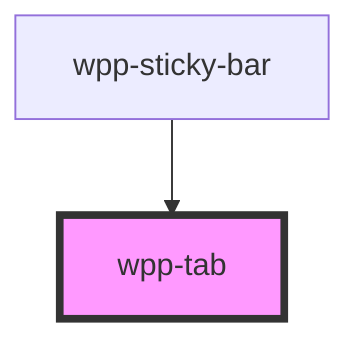

# wpp-tab

<!-- Auto Generated Below -->

## Properties

| Property             | Attribute  | Description                                                                                                              | Type                   | Default     |
| -------------------- | ---------- | ------------------------------------------------------------------------------------------------------------------------ | ---------------------- | ----------- |
| `active`             | `active`   | If the component is active.                                                                                              | `boolean`              | `false`     |
| `counter`            | `counter`  | Defines the number of elements within a specific item.                                                                   | `number`               | `0`         |
| `disabled`           | `disabled` | If the component is disabled.                                                                                            | `boolean`              | `false`     |
| `icon`               | `icon`     | Defines the icon that will be displayed in the tab. Must be an icon from the WPP library. Example: `wpp-icon-pie-chart`. | ``wpp-icon-${string}`` | `undefined` |
| `size`               | `size`     | Indicates tabs size                                                                                                      | `"m" \| "s"`           | `'m'`       |
| `value` _(required)_ | `value`    | Indicates value of the item (must be unique)                                                                             | `string`               | `undefined` |

## Events

| Event                     | Description                       | Type                                |
| ------------------------- | --------------------------------- | ----------------------------------- |
| `wppBlur`                 | Emitted when an item loses focus. | `CustomEvent<FocusEvent>`           |
| `wppChangeTabControlItem` | Emitted when an item is clicked.  | `CustomEvent<TabChangeEventDetail>` |
| `wppFocus`                | Emitted when an item is in focus. | `CustomEvent<FocusEvent>`           |

## Shadow Parts

| Part        | Description               |
| ----------- | ------------------------- |
| `"counter"` | counter text element      |
| `"inner"`   | Content slot element      |
| `"wrapper"` | component wrapper element |

## CSS Custom Properties

| Name                                  | Description |
| ------------------------------------- | ----------- |
| `--wpp-tab-bg-color`                  |             |
| `--wpp-tab-first-border-color-focus`  |             |
| `--wpp-tab-padding-m`                 |             |
| `--wpp-tab-padding-s`                 |             |
| `--wpp-tab-second-border-color-focus` |             |
| `--wpp-tab-tab-font-weight`           |             |
| `--wpp-tab-tab-margin`                |             |
| `--wpp-tab-text-color`                |             |
| `--wpp-tab-text-color-active`         |             |
| `--wpp-tab-text-color-disabled`       |             |
| `--wpp-tab-text-color-hover`          |             |
| `--wpp-tab-text-color-selected`       |             |
| `--wpp-tab-width`                     |             |

## Dependencies

### Used by

 - [wpp-sticky-bar](../../../wpp-sticky-bar)

### Graph

----------------------------------------------

*Built with [StencilJS](https://stenciljs.com/)*
