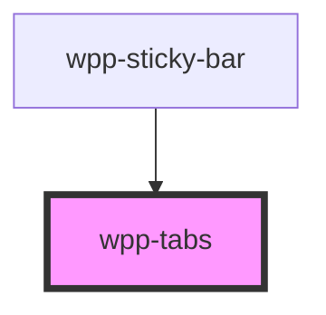

# wpp-tabs


<!-- Auto Generated Below -->


## Usage

### Angular

```ts
@Component({
  ...
})
export class TabsExample {
  public activeTab: string = 'tab-1';

  public handleActiveTabChange(event: Event): void {
    this.activeTab = (event as CustomEvent<TabsChangeEventDetail>).detail.value
  }
}
```

```html
<wpp-tabs [value]="activeTab" (wppChange)="handleActiveTabChange($event)">
  <wpp-tab value="tab-1">Tab 1</wpp-tab>
  <wpp-tab value="tab-2" [counter]="10">Tab 2</wpp-tab>
  <wpp-tab value="tab-3" disabled>Tab 3</wpp-tab>
</wpp-tabs>

<ng-container [ngSwitch]="activeTab">
  <wpp-card *ngSwitchCase="'tab-1'">
    <wpp-typography type="l-heading">Tab 1</wpp-typography>
    <p>Lorem ipsum dolor sit amet, consectetur adipiscing elit, sed do eiusmod tempor incididunt ut labore et dolore magna aliqua. Ut enim ad minim veniam, quis nostrud exercitation ullamco laboris nisi ut aliquip ex ea commodo consequat. Duis aute irure dolor in reprehenderit in voluptate velit esse cillum dolore eu fugiat nulla pariatur. Excepteur sint occaecat cupidatat non proident, sunt in culpa qui officia deserunt mollit anim id est laborum.</p>
  </wpp-card>

  <wpp-card *ngSwitchCase="'tab-2'">
    <wpp-typography type="l-heading">Tab 2</wpp-typography>
    <p>Lorem ipsum dolor sit amet, consectetur adipiscing elit, sed do eiusmod tempor incididunt ut labore et dolore magna aliqua. Ut enim ad minim veniam, quis nostrud exercitation ullamco laboris nisi ut aliquip ex ea commodo consequat. Duis aute irure dolor in reprehenderit in voluptate velit esse cillum dolore eu fugiat nulla pariatur. Excepteur sint occaecat cupidatat non proident, sunt in culpa qui officia deserunt mollit anim id est laborum.</p>
  </wpp-card>

  <wpp-card *ngSwitchCase="'tab-3'">
    <wpp-typography type="l-heading">Tab 3</wpp-typography>
    <p>Lorem ipsum dolor sit amet, consectetur adipiscing elit, sed do eiusmod tempor incididunt ut labore et dolore magna aliqua. Ut enim ad minim veniam, quis nostrud exercitation ullamco laboris nisi ut aliquip ex ea commodo consequat. Duis aute irure dolor in reprehenderit in voluptate velit esse cillum dolore eu fugiat nulla pariatur. Excepteur sint occaecat cupidatat non proident, sunt in culpa qui officia deserunt mollit anim id est laborum.</p>
  </wpp-card>
</ng-container>
```


### React

```tsx
import React, { useState } from 'react'
import { WppTabs, WppTab, WppTypography } from '@wppopen/components-library-react'
import { TabsChangeEventDetail } from '@wppopen/components-library'

export const TabsExample = () => {
  const [currentTab, setCurrentTab] = useState('cars')

  const handleTabChange = (event: CustomEvent<TabsChangeEventDetail>) => {
    setCurrentTab(event.detail.value)
  }

  return (
    <>
      <WppTabs value={currentTab} onWppChange={handleTabChange}>
        <WppTab value='houses'>Houses</WppTab>
        <WppTab value='cars'>Cars</WppTab>
        <WppTab disabled counter={2} value='food'>
          Food
        </WppTab>
        <WppTab value='drinks'>Drinks</WppTab>
      </WppTabs>
      {
        {
          houses: (
            <WppTypography type="xs-body-regular" className="tab-content">
              First content
            </WppTypography>
          ),
          cars: (
            <WppTypography type="xs-body-regular" className="tab-content">
              Second content
            </WppTypography>
          ),
          drinks: (
            <WppTypography type="xs-body-regular" className="tab-content">
              Fourth content
            </WppTypography>
          ),
        }[currentTab]
      }
    </>
  )
}
```


### Vue

```vue

<script setup lang="ts">
import { ref } from "vue"

import { WppTabs, WppTab, WppTypography } from "@wppopen/components-library-vue"

const currentTab = ref("cars")

const handleTabChange = (event: CustomEvent) => {
  currentTab.value = event.detail.value
}
</script>

<template>
  <WppTabs :value="currentTab" @wppChange="handleTabChange">
    <WppTab value="houses">Houses</WppTab>
    <WppTab value="cars">Cars</WppTab>
    <WppTab disabled counter="2" value="food">
      Food
    </WppTab>
    <WppTab value="drinks">Drinks</WppTab>
  </WppTabs>

  <WppTypography v-if="currentTab === 'houses'" type="xs-body-regular" class="tab-content">
    First content
  </WppTypography>
  <WppTypography v-if="currentTab === 'cars'" type="xs-body-regular" class="tab-content">
    Second content
  </WppTypography>
  <WppTypography v-if="currentTab === 'drinks'" type="xs-body-regular" class="tab-content">
    Fourth content
  </WppTypography>
</template>


```


## Properties

| Property             | Attribute | Description                      | Type         | Default     |
| -------------------- | --------- | -------------------------------- | ------------ | ----------- |
| `size`               | `size`    | Indicates tabs size              | `"m" \| "s"` | `'m'`       |
| `value` _(required)_ | `value`   | Defines the active tab `itemId`. | `string`     | `undefined` |


## Events

| Event       | Description                                                            | Type                                 |
| ----------- | ---------------------------------------------------------------------- | ------------------------------------ |
| `wppChange` | Emitted when the active tab has changed, emits index of the active tab | `CustomEvent<TabsChangeEventDetail>` |


## Slots

| Slot | Description                                                                                 |
| ---- | ------------------------------------------------------------------------------------------- |
|      | Should contain only the tab control elements. The default slot, without the name attribute. |


## Shadow Parts

| Part        | Description               |
| ----------- | ------------------------- |
| `"counter"` | tabs slider element       |
| `"inner"`   | Content slot element      |
| `"slider"`  |                           |
| `"wrapper"` | component wrapper element |


## CSS Custom Properties

| Name                                    | Description |
| --------------------------------------- | ----------- |
| `--wpp-tabs-selected-item-slider-color` |             |
| `--wpp-tabs-slider-border-radius`       |             |
| `--wpp-tabs-slider-color`               |             |
| `--wpp-tabs-slider-width`               |             |
| `--wpp-tabs-width`                      |             |


## Dependencies

### Used by

 - [wpp-sticky-bar](../wpp-sticky-bar)

### Graph


----------------------------------------------

*Built with [StencilJS](https://stenciljs.com/)*
