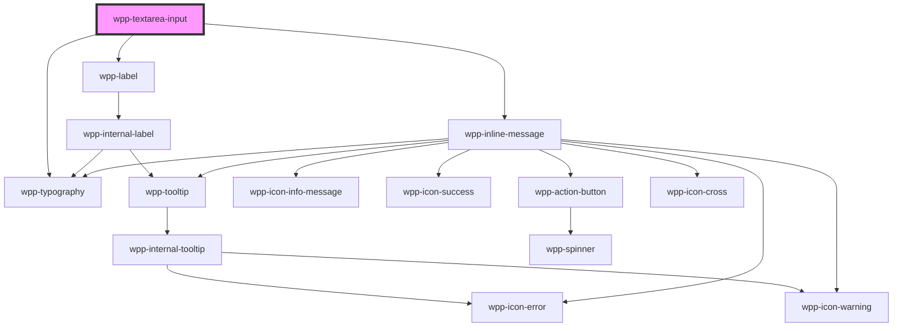

# wpp-textarea-input


<!-- Auto Generated Below -->


## Usage

### Angular

```html
<wpp-textarea-input
  [labelConfig]='labelConfig'
  [message]='message'
  [messageType]='messageType'
  name='name'
  id='name'
></wpp-textarea-input>
```


### React

```tsx
import { WppTextareaInput } from '@platform-ui-kit/components-library-react'

export const TextareaInputExample = () => (
  <WppTextareaInput
    name="email"
    placeholder="Email"
    message="Email error"
    messageType="error"
    value="example@gma"
    labelConfig={{
      text: 'Enter some email info',
      icon: 'wpp-icon-mail'
    }}
  />
)
```


### Vue

```vue
<script setup>
import { WppTextareaInput } from "@platform-ui-kit/components-library-vue";
</script>

<template>
  <WppTextareaInput
    placeholder="Enter text"
    name="asd"
    charactersLimit="10"
    warningThreshold="5"
    data-testid="regular-limited-text-area"
    required
    autoFocus
    :labelConfig="{
      icon: 'wpp-icon-info',
      text: 'Regular Text Area with Limit',
      description: 'Description',
      locales: {
        optional: 'Optional',
      },
    }"
  />
</template>
```


## Properties

| Property             | Attribute            | Description                                                                                                                                                                                         | Type                                           | Default                                           |
| -------------------- | -------------------- | --------------------------------------------------------------------------------------------------------------------------------------------------------------------------------------------------- | ---------------------------------------------- | ------------------------------------------------- |
| `ariaProps`          | --                   | Contains the textarea `aria-` props.                                                                                                                                                                | `AriaProps`                                    | `{}`                                              |
| `autoFocus`          | `auto-focus`         | If `true`, the input should be focused on page load                                                                                                                                                 | `boolean`                                      | `false`                                           |
| `charactersLimit`    | `characters-limit`   | Defines the textarea character limit.                                                                                                                                                               | `number \| undefined`                          | `undefined`                                       |
| `disabled`           | `disabled`           | If the textarea is disabled.                                                                                                                                                                        | `boolean`                                      | `false`                                           |
| `labelConfig`        | --                   | Indicates label config                                                                                                                                                                              | `LabelConfig \| undefined`                     | `undefined`                                       |
| `labelTooltipConfig` | --                   | Tooltip config for label, under the hood tooltip using tippy.js, all information about this library and available props you can see via this link `https://atomiks.github.io/tippyjs/v6/all-props/` | `DropdownConfig`                               | `{     popperOptions: { strategy: 'fixed' },   }` |
| `locales`            | --                   | Indicates locales for textarea component                                                                                                                                                            | `{ charactersEntered?: string \| undefined; }` | `{}`                                              |
| `maxMessageLength`   | `max-message-length` | Defines a maximum length for the textarea threshold warning/error messages. Once a message exceeds `maxMessageLength`, it will be truncated, with the full message shown in a tooltip.              | `number \| undefined`                          | `undefined`                                       |
| `message`            | `message`            | Defines the textarea message.                                                                                                                                                                       | `string \| undefined`                          | `undefined`                                       |
| `messageType`        | `message-type`       | Defines the textarea message type.                                                                                                                                                                  | `"error" \| "warning" \| undefined`            | `undefined`                                       |
| `name`               | `name`               | Defines the textarea name.                                                                                                                                                                          | `string \| undefined`                          | `undefined`                                       |
| `placeholder`        | `placeholder`        | Defines the textarea placeholder.                                                                                                                                                                   | `string \| undefined`                          | `undefined`                                       |
| `required`           | `required`           | If the textarea is required.                                                                                                                                                                        | `boolean`                                      | `false`                                           |
| `rows`               | `rows`               | Defines the textarea height in rows.                                                                                                                                                                | `number`                                       | `undefined`                                       |
| `size`               | `size`               | Defines the textarea size.                                                                                                                                                                          | `"m" \| "s"`                                   | `'m'`                                             |
| `value`              | `value`              | Defines the textarea value.                                                                                                                                                                         | `string`                                       | `undefined`                                       |
| `warningThreshold`   | `warning-threshold`  | Defines a char threshold after which users are notified that they are about to exceed `charactersLimit`.                                                                                            | `number`                                       | `20`                                              |


## Events

| Event       | Description                              | Type                                                                                |
| ----------- | ---------------------------------------- | ----------------------------------------------------------------------------------- |
| `wppBlur`   | Emitted when the textarea loses focus.   | `CustomEvent<FocusEvent>`                                                           |
| `wppChange` | Emitted when the textarea value changes. | `CustomEvent<BaseFormControlEventDetail<string> & { name?: string \| undefined; }>` |
| `wppFocus`  | Emitted when the textarea is in focus.   | `CustomEvent<FocusEvent>`                                                           |


## Methods

### `getValue() => Promise<TextareaInputValue>`

Method that returns current input value.

#### Returns

Type: `Promise<string>`


### `select() => Promise<void>`

Method that selects all the text in an element

#### Returns

Type: `Promise<void>`


### `setFocus() => Promise<void>`

Method that sets focus on the native input.

#### Returns

Type: `Promise<void>`


### `setValue(value: TextareaInputValue) => Promise<void>`

Method that sets input value.

#### Returns

Type: `Promise<void>`


## Shadow Parts

| Part                | Description                 |
| ------------------- | --------------------------- |
| `"label"`           | Label text element          |
| `"limit-label"`     | limit label text element    |
| `"limit-text"`      | limit value text element    |
| `"limit-wrapper"`   | limit block wrapper element |
| `"message"`         | message element             |
| `"message-wrapper"` | message wrapper element     |
| `"textarea"`        | Textarea input element      |


## CSS Custom Properties

| Name                                          | Description |
| --------------------------------------------- | ----------- |
| `--wpp-counter-first-border-color-focus`      |             |
| `--wpp-counter-second-border-color-focus`     |             |
| `--wpp-text-area-bg-color`                    |             |
| `--wpp-text-area-bg-color-active`             |             |
| `--wpp-text-area-bg-color-disabled`           |             |
| `--wpp-text-area-bg-color-hover`              |             |
| `--wpp-text-area-border-color`                |             |
| `--wpp-text-area-border-color-active`         |             |
| `--wpp-text-area-border-color-disabled`       |             |
| `--wpp-text-area-border-color-hover`          |             |
| `--wpp-text-area-border-radius`               |             |
| `--wpp-text-area-border-style`                |             |
| `--wpp-text-area-border-width`                |             |
| `--wpp-text-area-height`                      |             |
| `--wpp-text-area-inline-message-margin`       |             |
| `--wpp-text-area-label-color`                 |             |
| `--wpp-text-area-label-margin`                |             |
| `--wpp-text-area-padding`                     |             |
| `--wpp-text-area-placeholder-color`           |             |
| `--wpp-text-area-text-color-disabled`         |             |
| `--wpp-textarea-characters-limit-font-weight` |             |


## Dependencies

### Depends on

- [wpp-label](../wpp-label)
- [wpp-inline-message](../wpp-inline-message)
- [wpp-typography](../wpp-typography)

### Graph


----------------------------------------------

*Built with [StencilJS](https://stenciljs.com/)*
