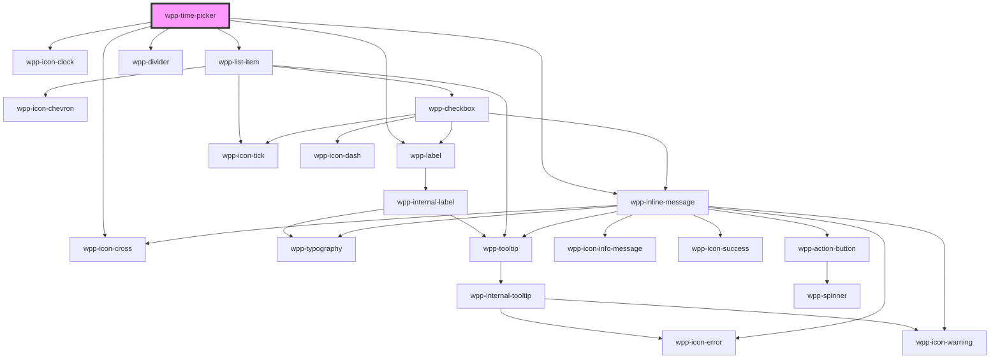

# wpp-time-picker


<!-- Auto Generated Below -->


## Usage

### Angular

```ts
import { Component } from '@angular/core'

@Component({
  selector: 'time-picker-example',
  templateUrl: './time-picker.page.html',
  styleUrls: ['./time-picker.page.scss'],
})
export class TimePickerExamplePage {
  value: string = ''
  minutesInterval: 1 | 5 | 10 | 15 = 15

  handleWppChange(event: any): void {
    console.log(event)
    this.value = event.detail.timeFormat
  }

  handleWppClear(event: any): void {
    console.log(event)
    this.value = event.detail.timeFormat
  }
}
```

```html
<div class="container">
  <wpp-typography class="title" type="xl-heading">Time Picker</wpp-typography>

  <wpp-time-picker
    [value]="value"
    [labelConfig]="{ text: 'Label' }"
    required
    [minutesInterval]="minutesInterval"
    (wppChange)="handleWppChange($event)"
    (wppClear)="handleWppClear($event)"
  >
  </wpp-time-picker>
</div>
```

```scss
.container {
  display: flex;
  flex-direction: column;
  align-items: flex-start;
  padding: 50px;

  .title {
    margin-bottom: 20px;
  }
}
```


### React

```tsx
import React, { useState } from 'react'
import styles from './TimePicker.module.scss'
import { WppButton, WppTimePicker, WppTypography } from '@wppopen/components-library-react'

const TimePicker = () => {
  const [value, setValue] = useState<string>('')
  const [minutesInterval, setMinutesInterval] = useState<1 | 5 | 10 | 15>(15)

  return (
    <div className={styles.container}>
      <WppTypography type="xl-heading">Time Picker</WppTypography>
      <WppTimePicker
        value={value}
        labelConfig={{ text: 'Label' }}
        required
        minutesInterval={minutesInterval}
        onWppChange={(event: any) => {
          console.log(event)
          setValue(event.detail.timeFormat)
        }}
        onWppClear={(event: any) => {
          console.log(event)
          setValue(event.detail.timeFormat)
        }}
      ></WppTimePicker>
    </div>
  )
}
```


### Vue

```vue
<script setup>
import { ref } from 'vue'
import { WppButton, WppTimePicker, WppTypography } from '@wppopen/components-library-vue'

const value = ref('')
const minutesInterval = ref(15)

const handleWppChange = event => {
  console.log(event)
  value.value = event.detail.timeFormat
}

const handleWppClear = event => {
  console.log(event)
  value.value = event.detail.timeFormat
}
</script>

<template>
  <div className="container">
    <WppTypography className="title" type="xl-heading"> Time Picker </WppTypography>

    <WppTimePicker
      :value="value"
      :labelConfig="{ text: 'Label' }"
      required
      :minutesInterval="minutesInterval"
      @wppChange="handleWppChange"
      @wppClear="handleWppClear"
    />
  </div>
</template>

<style scoped>
.container {
  display: flex;
  flex-direction: column;
  align-items: flex-start;
  padding: 50px;
}

.title {
  margin-bottom: 20px;
}
</style>
```


## Properties

| Property             | Attribute            | Description                                                                                                                                                                                                                                   | Type                                | Default                                           |
| -------------------- | -------------------- | --------------------------------------------------------------------------------------------------------------------------------------------------------------------------------------------------------------------------------------------- | ----------------------------------- | ------------------------------------------------- |
| `disabled`           | `disabled`           | If `true`, the time picker is disabled.                                                                                                                                                                                                       | `boolean`                           | `false`                                           |
| `dropdownConfig`     | --                   | Defines the dropdown configuration. Under the hood dropdown using tippy.js, all information about this library and available props you can see via this link `https://atomiks.github.io/tippyjs/v6/all-props/`                                | `DropdownConfig`                    | `{}`                                              |
| `labelConfig`        | --                   | Indicates label config.                                                                                                                                                                                                                       | `LabelConfig \| undefined`          | `undefined`                                       |
| `labelTooltipConfig` | --                   | Dropdown config for label, under the hood tooltip using tippy.js, all information about this library and available props you can see via this link `https://atomiks.github.io/tippyjs/v6/all-props/`                                          | `DropdownConfig`                    | `{     popperOptions: { strategy: 'fixed' },   }` |
| `maxMessageLength`   | `max-message-length` | Indicates time picker message maximum length                                                                                                                                                                                                  | `number \| undefined`               | `undefined`                                       |
| `message`            | `message`            | Indicates time picker message.                                                                                                                                                                                                                | `string \| undefined`               | `undefined`                                       |
| `messageType`        | `message-type`       | Indicates time picker message type. This property should be used together with "messagae" property for "error" and "warning" states.                                                                                                          | `"error" \| "warning" \| undefined` | `undefined`                                       |
| `minutesInterval`    | `minutes-interval`   | Defines the interval of minutes. Can take of one of the following values: 1, 5, 10, 15                                                                                                                                                        | `1 \| 10 \| 15 \| 5`                | `5`                                               |
| `name`               | `name`               | Indicates time picker name.                                                                                                                                                                                                                   | `string \| undefined`               | `undefined`                                       |
| `placeholder`        | `placeholder`        | Defines the placeholder of the time picker. Placeholder is displayed when there is no value in the time picker.                                                                                                                               | `string`                            | `PLACEHOLDER`                                     |
| `required`           | `required`           | If `true`, the datepicker input is required                                                                                                                                                                                                   | `boolean`                           | `false`                                           |
| `size`               | `size`               | Defines the time picker size, which differs in terms of paddings.                                                                                                                                                                             | `"m" \| "s"`                        | `'m'`                                             |
| `tooltipConfig`      | --                   | Defines the tooltip configuration for the message below the input. Under the hood dropdown using tippy.js, all information about this library and available props you can see via this link `https://atomiks.github.io/tippyjs/v6/all-props/` | `DropdownConfig`                    | `{}`                                              |
| `value`              | `value`              | Value of time picker. Should always have a valid time format.                                                                                                                                                                                 | `string`                            | `''`                                              |
| `width`              | `width`              | The width of time picker. Values can be in "px" or in "%". Default value is "198px".                                                                                                                                                          | `string`                            | `DEFAULT_WIDTH_VALUE`                             |


## Events

| Event       | Description                                                                                                      | Type                                        |
| ----------- | ---------------------------------------------------------------------------------------------------------------- | ------------------------------------------- |
| `wppBlur`   | Emitted when the input loses focus                                                                               | `CustomEvent<void>`                         |
| `wppChange` | Emitted when the dropdown of the time picker closes. Contains details about the current value of the datepicker. | `CustomEvent<TimePickerChangeEventDetails>` |
| `wppClear`  | Emitted when the "cross" icon is clicked and the value of the time picker is cleared.                            | `CustomEvent<TimePickerChangeEventDetails>` |
| `wppFocus`  | Emitted when the input receives focus                                                                            | `CustomEvent<FocusEvent>`                   |


## Dependencies

### Depends on

- [wpp-label](../wpp-label)
- [wpp-icon-clock](../wpp-icon/components/content/content/wpp-icon-clock)
- [wpp-icon-cross](../wpp-icon/components/add-and-remove/wpp-icon-cross)
- [wpp-list-item](../wpp-list-item)
- [wpp-divider](../wpp-divider)
- [wpp-inline-message](../wpp-inline-message)

### Graph


----------------------------------------------

*Built with [StencilJS](https://stenciljs.com/)*
