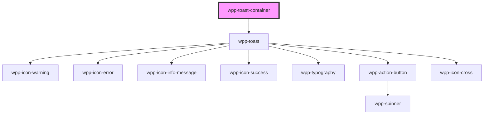

# wpp-toast-container

Create a lightweight and easily customizable alert message.

<!-- Auto Generated Below -->

## Properties

| Property             | Attribute               | Description                                              | Type     | Default         |
| -------------------- | ----------------------- | -------------------------------------------------------- | -------- | --------------- |
| `maxToastsToDisplay` | `max-toasts-to-display` | Defines the maximum number of toasts to display at once. | `number` | `4`             |
| `zIndex`             | `z-index`               | Defines the z-index of the WppToastContainer.            | `number` | `Z_INDEX.TOAST` |

## Methods

### `addToast(data: ToastState) => Promise<string>`

Method for adding toasts to `toast-container`.

#### Returns

Type: `Promise<string>`

### `hideToast(id: string) => Promise<void>`

Method for hiding toasts from `toast-container`.

#### Returns

Type: `Promise<void>`

### `updateToast(id: string, updatedData: Partial<Omit<ToastState, 'duration'>>) => Promise<void>`

Method for updating toast from `toast-container`.

#### Returns

Type: `Promise<void>`

## Shadow Parts

| Part     | Description |
| -------- | ----------- |
| `"item"` | toast item  |

## CSS Custom Properties

| Name                        | Description |
| --------------------------- | ----------- |
| `--wpp-toast-margin-bottom` |             |

## Dependencies

### Depends on

- [wpp-toast](../..)

### Graph

----------------------------------------------

*Built with [StencilJS](https://stenciljs.com/)*
