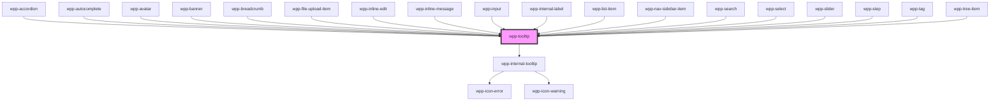

# wpp-tooltip

Tooltips display a message when users hover over an anchor element.

A tooltip with an error state is used to indicate validation errors when they cannot be shown inline.

<!-- Auto Generated Below -->


## Usage

### Angular

```html
<wpp-tooltip text='Message'>
  <span>Anchor</span>
</wpp-tooltip>

<wpp-tooltip placement='left' header='Title' text='Message' value='42'>
  <wpp-button>Apply</wpp-button>
</wpp-tooltip>

<wpp-tooltip is-error placement='bottom' text='Should be a valid email'>
  <wpp-input [labelConfig]="labelConfig" [(ngModel)]='value'></wpp-input>
</wpp-tooltip>
```


### React

```tsx
import { WppTooltip } from '@platform-ui-kit/components-library-react'
import { renderToString } from 'react-dom/server'

export const TooltipExample = () => (
  <>
    <WppTooltip text="Message">
      <div>Anchor</div>
    </WppTooltip>

    <WppTooltip placement="left" header="Title" text="Message" value="42">
      <WppButton>Apply</WppButton>
    </WppTooltip>

    <WppTooltip isError placement="bottom" text="Should be a valid email">
      <WppInput
        labelConfig={labelConfig}
        value={emailValue}
      />
    </WppTooltip>
  </>
)


const renderString = renderToString(
  <div>
    <WppTypography>This Node Element is created as HTML and parsed to string</WppTypography>
    <WppButton>button</WppButton>
  </div>,
)

export const TooltipWithAllowHTML = () => (
  <WppTooltip
    config={{ placement: 'right', allowHTML: true }}
    text={renderString}
  >
    <WppButton>
      Allow HTML tooltip
    </WppButton>
  </WppTooltip>
)
```


### Vue

```vue

<script setup lang="ts">
import { WppTooltip } from '@platform-ui-kit/components-library-vue'
</script>

<template>
  <WppTooltip text="Message">
    <div>Anchor</div>
  </WppTooltip>

  <WppTooltip placement="left" header="Title" text="Message" value="42">
    <WppButton>Apply</WppButton>
  </WppTooltip>

  <WppTooltip isError placement="bottom" text="Should be a valid email">
    <WppInput
      :value="emailValue"
      :labelConfig="labelConfig"
    />
  </WppTooltip>
</template>


```


## Properties

| Property        | Attribute        | Description                                                                                                                                                                                                                                                                              | Type                                                        | Default        |
| --------------- | ---------------- | ---------------------------------------------------------------------------------------------------------------------------------------------------------------------------------------------------------------------------------------------------------------------------------------- | ----------------------------------------------------------- | -------------- |
| `ariaProps`     | --               | Contains the button `aria-` props.                                                                                                                                                                                                                                                       | `AriaProps`                                                 | `{}`           |
| `config`        | --               | Defines the dropdown configuration. Under the hood dropdown using tippy.js, all information about this library and available props you can see via this link `https://atomiks.github.io/tippyjs/v6/all-props/`                                                                           | `DropdownConfig`                                            | `{}`           |
| `dropdownWidth` | `dropdown-width` | Defines the dropdown's width. The maximum width of the dropdown is 350px.                                                                                                                                                                                                                | `string`                                                    | `'auto'`       |
| `error`         | `error`          | If the tooltip is styled as an error.                                                                                                                                                                                                                                                    | `boolean`                                                   | `false`        |
| `externalClass` | `external-class` | Add an external class to the tooltip wrapper. This class will be applied to this wrapper that placed in tippy box that appended to the body. To add some properties to this class you have to add this class to global styles, for example .tooltip-wrapper.external-class-name {  ... } | `string`                                                    | `''`           |
| `header`        | `header`         | Defines the tooltip title.                                                                                                                                                                                                                                                               | `string \| undefined`                                       | `undefined`    |
| `text`          | `text`           | Defines the main tooltip message.                                                                                                                                                                                                                                                        | `string \| undefined`                                       | `undefined`    |
| `theme`         | `theme`          | Defines the tooltip theme.                                                                                                                                                                                                                                                               | `"dark" \| "light"`                                         | `'dark'`       |
| `value`         | `value`          | If set, adds a value row under the main message.                                                                                                                                                                                                                                         | `string \| undefined`                                       | `undefined`    |
| `warning`       | `warning`        | If the tooltip is styled as a warning.                                                                                                                                                                                                                                                   | `boolean`                                                   | `false`        |
| `wordBreak`     | `word-break`     | Sets the word breaking behaviour. By default, it is "break-word", meaning the words will be broken if there is not enough space and a hyphen ("-") is added. The other option is "break-all", which breaks the word but does not add the hyphen.                                         | `"auto-phrase" \| "break-all" \| "break-word" \| undefined` | `'break-word'` |


## Slots

| Slot                | Description                                                                                                                                                                                                   |
| ------------------- | ------------------------------------------------------------------------------------------------------------------------------------------------------------------------------------------------------------- |
|                     | Can contain the tooltip anchor content. The default slot, without the name attribute.                                                                                                                         |
| `"tooltip-content"` | Contains the custom content the user gives to the tooltip. To use this slot, you also have to pass `allowHTML: true` to the `config` property. Do not use WPP components (except WppTypography) in this slot. |


## Shadow Parts

| Part       | Description |
| ---------- | ----------- |
| `"anchor"` |             |
| `"inner"`  |             |


## CSS Custom Properties

| Name                                        | Description |
| ------------------------------------------- | ----------- |
| `--wpp-tooltip-border-radius`               |             |
| `--wpp-tooltip-dark-bg-color`               |             |
| `--wpp-tooltip-dark-header-text-color`      |             |
| `--wpp-tooltip-dark-text-color`             |             |
| `--wpp-tooltip-dark-value-color`            |             |
| `--wpp-tooltip-dark-with-value-text-color`  |             |
| `--wpp-tooltip-error-bg-color`              |             |
| `--wpp-tooltip-error-text-color`            |             |
| `--wpp-tooltip-icon-margin-right`           |             |
| `--wpp-tooltip-light-bg-color`              |             |
| `--wpp-tooltip-light-box-shadow`            |             |
| `--wpp-tooltip-light-header-text-color`     |             |
| `--wpp-tooltip-light-text-color`            |             |
| `--wpp-tooltip-light-value-color`           |             |
| `--wpp-tooltip-light-with-value-text-color` |             |
| `--wpp-tooltip-padding`                     |             |
| `--wpp-tooltip-text-margin-bottom`          |             |
| `--wpp-tooltip-with-header-padding`         |             |
| `--wpp-tooltip-with-value-padding`          |             |


## Dependencies

### Used by

 - [wpp-accordion](../wpp-accordion)
 - [wpp-autocomplete](../wpp-autocomplete)
 - [wpp-avatar](../wpp-avatar-group/components/wpp-avatar)
 - [wpp-banner](../wpp-banner)
 - [wpp-breadcrumb](../wpp-breadcrumb)
 - [wpp-file-upload-item](../wpp-file-upload/components)
 - [wpp-inline-edit](../wpp-inline-edit)
 - [wpp-inline-message](../wpp-inline-message)
 - [wpp-input](../wpp-input)
 - [wpp-internal-label](../wpp-label/components/wpp-internal-label)
 - [wpp-list-item](../wpp-list-item)
 - [wpp-nav-sidebar-item](../wpp-nav-sidebar/components/wpp-nav-sidebar-item)
 - [wpp-search](../wpp-search)
 - [wpp-select](../wpp-select)
 - [wpp-slider](../wpp-slider)
 - [wpp-step](../wpp-stepper/components/wpp-step)
 - [wpp-tag](../wpp-tag)
 - [wpp-tree-item](../wpp-tree/components/wpp-tree-item)

### Depends on

- wpp-internal-tooltip

### Graph


----------------------------------------------

*Built with [StencilJS](https://stenciljs.com/)*
