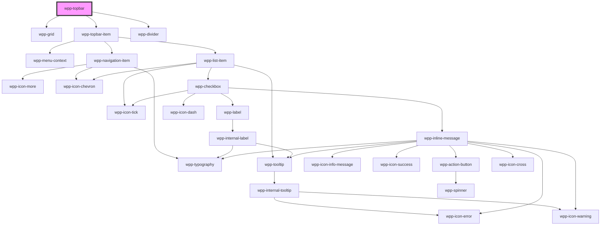

# wpp-topbar


<!-- Auto Generated Below -->


## Usage

### Angular

```ts
@Component({
  ...
})
export class TabControlExample {
  public navigationData: INavigation[] = [
    {
      label: 'Learning',
      value: 'learning',
      children: [
        {
          label: 'Guided tour',
          value: 'guidedTour',
          link: '/learning/guided-tour',
        },
      ],
    },
    {
      label: 'Marketplace',
      value: 'marketplace',
      link: '/marketplace',
    },
  ]

  public initialValue: string = 'community'

  public handleTopbarItemChange(event: Event): void {
    this.initialValue = (event as CustomEvent).detail.value
    this.router.navigate(event.detail.link)
  }
}
```

```html
<wpp-topbar
  [navigation]='navigationData'
  [value]='initialValue'
  (wppChange)="handleTopbarItemChange($event)"
>
  <div slot="app" class="app">
    
    <wpp-typography type="m-body-accent" tag="h3" class='app-name'>APP Name</wpp-typography>
  </div>
</wpp-topbar>
```


### React

```tsx
import React, { useState } from 'react'
import { WppTopbar, WppButton } from '@platform-ui-kit/components-library-react'
import { NavigationState } from '@platform-ui-kit/components-library'
import { useNavigate } from 'react-router-dom'

const initNavigation: NavigationState[] = [
  {
    label: 'Home',
    value: 'home',
    path: '/home',
  },
  {
    label: 'Client services',
    value: 'clientServices',
    path: '/client-services',
  },
  {
    label: 'Learning',
    value: 'learning',
    children: [
      {
        label: 'Guided tour',
        value: 'guidedTour',
        path: '/learning/guided-tour',
      },
      {
        label: 'Case studies',
        value: 'caseStudies',
        path: '/learning/case-studies',
      },
      {
        label: 'Community',
        value: 'community',
        path: '/learning/community',
      },
    ],
  },
  {
    label: 'Marketplace',
    value: 'marketplace',
    path: '/marketplace',
  },
  {
    label: 'Dev portal',
    value: 'devPortal',
    path: '/devPortal',
  },
]

export const TopbarExample = () => {
  const [value, setValue] = useState('devPortal')
  const [navigationData, setNavigationData] = useState(initNavigation)
  const navigate = useNavigate()

  const handleTopbarItemChange = (event: CustomEvent) => {
    setValue(event.detail.value)
    navigate(event.detail.path)
  }

  const handleAddNavigationItemToBeginning = () => {
    setNavigationData([{ label: 'Start', value: 'start', path: '/start' }, ...navigationData])
  }

  const handleAddNavigationItemToEnd = () => {
    setNavigationData([...navigationData, { label: 'End', value: 'end', path: '/end' }])
  }

  return (
    <>
      <WppTopbar
        value={value}
        navigation={navigationData}
        onWppChange={handleTopbarItemChange}
      >
        <div slot="app">
          
          <WppTypography type="m-body-accent" tag="h3">APP Name</WppTypography>
        </div>
      </WppTopbar>
      <div>
        <WppButton variant="secondary" onClick={handleAddNavigationItemToBeginning}>
          Add new navigation to beginning
        </WppButton>
        <WppButton variant="secondary" onClick={handleAddNavigationItemToEnd}>
          Add new navigation to end
        </WppButton>
      </div>
    </>
  )
}
```


### Vue

```vue

<script setup lang="ts">
import { ref } from "vue";

import {
  WppTopbar,
  WppButton,
  WppTypography,
} from "@platform-ui-kit/components-library-vue";

const initNavigation = [
  {
    label: "Home",
    value: "home",
    path: "/topbar",
  },
  {
    label: "Client services",
    value: "clientServices",
    path: "/topbar/client-services",
  },
  {
    label: "Learning",
    value: "learning",
    children: [
      {
        label: "Guided tour",
        value: "guidedTour",
        path: "/topbar/learning/guided-tour",
      },
      {
        label: "Case studies",
        value: "caseStudies",
        path: "/topbar/learning/case-studies",
      },
      {
        label: "Community",
        value: "community",
        path: "/topbar/learning/community",
      },
    ],
  },
  {
    label: "Marketplace",
    value: "marketplace",
    path: "/topbar/marketplace",
  },
  {
    label: "Dev portal",
    value: "devPortal",
    path: "/topbar/devPortal",
  },
];

const firstValue = ref("devPortal");
const secondValue = ref("community");
const navigationData = ref(initNavigation);

const handleTopbarItemChange = (event: CustomEvent) => {
  firstValue.value = event.detail.value;
  secondValue.value = event.detail.value;

  console.log(event.detail.path);
};

const handleAddNavigationItemToBeginning = () => {
  navigationData.value = [
    { label: "Start", value: "start", path: "/topbar/start" },
    ...navigationData.value,
  ];
};

const handleAddNavigationItemToEnd = () => {
  navigationData.value = [
    ...navigationData.value,
    { label: "End", value: "end", path: "/topbar/end" },
  ];
};
</script>

<template>
  <div>
    <div class="page">
      <WppTopbar
        :value="firstValue"
        :navigation="navigationData"
        @wppChange="handleTopbarItemChange"
      >
        <div slot="app" class="app">
          
          <WppTypography class="name" type="m-strong" tag="h3">
            APP Name
          </WppTypography>
        </div>
      </WppTopbar>

      <WppTopbar :value="firstValue" :navigation="navigationData" />

      <WppTopbar :value="secondValue" :navigation="navigationData" />

      <div class="actions">
        <WppButton
          variant="secondary"
          @click="handleAddNavigationItemToBeginning"
        >
          Add new navigation to beginning
        </WppButton>
        <WppButton variant="secondary" @click="handleAddNavigationItemToEnd">
          Add new navigation to end
        </WppButton>
      </div>
    </div>
  </div>
</template>

<style scoped>
.page {
  padding: 20px 0 50px;
  box-shadow: 0 4px 12px rgb(52 58 63 / 10.2%);
}

.image {
  display: flex;
  width: 40px;
  max-width: 40px;
  height: 40px;
  margin-right: 12px;
}

.app {
  display: flex;
  align-items: center;
  margin-right: 32px;
}

.name {
  white-space: nowrap;
}

.actions {
  display: inline-flex;
  flex-direction: column;
  justify-content: space-between;
  height: 100px;
  margin-top: 20px;
}
</style>

```


## Properties

| Property                  | Attribute     | Description                                                                                                                                                                                                                                                                         | Type                | Default          |
| ------------------------- | ------------- | ----------------------------------------------------------------------------------------------------------------------------------------------------------------------------------------------------------------------------------------------------------------------------------- | ------------------- | ---------------- |
| `nativeLink`              | `native-link` | If the navigation link behaves as an `a` tag. If the app uses `client side render`, leave as `false`, and if the app uses `server side render`, change to `true`. This prop is not dynamic, so, when changing its value in Storybook, refresh the page to see the change reflected. | `boolean`           | `false`          |
| `navigation` _(required)_ | --            | Defines the navigation items, e.g. `navigation=[{ label: 'Home', value: 'home' }]`                                                                                                                                                                                                  | `NavigationState[]` | `undefined`      |
| `value`                   | `value`       | Defines the initially active topbar item.                                                                                                                                                                                                                                           | `string`            | `undefined`      |
| `zIndex`                  | `z-index`     | Defines the z-index of the WppTopbar.                                                                                                                                                                                                                                               | `number`            | `Z_INDEX.TOPBAR` |


## Events

| Event       | Description                                                                                              | Type                                     |
| ----------- | -------------------------------------------------------------------------------------------------------- | ---------------------------------------- |
| `wppChange` | Emitted when topbar item was changed, return object like { value: 'home', path: '/home', label: 'Home' } | `CustomEvent<NavigationItemEventDetail>` |


## Slots

| Slot    | Description                                                    |
| ------- | -------------------------------------------------------------- |
| `"app"` | May contain descriptive app data (e.g., icon, name, and so on) |


## Shadow Parts

| Part            | Description                 |
| --------------- | --------------------------- |
| `"body"`        | Main content wrapper        |
| `"divider"`     | divider element             |
| `"navigation"`  | Navigation items            |
| `"topbar-item"` | topbar item wrapper element |
| `"wrapper"`     | Wrapper element             |


## CSS Custom Properties

| Name                            | Description |
| ------------------------------- | ----------- |
| `--wpp-topbar-item-margin`      |             |
| `--wpp-topbar-max-width`        |             |
| `--wpp-topbar-padding`          |             |
| `--wpp-topbar-with-app-padding` |             |


## Dependencies

### Depends on

- [wpp-grid](../wpp-grid)
- [wpp-topbar-item](./components/wpp-topbar-item)
- [wpp-divider](../wpp-divider)

### Graph


----------------------------------------------

*Built with [StencilJS](https://stenciljs.com/)*
