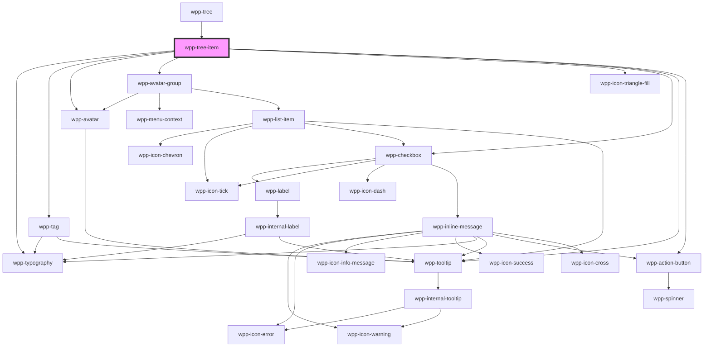

# wpp-tree-item-2

<!-- Auto Generated Below -->

## Properties

| Property                    | Attribute                      | Description                                                                                                                                                                                                                                                                                                                                                                                                                                                                                                                                         | Type                                        | Default     |
| --------------------------- | ------------------------------ | --------------------------------------------------------------------------------------------------------------------------------------------------------------------------------------------------------------------------------------------------------------------------------------------------------------------------------------------------------------------------------------------------------------------------------------------------------------------------------------------------------------------------------------------------- | ------------------------------------------- | ----------- |
| `disableOpenCloseAnimation` | `disable-open-close-animation` | Defines animation for open/close wpp-tree-item.                                                                                                                                                                                                                                                                                                                                                                                                                                                                                                     | `boolean`                                   | `false`     |
| `disableSearchHighlight`    | `disable-search-highlight`     | Defines words highlight in tree-item's title after search.                                                                                                                                                                                                                                                                                                                                                                                                                                                                                          | `boolean`                                   | `false`     |
| `endContent`                | --                             | Specifies the content to be displayed on the right side of the tree item. The content can be one of the following types: `avatar`, `avatarGroup`, `tag`, or `text`. Each type supports its own set of properties, which are passed through the `TreeItemEndContentProps` interface.  Example usage: - `avatar`: Display a single avatar, typically representing a user. - `avatarGroup`: Show multiple avatars grouped together. - `tag`: Render a status tag with customizable label and color. - `text`: Show a text label with optional tooltip. | `TreeItemEndContentProps \| undefined`      | `undefined` |
| `highlightOptions`          | --                             | Indicates highlightOptions for text highlight after search                                                                                                                                                                                                                                                                                                                                                                                                                                                                                          | `TreeItemHighlightOptions`                  | `undefined` |
| `item`                      | --                             | Indicates current item props                                                                                                                                                                                                                                                                                                                                                                                                                                                                                                                        | `TreeType`                                  | `undefined` |
| `level`                     | `level`                        | Indicates deep level of tree                                                                                                                                                                                                                                                                                                                                                                                                                                                                                                                        | `number`                                    | `1`         |
| `multiple`                  | `multiple`                     | If 'true', it will be possible to have multiple selection                                                                                                                                                                                                                                                                                                                                                                                                                                                                                           | `boolean`                                   | `false`     |
| `search`                    | `search`                       | Indicates search param                                                                                                                                                                                                                                                                                                                                                                                                                                                                                                                              | `string`                                    | `undefined` |
| `text`                      | `text`                         | Indicates current item title                                                                                                                                                                                                                                                                                                                                                                                                                                                                                                                        | `string \| undefined`                       | `undefined` |
| `transformSearchQuery`      | --                             | Helper that transforms a search query to a custom string, which is then passed to the "highlightWords" library in order to match it to the provided tree item text. For example, "cars!" would be transformed to "cars"                                                                                                                                                                                                                                                                                                                             | `((search: string) => string) \| undefined` | `undefined` |
| `withItemsTruncation`       | `with-items-truncation`        | Defines truncation for wpp-tree-item                                                                                                                                                                                                                                                                                                                                                                                                                                                                                                                | `boolean`                                   | `false`     |

## Events

| Event                     | Description                                | Type                    |
| ------------------------- | ------------------------------------------ | ----------------------- |
| `wppTreeItemOpenChange`   | Emitted updated item details               | `CustomEvent<TreeType>` |
| `wppTreeItemSelectChange` | Emitted when updated item selectable state | `CustomEvent<TreeType>` |

## Shadow Parts

| Part                            | Description |
| ------------------------------- | ----------- |
| `"icon-start"`                  |             |
| `"tree-item"`                   |             |
| `"tree-item-action-button"`     |             |
| `"tree-item-checkbox"`          |             |
| `"tree-item-end-avatar"`        |             |
| `"tree-item-end-avatar-group"`  |             |
| `"tree-item-end-tag"`           |             |
| `"tree-item-end-text"`          |             |
| `"tree-item-switcher"`          |             |
| `"tree-item-title"`             |             |
| `"tree-item-title-highlighted"` |             |
| `"tree-item-title-wrapper"`     |             |

## CSS Custom Properties

| Name                                                  | Description |
| ----------------------------------------------------- | ----------- |
| `--wpp-tree-item-bg-color`                            |             |
| `--wpp-tree-item-bg-color-hover`                      |             |
| `--wpp-tree-item-bg-color-selected`                   |             |
| `--wpp-tree-item-border-radius`                       |             |
| `--wpp-tree-item-checkbox-margin`                     |             |
| `--wpp-tree-item-cursor`                              |             |
| `--wpp-tree-item-disabled-color`                      |             |
| `--wpp-tree-item-extended-active-bg-color`            |             |
| `--wpp-tree-item-extended-icon-color-active`          |             |
| `--wpp-tree-item-extended-icon-color-hover`           |             |
| `--wpp-tree-item-extended-icon-margin`                |             |
| `--wpp-tree-item-height`                              |             |
| `--wpp-tree-item-icon-end-color-active`               |             |
| `--wpp-tree-item-icon-end-color-hover`                |             |
| `--wpp-tree-item-padding`                             |             |
| `--wpp-tree-item-switcher-transition-duration`        |             |
| `--wpp-tree-item-switcher-transition-property`        |             |
| `--wpp-tree-item-switcher-transition-timing-function` |             |
| `--wpp-tree-item-text-active`                         |             |
| `--wpp-tree-item-text-highlight`                      |             |
| `--wpp-tree-item-width`                               |             |

## Dependencies

### Used by

 - [wpp-tree](../..)

### Depends on

- [wpp-typography](../../../wpp-typography)
- [wpp-tag](../../../wpp-tag)
- [wpp-avatar](../../../wpp-avatar-group/components/wpp-avatar)
- [wpp-avatar-group](../../../wpp-avatar-group)
- [wpp-icon-triangle-fill](../../../wpp-icon/components/content/shapes/wpp-icon-triangle-fill)
- [wpp-checkbox](../../../wpp-checkbox)
- [wpp-tooltip](../../../wpp-tooltip)
- [wpp-action-button](../../../wpp-action-button)

### Graph

----------------------------------------------

*Built with [StencilJS](https://stenciljs.com/)*
