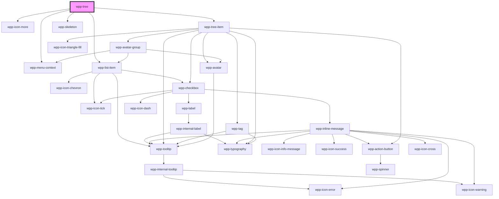

# wpp-tree


<!-- Auto Generated Below -->


## Usage

### Angular

You could use defaultSelectedIds property to pass an array of default selected ids. In order to make several items opened
by default feel free to add 'open: true' property in the data to the desired item.

> Note: Do not use defaultSelectedIds when you are trying to implement custom selection logic.

> Note: single mode accepts only 1 element in array of defaultSelectedIds.

```html
<div>
  <div>
    <h3 class='text'>Single select</h3>
    <wpp-tree [data]='treeData' (wppChange)='handleTreeChange($event)'></wpp-tree>
  </div>
  <div>
    <h3 class='text'>Multiple select</h3>
    <wpp-tree [data]='treeData' multiple="true" (wppChange)='handleTreeChange($event)'></wpp-tree>
  </div>
  <div>
    <h3 class='text'>Tree with filter</h3>

    <wpp-input type="search" placeholder="Search" (wppChange)='handleSearchChange($event)'></wpp-input>
    <wpp-tree [data]='treeData' [search]='search' (wppChange)='handleTreeChange($event)'></wpp-tree>
  </div>
</div>
```

```ts
@Component({
  selector: 'tree-example-page',
  templateUrl: './tree-2-example.page.html',
  styleUrls: ['./tree-2-example.page.scss'],
  changeDetection: ChangeDetectionStrategy.OnPush,
})
export class Tree2ExamplePage {
  public treeData: TreeType[] = [
    {
      title: 'Cars',
      id: '0',
      children: [
        {
          title: 'Toyota',
          id: '1',
          iconsEnd: [
            { icon: `wpp-icon-arrow`, name: 'remove' },
            { icon: 'wpp-icon-cross', name: 'save' },
          ],
          children: [
            {
              title: 'Avalon',
              id: '1-1',
              disabled: true,
            },
            {
              title: 'Prius',
              id: '1-2',
              disabled: true,
              iconsEnd: [
                { icon: `wpp-icon-arrow`, name: 'remove' },
                { icon: 'wpp-icon-cross', name: 'save' },
              ],
            },
            {
              title: 'Camry Variants',
              id: '1-3',
              iconsEnd: [
                { icon: `wpp-icon-arrow`, name: 'remove' },
                { icon: 'wpp-icon-cross', name: 'save' },
              ],
              children: [
                {
                  title: 'Camry 3.5',
                  id: '1-3-1',
                },
                {
                  title: 'Camry Hybrid',
                  id: '1-3-2',
                },
              ],
            },
          ],
        },
        {
          title: 'Skoda',
          id: '2',
          children: [
            {
              title: 'Kodiaq',
              id: '2-1',
              iconEnd: {
                icon: 'wpp-icon-sad',
                name: 'edit',
              },
            },
            {
              title: 'Superb',
              id: '2-2',
            },
            {
              title: 'Octavia',
              id: '2-3',
            },
          ],
        },
        {
          title: 'Volkswagen',
          id: '3',
          children: [
            {
              title: 'Passat',
              id: '3-1',
            },
            {
              title: 'Tiguan',
              id: '3-2',
            },
            {
              title: 'Touareg',
              id: '3-3',
            },
          ],
        },
      ],
    },
    {
      title: 'Motocicle',
      id: '4',
    },
    {
      title: 'Planes',
      id: '5',
      children: [
        {
          title: 'B-52',
          id: '5-1',
        },
        {
          title: 'MIG-21',
          id: '5-2',
        },
      ],
    },
  ]

  public search = ''

  public handleTreeChange(event: any): void {
    this.treeData = event.detail.treeState
  }

  public handleSearchChange(event: any): void {
    this.search = event.detail.value || ''
  }
}
```

```html
<div>
  <div>
    <h3 class='text'>Single select with End Content</h3>
    <wpp-tree [data]='treeData' (wppChange)='handleTreeChange($event)'></wpp-tree>
  </div>
  <div>
    <h3 class='text'>Multiple select</h3>
    <wpp-tree [data]='treeData' multiple="true" (wppChange)='handleTreeChange($event)'></wpp-tree>
  </div>
  <div>
    <h3 class='text'>Tree with filter</h3>
    <wpp-input type="search" placeholder="Search" (wppChange)='handleSearchChange($event)'></wpp-input>
    <wpp-tree [data]='treeData' [search]='search' (wppChange)='handleTreeChange($event)'></wpp-tree>
  </div>
</div>
```

```ts
@Component({
  selector: 'tree-example-page',
  templateUrl: './tree-example.page.html',
  styleUrls: ['./tree-example.page.scss'],
  changeDetection: ChangeDetectionStrategy.OnPush,
})
export class TreeExamplePage {
  public treeData: TreeType[] = [
    {
      title: 'Task 1',
      id: '0',
      endContent: {
        contentType: 'text',
        props: { text: 'Due in 3 days' }
      },
      children: [
        {
          title: 'Subtask 1.1',
          id: '0-1',
          endContent: {
            contentType: 'tag',
            props: {
              label: 'In Progress',
              variant: 'warning',
              icon: 'wpp-icon-info'
            }
          },
        }
      ]
    },
    {
      title: 'Task 2',
      id: '1',
      endContent: {
        contentType: 'avatar',
        props: {
          src: 'https://example.com/avatar1.jpg',
          name: 'John Doe',
          size: 'sm',
        },
      },
      children: [
        {
          title: 'Subtask 2.1',
          id: '1-1',
          endContent: {
            contentType: 'avatarGroup',
            props: {
              avatars: [
                { src: 'https://example.com/avatar2.jpg', name: 'Jane' },
                { src: 'https://example.com/avatar3.jpg', name: 'Tom' },
              ]
            }
          }
        }
      ]
    }
  ];

  public search = '';

  public handleTreeChange(event: any): void {
    this.treeData = event.detail.treeState;
  }

  public handleSearchChange(event: any): void {
    this.search = event.detail.value || '';
  }
}
```


### React

Tree component works as a controlled component. That means, wppChange event returns to you treeState snapshot
which one you should pass to the 'data' prop to rerender component and see changes

To implement initial open state you should simply add properties 'open: true' to the desired
item in data config like this

```json
 {
  title: 'Cars',
  id: '0',
  open: true,
  selected: true,
  disabled: true,
  // Make it possible to show spinner instead of icon
  "loadingActions": false,
  // Show context menu with provided icons as options. Click on those icons trigger onWppActionClick callback.
  iconsEnd: [
    { icon: `wpp-icon-info`, name: 'remove' },
    { icon: 'wpp-icon-cross', name: 'save' },
  ],
  children: [
    {
      title: 'Toyota',
      id: '0-0',
      ...
    },
    {
      title: 'Mercedes',
      id: '0-1',
      ...
    }
  ]
}
```

```tsx
const TreeSingle = () => {
  const [treeData, setTreeData] = useState(data)

  const handleTreeChange = (event: CustomEvent<TreeChangeEventDetail>) => {
    console.log('handleTreeChange event :>> ', event.detail)
    setTreeData(event.detail.treeState)
  }

  const handleActionClick = (event: CustomEvent<TreeActionClickEventDetail>) => {
    console.log('handleActionClick', event.detail)
  }

  return (
    <>
      <h3 className={styles.title}>Single tree</h3>
      <WppTree
        className={styles.tree}
        data={treeData}
        onWppChange={handleTreeChange}
        data-testid="single-tree"
        onWppActionClick={handleActionClick}
      />
    </>
  )
}
```

```json
const dataWithEndContent: TreeType[] = [
  {
    title: 'Task 1',
    id: '1',
    endContent: {
      contentType: 'text',
      props: { text: 'Due in 3 days' }
    },
    children: [
      {
        title: 'Subtask 1.1',
        id: '1-1',
        endContent: {
          contentType: 'tag',
          props: {
            label: 'In Progress',
            variant: 'warning',
            icon: 'wpp-icon-info'
          }
        }
      }
    ]
  },
  {
    title: 'Task 2',
    id: '2',
    endContent: {
      contentType: 'avatar',
      props: {
        src: 'https://example.com/avatar1.jpg',
        name: 'John Doe',
        size: 'sm',
      }
    },
    children: [
      {
        title: 'Subtask 2.1',
        id: '2-1',
        endContent: {
          contentType: 'avatarGroup',
          props: {
            avatars: [
              { src: 'https://example.com/avatar2.jpg', name: 'Jane' },
              { src: 'https://example.com/avatar3.jpg', name: 'Tom' },
            ]
          }
        }
      }
    ]
  }
]
```

```tsx
const TreeSingleWithEndContent = () => {
  const [treeData, setTreeData] = useState(dataWithEndContent)

  const handleTreeChange = (event: CustomEvent<TreeChangeEventDetail>) => {
    setTreeData(event.detail.treeState)
  }

  const handleActionClick = (event: CustomEvent<TreeActionClickEventDetail>) => {
    console.log('handleActionClick', event.detail)
  }

  return (
    <>
      <h3 className={styles.title}>Tree with End Content</h3>
      <WppTree
        className={styles.tree}
        data={treeData}
        onWppChange={handleTreeChange}
        onWppActionClick={handleActionClick}
        data-testid="single-tree-end-content"
      />
    </>
  )
}
```

```tsx
const TreeSingleWithSearch = () => {
  const [treeData, setTreeData] = useState(chosData)
  const [search, setSearch] = useState('')

  const handleTreeChange = (event: CustomEvent) => {
    console.log('handleTreeChange event :>> ', event.detail)
    setTreeData(event.detail.treeState)
  }

  const handleSearch = (e: CustomEvent<InputChangeEventDetail>) => {
    setSearch(e.detail.value || '')
  }

  const handleActionClick = (event: CustomEvent) => {
    console.log('handleActionClick', event.detail)
  }

  // In order to prevent rendering issues on big data, use debounce for search handler
  const debouncedHandleSearch = useCallback(debounce(handleSearch, 400), [])

  return (
    <>
      <h3 className={styles.title}>Single tree with search</h3>
      <WppInput className={styles.search} onWppChange={debouncedHandleSearch} type="search" placeholder="Search" />
      <WppTree
        className={styles.tree}
        data={treeData}
        search={search}
        onWppChange={handleTreeChange}
        onWppActionClick={handleActionClick}
      />
    </>
  )
}
```

Search implementation could vary with help of searchConfig property. Default implementation works as search
by multiple words, but if you want to change it, you could pass your own matcher function in searchConfig \*/

```tsx
const TreeSingleWithCustomSearch = () => {
  const [treeData, setTreeData] = useState(data)
  const [search, setSearch] = useState('')

  const handleTreeChange = (event: CustomEvent<TreeChangeEventDetail>) => {
    console.log('handleTreeChange event :>> ', event.detail)
    setTreeData(event.detail.treeState)
  }

  const handleSearch = (e: CustomEvent<InputChangeEventDetail>) => {
    setSearch(e.detail.value || '')
  }

  // In order to prevent rendering issues on big data, use debounce for search handler
  const debouncedHandleSearch = useCallback(debounce(handleSearch, 400), [])

  return (
    <>
      <h3 className={styles.title}>Single tree with custom search</h3>
      <WppInput className={styles.search} onWppChange={debouncedHandleSearch} type="search" placeholder="Search" />
      <WppTree
        className={styles.tree}
        data={treeData}
        search={search}
        onWppChange={handleTreeChange}
        data-testid="single-tree-custom-search"
        searchConfig={{
          isMatchingSearch: (title, search) => title.toLowerCase() === search.toLowerCase(),
        }}
      />
    </>
  )
}
```

You could use defaultSelectedIds property to pass an array of default selected ids. In order to make several items opened
by default feel free to add 'open: true' property in the data to the desired item.

> Note: Do not use defaultSelectedIds when you are trying to implement custom selection logic.

> Note: single mode accepts only 1 element in array of defaultSelectedIds.

```tsx
const TreeMultiple = () => {
  const [treeData, setTreeData] = useState(dataWithLongNames)

  const handleTreeChange = (event: CustomEvent<TreeChangeEventDetail>) => {
    console.log('handleTreeChange event :>> ', event.detail)
    setTreeData(event.detail.treeState)
  }

  const handleActionClick = (event: CustomEvent<TreeActionClickEventDetail>) => {
    console.log('handleActionClick', event.detail)
  }

  return (
    <>
      <h3 className={styles.title}>Multiple tree with selected by default</h3>
      <WppTree
        className={styles.tree}
        data={treeData}
        multiple
        onWppChange={handleTreeChange}
        onWppActionClick={handleActionClick}
        defaultSelectedIds={['2-1', '1']}
        data-testid="multiple-tree"
      />
    </>
  )
}
```

```tsx
const TreeMultipleWithNotSelectableItem = () => {
  const data = [
    {
      title: 'Cars',
      id: '0',
      children: [
        {
          title: 'Toyota',
          id: '0-0',
          iconsEnd: [
            { icon: `wpp-icon-info`, name: 'remove' },
            { icon: 'wpp-icon-cross', name: 'save' },
          ],
        },
      ],
    },
    {
      title: 'Planes',
      isNotSelectable: true,
      id: '1',
      children: [
        {
          title: 'B-52',
          id: '1-0',
        },
        {
          title: 'MIG-21',
          id: '1-1',
        },
      ],
    },
  ]
  const [treeData, setTreeData] = useState(data)

  const handleTreeChange = (event: CustomEvent<TreeChangeEventDetail>) => {
    console.log('handleTreeChange event :>> ', event.detail)
    setTreeData(event.detail.treeState)
  }

  return (
    <>
      <h3 className={styles.title}>Multiple tree with not selectable Planes item</h3>
      <WppTree
        className={styles.tree}
        data={treeData}
        multiple
        onWppChange={handleTreeChange}
        data-testid="multiple-tree"
      />
    </>
  )
}
```

```tsx
const TreeMultipleWithSearch = () => {
  const [treeData, setTreeData] = useState(dataWithLongNames)
  const [search, setSearch] = useState('')

  const handleTreeChange = (event: CustomEvent<TreeChangeEventDetail>) => {
    setTreeData(event.detail.treeState)
  }

  const handleSearch = (e: CustomEvent<InputChangeEventDetail>) => {
    setSearch(e.detail.value || '')
  }

  // In order to prevent rendering issues on big data, use debounce for search handler
  const debouncedHandleSearch = useCallback(debounce(handleSearch, 400), [])

  return (
    <>
      <h3 className={styles.title}>Multiple tree with search</h3>
      <WppInput className={styles.search} onWppChange={debouncedHandleSearch} type="search" placeholder="Search" />
      <WppTree
        className={styles.tree}
        data={treeData}
        search={search}
        multiple
        onWppChange={handleTreeChange}
        data-testid="multiple-tree"
      />
    </>
  )
}
```

Below is example of configuration passed to the Tree component

```ts
export const data: TreeType[] = [
  {
    title: 'Cars',
    id: '0',
    children: [
      {
        title: 'Toyota',
        // This particular property makes impossible to select item, but you still can open it or operate with icons
        isNotSelectable: true,
        id: '0-0',
        iconsEnd: [
          { icon: `wpp-icon-info`, name: 'remove' },
          { icon: 'wpp-icon-cross', name: 'save' },
        ],
        children: [
          {
            title: 'Avalon',
            id: '0-0-0',
            disabled: true,
          },
          {
            title: 'Prius',
            id: '0-0-1',
            disabled: true,
            iconsEnd: [
              { icon: `wpp-icon-arrow`, name: 'remove' },
              { icon: 'wpp-icon-cross', name: 'save' },
            ],
          },
          {
            title: 'Camry Variants',
            id: '0-0-2',
            iconsEnd: [
              { icon: `wpp-icon-arrow`, name: 'remove' },
              { icon: 'wpp-icon-cross', name: 'save' },
            ],
            children: [
              {
                title: 'Camry 3.5',
                id: '0-0-2-1',
              },
              {
                title: 'Camry Hybrid',
                id: '0-0-2-2',
              },
            ],
          },
        ],
      },
      {
        title: 'Skoda',
        id: '0-1',
        children: [
          {
            title: 'Kodiaq',
            id: '0-1-0',
            someProps: true,
            iconEnd: {
              icon: 'wpp-icon-sad',
              name: 'edit',
            },
          },
          {
            title: 'Superb',
            id: '0-1-1',
          },
          {
            title: 'Octavia',
            id: '0-1-2',
          },
        ],
      },
      {
        title: 'Volkswagen',
        id: '0-2',
        children: [
          {
            title: 'Passat',
            id: '0-2-0',
          },
          {
            title: 'Tiguan',
            id: '0-2-1',
          },
          {
            title: 'Touareg',
            id: '0-2-2',
          },
        ],
      },
    ],
  },
  {
    title: 'Motorcycle',
    id: '1',
  },
  {
    title: 'Planes',
    id: '2',
    children: [
      {
        title: 'B-52',
        id: '2-0',
      },
      {
        title: 'MIG-21',
        id: '2-1',
      },
    ],
  },
]
```


### Vue

You could use defaultSelectedIds property to pass an array of default selected ids. In order to make several items opened
by default feel free to add 'open: true' property in the data to the desired item.

> Note: Do not use defaultSelectedIds when you are trying to implement custom selection logic.

> Note: single mode accepts only 1 element in array of defaultSelectedIds.

```vue

<script setup lang="ts">
import { ref } from "vue"

import { WppTree } from "@platform-ui-kit/components-library-vue"}

const data = [
  {
    title: 'Cars',
    id: '0',
    children: [
      {
        title: 'Toyota',
        // This particular property makes impossible to select item, but you still can open it or operate with icons
        isNotSelectable: true,
        id: '0-0',
        iconsEnd: [
          { icon: `wpp-icon-info`, name: 'remove' },
          { icon: 'wpp-icon-cross', name: 'save' },
        ],
        children: [
          {
            title: 'Avalon',
            id: '0-0-0',
            disabled: true,
          },
          {
            title: 'Prius',
            id: '0-0-1',
            disabled: true,
            iconsEnd: [
              { icon: `wpp-icon-arrow`, name: 'remove' },
              { icon: 'wpp-icon-cross', name: 'save' },
            ],
          },
          {
            title: 'Camry Variants',
            id: '0-0-2',
            iconsEnd: [
              { icon: `wpp-icon-arrow`, name: 'remove' },
              { icon: 'wpp-icon-cross', name: 'save' },
            ],
            children: [
              {
                title: 'Camry 3.5',
                id: '0-0-2-1',
              },
              {
                title: 'Camry Hybrid',
                id: '0-0-2-2',
              },
            ],
          },
        ],
      },
      {
        title: 'Skoda',
        id: '0-1',
        children: [
          {
            title: 'Kodiaq',
            id: '0-1-0',
            someProps: true,
            iconEnd: {
              icon: 'wpp-icon-sad',
              name: 'edit',
            },
          },
          {
            title: 'Superb',
            id: '0-1-1',
          },
          {
            title: 'Octavia',
            id: '0-1-2',
          },
        ],
      },
      {
        title: 'Volkswagen',
        id: '0-2',
        children: [
          {
            title: 'Passat',
            id: '0-2-0',
          },
          {
            title: 'Tiguan',
            id: '0-2-1',
          },
          {
            title: 'Touareg',
            id: '0-2-2',
          },
        ],
      },
    ],
  },
  {
    title: 'Motorcycle',
    id: '1',
  },
  {
    title: 'Planes',
    id: '2',
    children: [
      {
        title: 'B-52',
        id: '2-0',
      },
      {
        title: 'MIG-21',
        id: '2-1',
      },
    ],
  },
]

const treeData = ref(data)

const handleTreeChange = (event: CustomEvent) => {
  console.log('handleTreeChange event :>> ', event.detail)
  treeData.value = event.detail.treeState
}

const handleActionClick = (event: CustomEvent) => {
  console.log('handleActionClick', event.detail)
}
</script>

<template>
  <h3 class="title">Single tree</h3>
  <WppTree
    class="tree"
    :data="treeData"
    @wppChange="handleTreeChange"
    @wppActionClick="handleActionClick"
  />
</template>


```


```vue
<script setup lang="ts">
import { ref } from 'vue'
import { WppTree } from '@platform-ui-kit/components-library-vue'

const treeData = ref([
  {
    title: 'Task 1',
    id: '1',
    endContent: {
      contentType: 'text',
      props: { text: 'Due in 3 days' }
    },
    children: [
      {
        title: 'Subtask 1.1',
        id: '1-1',
        endContent: {
          contentType: 'tag',
          props: {
            label: 'In Progress',
            variant: 'warning',
            icon: 'wpp-icon-info'
          }
        }
      }
    ]
  },
  {
    title: 'Task 2',
    id: '2',
    endContent: {
      contentType: 'avatar',
      props: {
        src: 'https://example.com/avatar1.jpg',
        name: 'John Doe',
        size: 'sm',
      }
    },
    children: [
      {
        title: 'Subtask 2.1',
        id: '2-1',
        endContent: {
          contentType: 'avatarGroup',
          props: {
            avatars: [
              { src: 'https://example.com/avatar2.jpg', name: 'Jane' },
              { src: 'https://example.com/avatar3.jpg', name: 'Tom' },
            ]
          }
        }
      }
    ]
  }
])

const handleTreeChange = (event: CustomEvent) => {
  treeData.value = event.detail.treeState
}

const handleActionClick = (event: CustomEvent) => {
  console.log('Action button clicked:', event.detail)
}
</script>

<template>
  <h3 class="title">Single Tree with End Content</h3>
  <WppTree
    class="tree"
    :data="treeData"
    @wppChange="handleTreeChange"
    @wppActionClick="handleActionClick"
  />
</template>
```


## Properties

| Property                    | Attribute                      | Description                                                                                                                               | Type                                      | Default                                                                                                                               |
| --------------------------- | ------------------------------ | ----------------------------------------------------------------------------------------------------------------------------------------- | ----------------------------------------- | ------------------------------------------------------------------------------------------------------------------------------------- |
| `data` _(required)_         | --                             | Defines the tree data.                                                                                                                    | `TreeType[]`                              | `undefined`                                                                                                                           |
| `defaultSelectedIds`        | --                             | Default selected ids list                                                                                                                 | `(string \| number)[]`                    | `[]`                                                                                                                                  |
| `disableOpenCloseAnimation` | `disable-open-close-animation` | Defines animation for open/close wpp-tree-item.                                                                                           | `boolean`                                 | `false`                                                                                                                               |
| `disableSearchHighlight`    | `disable-search-highlight`     | Defines words highlight in tree-item's title after search.                                                                                | `boolean`                                 | `false`                                                                                                                               |
| `loading`                   | `loading`                      | Defines loading state                                                                                                                     | `boolean \| undefined`                    | `false`                                                                                                                               |
| `locales`                   | --                             | Defines the component locale types.                                                                                                       | `{ nothingFound?: string \| undefined; }` | `{}`                                                                                                                                  |
| `multiple`                  | `multiple`                     | If several items could be selected.                                                                                                       | `boolean`                                 | `false`                                                                                                                               |
| `search`                    | `search`                       | Indicates search value                                                                                                                    | `string \| undefined`                     | `''`                                                                                                                                  |
| `searchConfig`              | --                             | Defines the component locale types. Note: "isMatchSearch" is deprecated, use "isMatchingSearch" instead, which uses the tree-item object. | `TreeItemSearchConfig`                    | `{     isMatchSearch: undefined,     highlightOptions: {},     transformSearchQuery: undefined,     isMatchingSearch: undefined,   }` |
| `skeletonNumberItems`       | `skeleton-number-items`        | Defines number of loading skeleton items                                                                                                  | `number \| undefined`                     | `5`                                                                                                                                   |
| `withItemsTruncation`       | `with-items-truncation`        | Defines truncation for wpp-tree-item                                                                                                      | `boolean`                                 | `false`                                                                                                                               |


## Events

| Event            | Description                                            | Type                                                                                                                                                                                                                                           |
| ---------------- | ------------------------------------------------------ | ---------------------------------------------------------------------------------------------------------------------------------------------------------------------------------------------------------------------------------------------- |
| `wppActionClick` | Emitted when click on item actions(icons) was occurred | `CustomEvent<{ id: string \| number; name: string; item: TreeType; place: "start" \| "end"; }>`                                                                                                                                                |
| `wppChange`      | Emitted when tree have changed it's state              | `CustomEvent<{ treeState: TreeType[]; currentItem?: TreeType \| undefined; selectedItems?: (TreeType \| null)[] \| undefined; selectedOriginalItems?: Partial<TreeType>[] \| undefined; reason: "clear" \| "search" \| "select" \| "open"; }>` |


## Methods

### `clearAll() => Promise<void>`


#### Returns

Type: `Promise<void>`


### `recalculateTreeWidth() => Promise<void>`


#### Returns

Type: `Promise<void>`


### `selectAll() => Promise<void>`


#### Returns

Type: `Promise<void>`


## Shadow Parts

| Part                | Description |
| ------------------- | ----------- |
| `"content"`         |             |
| `"icon-end"`        |             |
| `"icon-start"`      |             |
| `"tree-container"`  |             |
| `"tree-empty-text"` |             |


## CSS Custom Properties

| Name                            | Description |
| ------------------------------- | ----------- |
| `--wpp-tree-container-bg-color` |             |
| `--wpp-tree-container-height`   |             |
| `--wpp-tree-container-width`    |             |
| `--wpp-tree-icon-end-color`     |             |
| `--wpp-tree-input-margin`       |             |
| `--wpp-tree-item-padding`       |             |
| `--wpp-tree-trigger-area`       |             |


## Dependencies

### Depends on

- [wpp-menu-context](../wpp-menu-context)
- [wpp-icon-more](../wpp-icon/components/system/menu/wpp-icon-more)
- [wpp-list-item](../wpp-list-item)
- [wpp-tree-item](./components/wpp-tree-item)
- [wpp-skeleton](../wpp-skeleton)

### Graph


----------------------------------------------

*Built with [StencilJS](https://stenciljs.com/)*
