# wpp-typography

<!-- Auto Generated Below -->

## Properties

| Property | Attribute | Description                          | Type                                                                                                                                                                                                                                                                                                                                                                                                                                                                                                                                                                                                                                                                                                                                                          | Default                   |
| -------- | --------- | ------------------------------------ | ------------------------------------------------------------------------------------------------------------------------------------------------------------------------------------------------------------------------------------------------------------------------------------------------------------------------------------------------------------------------------------------------------------------------------------------------------------------------------------------------------------------------------------------------------------------------------------------------------------------------------------------------------------------------------------------------------------------------------------------------------------- | ------------------------- |
| `color`  | `color`   | Defines the text color.              | ``var(--wpp-${string})``                                                                                                                                                                                                                                                                                                                                                                                                                                                                                                                                                                                                                                                                                                                                      | `'var(--wpp-text-color)'` |
| `tag`    | `tag`     | Defines the typography semantic tag. | `"h1" \| "h2" \| "h3" \| "h4" \| "h5" \| "h6" \| "p" \| "span"`                                                                                                                                                                                                                                                                                                                                                                                                                                                                                                                                                                                                                                                                                               | `'span'`                  |
| `type`   | `type`    | Defines the typography style.        | `"5xl-display" \| "5xl-display-light" \| "5xl-display-strong" \| "5xl-display-emphasis" \| "4xl-display" \| "4xl-display-light" \| "4xl-display-strong" \| "4xl-display-emphasis" \| "3xl-heading" \| "3xl-heading-light" \| "3xl-heading-strong" \| "3xl-heading-emphasis" \| "2xl-heading" \| "2xl-heading-light" \| "2xl-heading-strong" \| "2xl-heading-emphasis" \| "xl-heading" \| "xl-heading-light" \| "xl-heading-strong" \| "xl-heading-emphasis" \| "l-strong" \| "l-midi" \| "l-body" \| "l-light" \| "l-emphasis" \| "m-strong" \| "m-midi" \| "m-body" \| "m-light" \| "m-emphasis" \| "s-strong" \| "s-midi" \| "s-body" \| "s-light" \| "s-emphasis" \| "xs-strong" \| "xs-midi" \| "xs-body" \| "xs-light" \| "xs-emphasis" \| "2xs-strong"` | `'m-body'`                |

## Shadow Parts

| Part           | Description                  |
| -------------- | ---------------------------- |
| `"inner"`      | Content slot element         |
| `"typography"` | Main content wrapper element |

## CSS Custom Properties

| Name                               | Description |
| ---------------------------------- | ----------- |
| `--wpp-typography-color`           |             |
| `--wpp-typography-font-family`     |             |
| `--wpp-typography-font-size`       |             |
| `--wpp-typography-font-style`      |             |
| `--wpp-typography-font-weight`     |             |
| `--wpp-typography-letter-spacing`  |             |
| `--wpp-typography-line-height`     |             |
| `--wpp-typography-text-decoration` |             |
| `--wpp-typography-text-transform`  |             |

## Dependencies

### Used by

 - [wpp-accordion](../wpp-accordion)
 - [wpp-autocomplete](../wpp-autocomplete)
 - [wpp-chat-input](../wpp-chat/components/wpp-chat-input)
 - [wpp-color-picker](../wpp-color-picker)
 - [wpp-datepicker](../wpp-datepicker)
 - [wpp-file-upload-item](../wpp-file-upload/components)
 - [wpp-filter-button](../wpp-filter-button)
 - [wpp-inline-edit](../wpp-inline-edit)
 - [wpp-inline-message](../wpp-inline-message)
 - [wpp-internal-label](../wpp-label/components/wpp-internal-label)
 - [wpp-legend](../wpp-legend)
 - [wpp-menu-group](../wpp-menu-context/components/wpp-menu-group)
 - [wpp-navigation-item](../wpp-topbar/components/wpp-navigation-item)
 - [wpp-pagination](../wpp-pagination)
 - [wpp-pagination-item](../wpp-pagination/components/wpp-pagination-item)
 - [wpp-richtext](../wpp-richtext)
 - [wpp-search](../wpp-search)
 - [wpp-select](../wpp-select)
 - [wpp-slider](../wpp-slider)
 - [wpp-sticky-bar](../wpp-sticky-bar)
 - [wpp-tag](../wpp-tag)
 - [wpp-textarea-input](../wpp-textarea-input)
 - [wpp-toast](../wpp-toast)
 - [wpp-tree-item](../wpp-tree/components/wpp-tree-item)
 - [wpp-video-player](../wpp-video-player)

### Graph

```mermaid
graph TD;
  wpp-accordion --> wpp-typography
  wpp-autocomplete --> wpp-typography
  wpp-chat-input --> wpp-typography
  wpp-color-picker --> wpp-typography
  wpp-datepicker --> wpp-typography
  wpp-file-upload-item --> wpp-typography
  wpp-filter-button --> wpp-typography
  wpp-inline-edit --> wpp-typography
  wpp-inline-message --> wpp-typography
  wpp-internal-label --> wpp-typography
  wpp-legend --> wpp-typography
  wpp-menu-group --> wpp-typography
  wpp-navigation-item --> wpp-typography
  wpp-pagination --> wpp-typography
  wpp-pagination-item --> wpp-typography
  wpp-richtext --> wpp-typography
  wpp-search --> wpp-typography
  wpp-select --> wpp-typography
  wpp-slider --> wpp-typography
  wpp-sticky-bar --> wpp-typography
  wpp-tag --> wpp-typography
  wpp-textarea-input --> wpp-typography
  wpp-toast --> wpp-typography
  wpp-tree-item --> wpp-typography
  wpp-video-player --> wpp-typography
  style wpp-typography fill:#f9f,stroke:#333,stroke-width:4px
```

----------------------------------------------

*Built with [StencilJS](https://stenciljs.com/)*
