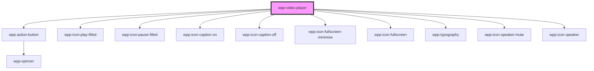

# wpp-video-player

<!-- Auto Generated Below -->

## Properties

| Property             | Attribute   | Description                                                                                                                                                                                                                                               | Type                                                                                                                                                                                                                                                                                                                                                                                                                                                                                                                                                                                                                                                                                                                                                                                                                                                                                                                                                                          | Default                                                       |
| -------------------- | ----------- | --------------------------------------------------------------------------------------------------------------------------------------------------------------------------------------------------------------------------------------------------------- | ----------------------------------------------------------------------------------------------------------------------------------------------------------------------------------------------------------------------------------------------------------------------------------------------------------------------------------------------------------------------------------------------------------------------------------------------------------------------------------------------------------------------------------------------------------------------------------------------------------------------------------------------------------------------------------------------------------------------------------------------------------------------------------------------------------------------------------------------------------------------------------------------------------------------------------------------------------------------------- | ------------------------------------------------------------- |
| `ariaProps`          | --          | Contains the WppVideo `aria-` props.                                                                                                                                                                                                                      | `AriaProps`                                                                                                                                                                                                                                                                                                                                                                                                                                                                                                                                                                                                                                                                                                                                                                                                                                                                                                                                                                   | `{}`                                                          |
| `caption`            | --          | Represents the text or content displayed as the caption.                                                                                                                                                                                                  | `undefined \| { label: string; kind: string; src: string; srclang: string; default?: boolean \| undefined; }`                                                                                                                                                                                                                                                                                                                                                                                                                                                                                                                                                                                                                                                                                                                                                                                                                                                                 | `undefined`                                                   |
| `controlPanelConfig` | --          | Configuration object for the control panel settings.  If set autoplay to `true`, the control bar will not be visible. `muted` and `loop` property on <video> tag will be set to true as default.                                                          | `{ showFullscreenButton?: boolean \| undefined; showVolumeButton?: boolean \| undefined; autoplay?: boolean \| undefined; muted?: boolean \| undefined; loop?: boolean \| undefined; }`                                                                                                                                                                                                                                                                                                                                                                                                                                                                                                                                                                                                                                                                                                                                                                                       | `{}`                                                          |
| `jumpValues`         | --          | Defines the jump values for the video progress bar and volume bar.                                                                                                                                                                                        | `{ videoSkipTimeValue: number; volumeSkipValue: number; }`                                                                                                                                                                                                                                                                                                                                                                                                                                                                                                                                                                                                                                                                                                                                                                                                                                                                                                                    | `{     videoSkipTimeValue: 5,     volumeSkipValue: 0.05,   }` |
| `locales`            | --          | Defines the component locale types.                                                                                                                                                                                                                       | `{ notSupportedPlayer?: string \| undefined; hostAriaLabel?: string \| undefined; videoPlayerElement?: string \| undefined; videoStates?: { playing: string; paused: string; idle: string; } \| undefined; controlsAriaLabel?: string \| undefined; playButtonAriaLabel?: { play: string; pause: string; } \| undefined; playPauseButtonArealLabels?: { play: string; pause: string; } \| undefined; captionButtonAriaLabel?: string \| undefined; volumeProgressLabel?: string \| undefined; volumeButtonAriaLabel?: string \| undefined; fullscreenButtonAriaLabel?: string \| undefined; videoProgressLabel?: string \| undefined; videoProgressAriaLabel?: string \| undefined; languageMenuAriaLabel?: string \| undefined; videoCaptionsAriaLabel?: string \| undefined; keyboardShortcutsDescription?: { title: string; playPause: string; backwardForward: string; volumeUpDown: string; captions: string; muteUnmute: string; fullscreen: string; } \| undefined; }` | `{}`                                                          |
| `preload`            | `preload`   | Specifies the preferred loading behavior.  - `'auto'`: Indicates that the browser should load the entire media content when the page loads, if possible. - `'metadata'`: Indicates that only the metadata (e.g., length, track list) should be preloaded. | `"auto" \| "metadata"`                                                                                                                                                                                                                                                                                                                                                                                                                                                                                                                                                                                                                                                                                                                                                                                                                                                                                                                                                        | `'metadata'`                                                  |
| `size`               | --          |                                                                                                                                                                                                                                                           | `{ width: number \| `${number}%`; height: number \| `${number}%`; }`                                                                                                                                                                                                                                                                                                                                                                                                                                                                                                                                                                                                                                                                                                                                                                                                                                                                                                          | `{ width: 640, height: 360 }`                                 |
| `src`                | `src`       | Represents the source of a resource.                                                                                                                                                                                                                      | `string \| string[]`                                                                                                                                                                                                                                                                                                                                                                                                                                                                                                                                                                                                                                                                                                                                                                                                                                                                                                                                                          | `''`                                                          |
| `thumbnail`          | `thumbnail` | Represents the thumbnail of the video.                                                                                                                                                                                                                    | `string \| undefined`                                                                                                                                                                                                                                                                                                                                                                                                                                                                                                                                                                                                                                                                                                                                                                                                                                                                                                                                                         | `''`                                                          |
| `type`               | `type`      | Represents the type of video source.                                                                                                                                                                                                                      | `string \| string[]`                                                                                                                                                                                                                                                                                                                                                                                                                                                                                                                                                                                                                                                                                                                                                                                                                                                                                                                                                          | `'video/mp4'`                                                 |

## Methods

### `pause() => Promise<void>`

Pauses the video playback.

#### Returns

Type: `Promise<void>`

A promise that resolves when the video is successfully paused.

### `play() => Promise<void>`

Plays the current video using the video player reference if it is available.

#### Returns

Type: `Promise<void>`

A promise that resolves when the video begins playback.

## Shadow Parts

| Part             | Description |
| ---------------- | ----------- |
| `"controls"`     |             |
| `"video-player"` |             |

## Dependencies

### Depends on

- [wpp-action-button](../wpp-action-button)
- wpp-icon-play-filled
- wpp-icon-pause-filled
- [wpp-icon-caption-on](../wpp-icon/components/media/media/wpp-icon-caption-on)
- [wpp-icon-caption-off](../wpp-icon/components/media/media/wpp-icon-caption-off)
- [wpp-icon-fullscreen-minimise](../wpp-icon/components/tools/resize-and-scale/wpp-icon-fullscreen-minimise)
- [wpp-icon-fullscreen](../wpp-icon/components/tools/resize-and-scale/wpp-icon-fullscreen)
- [wpp-typography](../wpp-typography)
- [wpp-icon-speaker-mute](../wpp-icon/components/media/media/wpp-icon-speaker-mute)
- [wpp-icon-speaker](../wpp-icon/components/media/media/wpp-icon-speaker)

### Graph

----------------------------------------------

*Built with [StencilJS](https://stenciljs.com/)*
